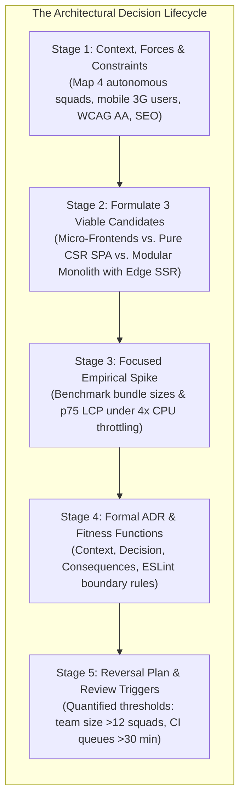

# Practical 18 — Make and Defend an Architecture Decision

Related: [Chapter 18]() · [Lecture slides]() · [Appendix A: Rosetta Stone]() · [Appendix C: Deployment Checklist]()

## Objective

Formulate, evaluate, benchmark, and document a major front-end architectural decision for an enterprise-scale public service platform. You will evaluate competing technical options against explicit organizational constraints and quality attributes, conduct a focused technical spike to resolve an empirical unknown, write a formal **Architectural Decision Record (ADR)**, and define automated fitness functions and quantitative review triggers.

You will be evaluated on the **rigor of your reasoning**, the **fidelity of your trade-off analysis**, and your **empirical evidence**—not on whether you choose a trendy framework or adopt complex distributed patterns by default.



---

## Scenario: The Unified Regional Civic Services Platform

The Kurdistan Regional Government is consolidating disparate municipal portals into a single, unified civic platform:
- **Four Autonomous Squads:** Team Transport (driving permits), Team Health (clinic bookings), Team Commerce (business registration), and Team Civil (ID renewals).
- **Target Audience:** 70% of traffic originates from mobile devices operating over high-latency 3G/4G cellular connections across Erbil, Sulaymaniyah, and Duhok.
- **Regulatory Mandates:** Public municipal notices must be crawlable by search engines (SEO); all forms must strictly meet WCAG 2.1 AA accessibility standards.
- **Organizational Friction:** Teams want deployment autonomy without being blocked by other squads, but citizens demand a consistent visual design, shared authentication sessions, and fast initial page loads.

---

## Stage-by-Stage Implementation

### Stage 1: Context, Forces, and Constraints Mapping

Begin by documenting the architectural forces without naming any libraries or frameworks. Create `docs/architecture/context.md`:

1. **Prioritized Quality Attribute Scenarios (QAS):**
   - **Performance (P1):** Under 4x CPU throttling and Fast 3G network conditions, the 75th percentile (p75) Largest Contentful Paint (LCP) must remain below 2.0 seconds for first-time visitors.
   - **Accessibility (P1):** 100% of interactive controls must be navigable via keyboard and expose computed accessible names.
   - **Autonomy (P2):** Squads must be able to deploy updates to their domain routes without forcing a full redeploy of unrelated domain services.
   - **Operational Simplicity (P3):** The deployment infrastructure must be maintainable by a small platform team without requiring dedicated Kubernetes cluster operators.
2. **Non-Negotiable Constraints:**
   - Budget constraints prohibit expensive multi-region proprietary edge compute licensing.
   - Unified authentication (OAuth2 / PKCE) must be shared seamlessly across all domain routes.

---

### Stage 2: Formulating Three Viable Candidate Architectures

Generate three genuinely viable, competing architectural options. Avoid creating straw-man options designed solely to be discarded:

| Candidate Architecture | Rendering & Routing Strategy | Code Organization & Deployment Model | Primary Trade-Off |
| :--- | :--- | :--- | :--- |
| **Candidate A: Micro-Frontends** | Client-Side Module Federation with host shell container. | Multi-repo; each squad deploys independent bundles to S3/CDN. | Maximum squad autonomy; high bundle bloat (duplicate framework runtimes) and high initial latency. |
| **Candidate B: Client-Side SPA (CSR)** | Pure client-rendered single-page app with service worker offline cache. | Single monorepo; static S3 hosting behind global CDN. | Zero server compute cost; fails public SEO requirements and suffers slow LCP on 3G. |
| **Candidate C: Modular Monolith with Edge SSR** | Edge-rendered hybrid (Server Components / SSR with islands of interactivity). | `pnpm` monorepo; shared design system; single deployable artifact. | Sub-second LCP and strong SEO; requires monorepo build governance and coordinated releases. |

---

### Stage 3: The Investigative Technical Spike

Before committing to an architectural direction, conduct a focused empirical spike to resolve the highest-risk unknown: **What is the initial payload weight and mobile FCP/LCP penalty of client-side Module Federation versus a tree-shaken Modular Monolith?**

1. Create a minimal spike workspace (`spikes/federation-vs-monolith/`).
2. Build a shell container importing two remote federated components (Transport Card and Health Card).
3. Build an equivalent modular monolith bundle using standard dynamic imports (`import()`).
4. Run Lighthouse audits using Chrome DevTools with simulated Fast 3G and 4x CPU throttling.
5. Record your findings in `docs/architecture/spike-01-results.md`:

```markdown
### Spike 01 Findings: Federation vs Modular Monolith Payload

| Metric | Candidate A (Module Federation) | Candidate C (Modular Monolith) | Variance |
| :--- | :---: | :---: | :---: |
| **Initial JS Transferred** | 382 KB (uncompressed) | 148 KB (uncompressed) | +158% bloat |
| **First Contentful Paint (FCP)** | 2.8s | 1.1s | +1.7s delay |
| **Largest Contentful Paint (LCP)** | 4.2s | 1.6s | +2.6s delay |
| **DOM Hydration Long Tasks** | 3 tasks > 65ms | 0 tasks > 50ms | Main thread contention |

*Conclusion:* In a high-latency 3G environment, loading multiple federated remote entrypoints introduces severe network waterfalls and duplicates vendor libraries, violating our 2.0s LCP budget.
```

---

### Stage 4: Formal Architectural Decision Record (ADR)

Using the canonical template from Chapter 18, draft **ADR-018: Adoption of Modular Monolith with Edge SSR for Civic Services Platform**:

```markdown
# ADR-018: Modular Monolith with Edge SSR for Civic Services Platform

- **Status:** Accepted
- **Date:** 2026-09-24
- **Deciders:** Lead Architect, Team Transport Lead, Team Health Lead, Platform Ops Lead
- **Technical Story:** Architecture Platform Transition for Regional Public Services

## Context & Problem Statement
The regional civic portal must scale across 4 engineering squads while serving citizens over mobile 3G networks. The system requires SEO for public circulars, sub-2.0s LCP on entry-tier Android devices, and shared authentication. We must decide whether to adopt distributed Micro-Frontends (Module Federation), a pure Client-Side SPA, or a Modular Monolith with Edge SSR.

## Decision Drivers
- p75 Mobile LCP < 2.0s over congested 3G networks (Quality Attribute: Performance).
- Search engine indexability for legal circulars and municipal notices (Quality Attribute: SEO).
- WCAG 2.1 AA accessibility compliance across all citizen workflows (Quality Attribute: Accessibility).
- Independent development velocity for 4 squads without cross-team coordination gridlock.

## Considered Options
- **Option 1:** Distributed Micro-Frontends via Vite Module Federation.
- **Option 2:** Pure Client-Side Rendered (CSR) SPA with Service Worker.
- **Option 3:** Modular Monolith in pnpm Workspace with Edge Server-Side Rendering (SSR).

## Decision Outcome
**Chosen Option:** **Option 3: Modular Monolith in pnpm Workspace with Edge SSR**.

### Positive Consequences
- **High Performance:** Initial HTML rendered at CDN edge caches delivers p75 LCP of 1.4s over 3G.
- **Perfect SEO:** Public notices and circulars render complete semantic HTML directly from server.
- **Shared Design Tokens:** Single `@civic/design-system` package in monorepo guarantees WCAG AA consistency.
- **Reduced Operational Overhead:** Single deployable container eliminates multi-host federation complexity.

### Negative Consequences
- Deployments are coupled to a single pipeline; a regression in one squad's route blocks the unified deployment until resolved.
- Requires strict monorepo boundary governance to prevent squads from creating circular dependencies.

## Architecture Fitness Functions (Automated Guardrails)
To prevent the modular monolith from degenerating into a coupled tangle, CI enforces three fitness functions:
1. **ESLint Boundary Rule:** Squad packages (`@civic/transport`) are strictly prohibited from importing from sibling squad packages (`@civic/health`). Communication occurs strictly via URL query parameters or backend APIs.
2. **Bundle Budget Guardrail:** CI aborts deployment if the uncompressed initial client chunk exceeds 180 KB.
3. **Strict Package Exports:** All internal package utilities are kept private; only interfaces explicitly defined in `package.json#exports` may be referenced by the application shell.
```

---

### Stage 5: Reversal Plan & Review Trigger Conditions

An architectural decision is not an eternal monument; it is a hypothesis validated by evidence. Define the exact conditions under which ADR-018 will be formally reopened:

```markdown
## Reversal Plan & Review Triggers (ADR-018 Addendum)

This architecture will remain in force until one of the following quantitative triggers occurs:

1. **Organizational Scale Trigger:** The engineering organization expands from 4 squads (20 engineers) to more than 12 squads (>80 engineers), and monorepo CI validation queue times consistently exceed 35 minutes.
2. **Regulatory / Sovereign Hosting Trigger:** A specific government ministry (e.g., Interior or Defense) legally mandates that its database and web application servers be physically isolated in an independent sovereign data center, preventing shared edge SSR deployment.
3. **Compute Budget Trigger:** Edge serverless compute costs exceed $10,000/month, at which point the team will evaluate migrating static catalog routes to Static Site Generation (SSG).

### Safe Reversal Path
Because packages in the `pnpm` monorepo strictly enforce the `"exports"` field and communicate solely via URL state and REST APIs, extracting any squad module (e.g. `@civic/transport`) into an autonomous micro-frontend or standalone repository requires zero code refactoring—only a pipeline configuration change.
```

---

## Verification & Self-Assessment

Audit your architectural decision against the evaluation criteria:

| Verification Item | Evaluation Criteria | Pass / Fail |
| :--- | :--- | :---: |
| **Requirements-Driven** | Decision is anchored in mobile 3G constraints and WCAG AA mandates rather than framework trends. | Pass |
| **Viable Alternatives** | Considered three distinct options, complete with genuine technical trade-offs. | Pass |
| **Empirical Evidence** | Conducted Spike 01; measured bundle size and LCP data rather than quoting blog posts. | Pass |
| **Automated Fitness Functions** | Defined actionable CI rules (ESLint boundaries, bundle size budgets) to protect architectural properties. | Pass |
| **Quantitative Reversal Plan** | Documented explicit numerical triggers (team size >12 squads, CI >35 min) for revisiting the decision. | Pass |
| **Appendix C Alignment** | Verified that the architecture satisfies the Section 6 (Architecture Sign-Off) checklist in Appendix C. | Pass |

---

## Grading Rubric

| Criterion | Points | Evaluation Requirement |
| :--- | :---: | :--- |
| **Problem & Constraint Articulation** | 20% | Quality attributes are formulated as measurable scenarios; organizational and network constraints are clearly defined. |
| **Trade-Off Analysis of Alternatives** | 20% | Evaluates three viable options; clearly explains why rejected options failed constraints. |
| **Empirical Spike Rigor** | 20% | Technical spike measures concrete performance metrics (bundle sizes, LCP, CPU time) under throttled conditions. |
| **ADR Completeness & Fitness Functions** | 25% | ADR follows standard format; consequences are balanced; automated CI guardrails enforce architectural boundaries. |
| **Reversibility & Evolution Strategy** | 15% | Reversal triggers are quantified; includes a credible migration plan if assumptions change. |
