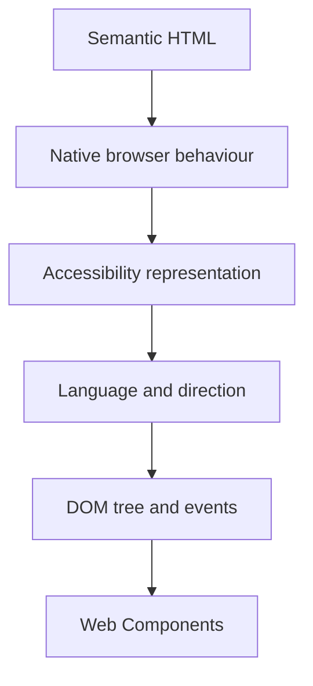
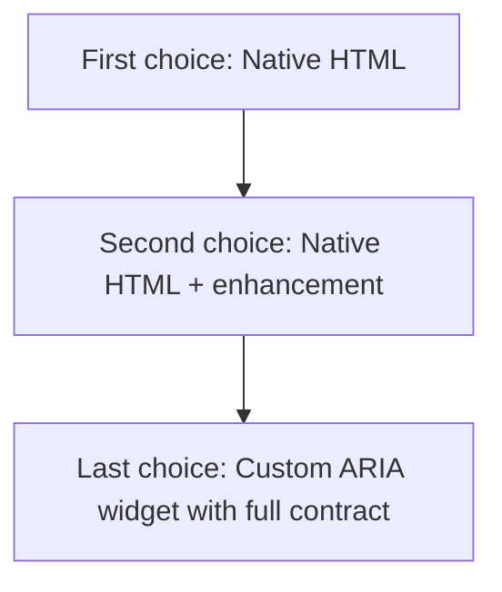
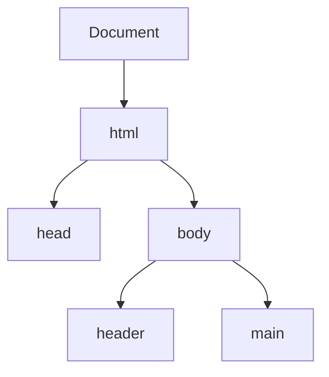
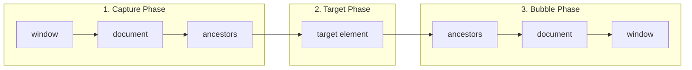

# Semantic HTML, Accessibility, Internationalization & the DOM

Meaningful structure, inclusive interaction, and the browser's live document tree

**Chapter 2**

Polla Fattah

---

## Today's goal

Build a mental model in which one document is shared by:

- the browser;
- keyboard users;
- assistive technologies;
- JavaScript;
- search and other software.

The goal is not to memorise tags. It is to choose structure, behaviour, language,
and DOM operations deliberately.

---

## By the end of today you can

- choose HTML for **meaning and behaviour**, not default appearance;
- structure a page with headings and landmarks;
- explain accessible names, focus order, labels, and errors;
- use native controls before inventing ARIA widgets;
- distinguish language from writing direction;
- query, traverse, create, and update DOM nodes safely;
- explain event propagation and delegation;
- describe where Web Components fit without replacing semantic HTML.

---

## The chapter's single model



These are not separate tricks. They are different views of the same interface
model.

---

## A running example: a public-service portal

We will imagine a multilingual service interface with:

- a site header and primary navigation;
- a page explaining one service;
- a request form;
- a table of existing requests;
- a status filter;
- Arabic and English content;
- a small custom element where a reusable boundary is useful.

The interface will remain understandable before JavaScript enhances it.

---

## HTML describes meaning, not appearance

These fragments may look similar after CSS:

```html
<div class="heading">Service Requests</div>
<div class="navigation">
  <div class="link">Home</div>
  <div class="link">Requests</div>
</div>
```

But the browser cannot infer the intended roles reliably.

---

## Prefer the meaningful structure

```html
<h1>Service Requests</h1>

<nav aria-label="Primary">
  <a href="/">Home</a>
  <a href="/requests">Requests</a>
</nav>

<main>
  <!-- the page's primary content -->
</main>
```

The second version identifies headings, navigation, links, and main content
without requiring a stylesheet or a JavaScript guess.

---

## One durable rule

> **Choose HTML according to meaning and behaviour before styling it according to appearance.**

HTML answers:

```text
What is this?
```

CSS answers:

```text
How should it look?
```

JavaScript answers only the behaviour that needs application logic.

---

## Build a document hierarchy

```html
<body>
  <header>...</header>
  <nav aria-label="Primary">...</nav>
  <main>
    <h1>Citizen Services</h1>
    <section>
      <h2>Request a document</h2>
    </section>
  </main>
  <footer>...</footer>
</body>
```

The hierarchy should make sense if all styling disappears.

---

## Headings are content structure

Use heading levels to represent relationships:

```html
<h1>Citizen Services</h1>
  <h2>Request a document</h2>
    <h3>Required information</h3>
  <h2>Existing requests</h2>
```

Do not choose `<h3>` because its default font size looks convenient.

---

## There is no automatic outline rescue

Do not assume that nested sections automatically create a perfect heading
outline for every tool.

Make the heading hierarchy explicit:

- one clear page-level `<h1>`;
- meaningful `<h2>` regions;
- `<h3>` only when a subsection belongs to the preceding `<h2>`;
- no skipped levels just for visual size.

Use CSS for size. Use headings for structure.

---

## Landmarks give the page a map

| Element | Meaning |
|---|---|
| `<header>` | Introductory content for the page or section |
| `<nav>` | A group of navigation links |
| `<main>` | The page's primary content |
| `<footer>` | Closing information for the page or section |
| `<aside>` | Related content, not the main flow |

Landmarks help users and tools move through a large interface.

---

## `<main>` and `<nav>`

There should normally be one primary `<main>` for the page.

Give multiple navigation regions useful names:

```html
<nav aria-label="Primary">...</nav>
<nav aria-label="Service sections">...</nav>
<nav aria-label="Breadcrumb">...</nav>
```

The label distinguishes regions that would otherwise all be announced as
navigation.

---

## `<header>`, `<footer>`, and `<aside>`

These elements are contextual:

```html
<article>
  <header><h2>Request status</h2></header>
  <p>...</p>
  <aside>Last updated yesterday</aside>
  <footer>Source: service desk</footer>
</article>
```

They are meaningful when their content has the corresponding relationship;
they are not decorative wrappers to use everywhere.

---

## `<section>` and `<article>`

Use `<section>` for a thematic region that normally has a heading.

Use `<article>` for content that could stand on its own or be reused:

```html
<section aria-labelledby="requests-title">
  <h2 id="requests-title">Existing requests</h2>
  <article>Request #1042</article>
  <article>Request #1043</article>
</section>
```

If a generic container has no semantic purpose, `<div>` is the honest choice.

---

## Lists carry relationships

Use list elements when the content is a list:

```html
<ul>
  <li>Proof of identity</li>
  <li>Proof of address</li>
</ul>
```

Do not build a list from paragraphs and line breaks merely because CSS will
make it look like one.

---

## Tables carry data relationships

```html
<table>
  <caption>Existing service requests</caption>
  <thead>
    <tr><th scope="col">Reference</th><th scope="col">Status</th></tr>
  </thead>
  <tbody>
    <tr><td>1042</td><td>In review</td></tr>
  </tbody>
</table>
```

The caption and header relationships make the data understandable outside the
visual grid.

---

## Figures, captions, and media

```html
<figure>
  
  <figcaption>Available service centres.</figcaption>
</figure>
```

An image's alternative text describes its purpose in context. Decorative
images may use an empty `alt=""`; omitting `alt` is not the same decision.

---

## Native controls are behaviour with a contract

Native elements bring established behaviour:

```html
<button type="button">Show request details</button>
<a href="/requests/1042">Open request 1042</a>
<input type="checkbox" name="urgent" id="urgent">
<details><summary>More information</summary>...</details>
```

The browser, keyboard, accessibility APIs, and form system already understand
these controls.

---

## Buttons perform actions; links navigate

```html
<!-- Changes state on this page -->
<button type="button" data-action="filter">Filter</button>

<!-- Takes the user to another resource -->
<a href="/requests/1042">View request</a>
```

Do not use a clickable `<div>` when a button or link expresses the real job.

---

## The clickable `<div>` problem

This creates a visual imitation, not a complete control:

```html
<div class="button" onclick="openDialog()">Open</div>
```

It lacks, unless you recreate them correctly:

- keyboard activation;
- focusability;
- the button role;
- disabled semantics;
- expected browser behaviour;
- a reliable accessible name.

Start with `<button>` and style it.

---

## The accessibility tree is not the DOM tree

The browser uses the DOM and other information to expose an accessibility
representation.

Assistive technology may receive:

```text
button: Submit request
heading level 1: Citizen Services
navigation: Primary
textbox: Email address
```

Good structure gives the browser useful information to expose.

---

## Accessible names answer “what is this?”

Controls need names users can perceive through their chosen interface:

```html
<label for="email">Email address</label>
<input id="email" name="email" type="email">
```

Visible labels are usually the strongest starting point. Placeholder text is a
hint and should not replace a label.

---

## Name icon-only controls deliberately

```html
<button type="button" aria-label="Close request details">
  <span aria-hidden="true">×</span>
</button>
```

The icon is visual decoration. The accessible name communicates the action.

Prefer visible text when space allows; it helps every user, not only screen
reader users.

---

## Keyboard interaction is part of the interface

Ask these questions for every interactive feature:

- Can the user reach it with the keyboard?
- Is the focus order logical?
- Is the focus indicator visible?
- Can the user operate it without a pointer?
- Does focus move somewhere sensible after a state change?

Accessibility is interaction design, not a final inspection step.

---

## Focus order follows the interface's meaning

Avoid using positive `tabindex` values to force an artificial order.

Prefer:

- meaningful document order;
- native controls;
- a visible focus style;
- a small, deliberate focus-management rule only when a component requires it.

If the DOM order is wrong, CSS reordering does not repair the reading or
keyboard model.

---

## Forms are an accessibility system

```html
<form>
  <label for="reference">Reference number</label>
  <input id="reference" name="reference" required>
  <button type="submit">Find request</button>
</form>
```

The form needs a relationship between label, control, name, value, validation,
and error feedback.

---

## Native validation is useful information

```html
<label for="email">Email address</label>
<input id="email" name="email" type="email" required>
```

Native constraints can provide a baseline. If JavaScript adds custom errors,
it must preserve a clear message, association, and recovery path.

Do not make invalid state visible only through colour.

---

## Group related controls

```html
<fieldset>
  <legend>Preferred contact method</legend>
  <label><input type="radio" name="contact" value="email"> Email</label>
  <label><input type="radio" name="contact" value="phone"> Phone</label>
</fieldset>
```

`fieldset` and `legend` communicate the group relationship that a visual box
alone cannot provide.

---

## Associate errors with the control

```html
<label for="phone">Phone number</label>
<input id="phone" aria-describedby="phone-error" aria-invalid="true">
<p id="phone-error">Enter a phone number including the area code.</p>
```

The error should explain what is wrong and how to fix it. Do not only add a red
border and expect the user to infer the problem.

---

## ARIA adds semantics only when HTML cannot

ARIA can describe a custom interaction, but it does not automatically create
the keyboard behaviour, focus management, state changes, or event handling.



---

## ARIA can make good HTML worse

Do not add roles that contradict the element's real meaning:

```html
<button role="heading">Submit</button>
```

The role does not repair a confused design. Use the element that expresses the
job, then add only the missing semantic information.

---

## Language begins in the document

```html
<html lang="en">
```

For a passage in another language:

```html
<p lang="ar">مرحباً بكم في خدمات المواطنين</p>
```

Language metadata supports pronunciation, hyphenation, spell checking,
translation, search, and assistive technology decisions.

---

## Language and direction are different

`lang` identifies the language. `dir` identifies the writing direction.

```html
<p lang="ar" dir="rtl">خدمات المواطنين</p>
<p lang="en" dir="ltr">Citizen services</p>
```

Arabic does not mean every surrounding interface region must be permanently
right-aligned. Direction belongs to the text and layout context.

---

## Direction can be automatic

```html
<p dir="auto">User-entered text appears here.</p>
```

`dir="auto"` lets the browser infer direction from the first strong character.
It is useful for unknown user content, but explicit direction is better when
the application knows the language and layout contract.

---

## Bidirectional text needs isolation

User-generated text can contain characters with different directionality.

```html
<p>
  Ticket reference: <bdi>{{ reference }}</bdi>
</p>
```

Use `<bdi>` when embedded user text should not disturb the surrounding order.
Use `<bdo dir="rtl">...</bdo>` only when deliberately overriding direction.

---

## RTL is not “mirror everything”

RTL-aware design considers:

- text direction;
- logical properties such as `margin-inline-start`;
- icon meaning;
- navigation order;
- tables and numbers;
- mixed-language content;
- focus and reading order.

Do not replace every left value with right and call the interface localized.

---

## The DOM is a live tree

HTML is the source representation. The DOM is the browser's live object tree.



JavaScript reads and changes this live tree. It does not edit the original
Markdown or HTML source file.

---

## Nodes and elements are related

The DOM contains different node types:

- document nodes;
- element nodes;
- text nodes;
- comment nodes.

An element is a node, but not every node is an element. APIs such as
`children`, `childNodes`, `parentElement`, and `textContent` expose different
views of that tree.

---

## Query the DOM precisely

```js
const form = document.querySelector('[data-service-form]');
const fields = form.querySelectorAll('input, select, textarea');
```

Use stable, meaningful selectors. Check whether a query can return `null`, and
avoid assuming that a selector matched the element you intended.

`querySelector()` returns the first match. `querySelectorAll()` returns a
static NodeList of all matches.

---

## Traverse relationships deliberately

```js
const row = event.target.closest('tr[data-request-id]');
const requestId = row?.dataset.requestId;
```

Useful relationships include:

- `parentElement`;
- `children`;
- `nextElementSibling`;
- `closest()`;
- `matches()`.

Traversal should express the component boundary, not depend on fragile visual
nesting.

---

## Create and insert elements safely

```js
const message = document.createElement('p');
message.textContent = userMessage;
message.className = 'status-message';
container.append(message);
```

Prefer `textContent` for untrusted text. Do not use `innerHTML` as a convenient
string formatter when the value may contain user or remote data.

---

## Attributes and properties are connected, not identical

```js
checkbox.setAttribute('aria-checked', 'true');
checkbox.checked = true;
```

Attributes are markup-facing values. Properties are live JavaScript-facing
state. Boolean controls make the distinction especially visible:

```js
checkbox.defaultChecked // initial value
checkbox.checked        // current live value
```

---

## Events connect users to the DOM

```js
button.addEventListener('click', (event) => {
  submitRequest();
});
```

Events carry an interaction through a tree. Understanding that path is more
reliable than attaching random handlers until the interface appears to work.

---

## Event propagation has phases



The event can be observed at different points in the path. This is why a
parent can respond to an interaction that occurred on a child.

---

## `target` and `currentTarget` differ

```js
list.addEventListener('click', (event) => {
  console.log(event.target);        // where it started
  console.log(event.currentTarget); // this listener's element
});
```

Confusing these values is a common source of bugs in delegated interfaces.

---

## Default actions and propagation are different

```js
link.addEventListener('click', (event) => {
  event.preventDefault(); // cancel navigation
  event.stopPropagation(); // stop this event moving farther
});
```

`stopPropagation()` does not cancel the browser's default action. Use each
operation only for the problem it solves.

---

## Event delegation scales repeated UI

```js
table.addEventListener('click', (event) => {
  const button = event.target.closest('[data-action="cancel"]');
  if (!button) return;
  cancelRequest(button.dataset.requestId);
});
```

One listener can handle current and future matching descendants. The handler
must still validate the target and preserve keyboard-accessible controls.

---

## Put the public-service interface together

```html
<html lang="en">
  <body>
    <header>...</header>
    <nav aria-label="Primary">...</nav>
    <main>
      <h1>Citizen Services</h1>
      <section aria-labelledby="form-title">...</section>
      <section aria-labelledby="table-title">...</section>
    </main>
    <footer>...</footer>
  </body>
</html>
```

Now add language metadata, labels, native controls, meaningful table headers,
and safe DOM updates before adding custom interaction.

---

## Web Components extend HTML

Web Components provide browser-native mechanisms for reusable boundaries:

- **Custom elements** define a new element name;
- **Shadow DOM** can isolate internal markup and styles;
- **Slots** allow controlled content insertion.

They are tools for encapsulation, not a reason to discard document meaning.

---

## A custom element still needs a contract

```js
class RequestStatus extends HTMLElement {
  connectedCallback() {
    this.textContent = this.getAttribute('status') ?? 'Unknown';
  }
}

customElements.define('request-status', RequestStatus);
```

The element needs clear inputs, output meaning, lifecycle behaviour, and an
accessibility story. Encapsulation does not make an interface accessible by
itself.

---

## Shadow DOM is not a security boundary

Shadow DOM can hide implementation details and scope styles.

It does not automatically provide:

- security isolation;
- an accessible name;
- keyboard behaviour;
- correct focus management;
- a good component API.

Treat it as an encapsulation mechanism, not a trust boundary.

---

## Slots preserve controlled composition

```html
<request-card>
  <span slot="status">In review</span>
</request-card>
```

Slots allow consumers to provide content to named insertion points. The
component still owns the surrounding semantics and must define how slotted
content participates in the accessible interface.

---

## The component should not erase the document

Good component design preserves:

- meaningful HTML where native elements already work;
- accessible names and labels;
- predictable keyboard behaviour;
- language and direction metadata;
- a clear DOM and event contract.

Web Components are an extension point, not a replacement for semantic HTML.

---
## Misconceptions to leave behind (Part 1)

| Misconception | Better model |
|---|---|
| “If it looks like a heading, it is a heading.” | Meaning comes from the element and structure. |
| “A `<div>` can replace any element.” | Native elements bring behaviour and semantics. |
| “ARIA makes custom controls accessible.” | ARIA describes; code must implement interaction. |
| “Placeholder text is a label.” | Use a real label and associate it with the control. |
---
## Misconceptions to leave behind (Part 2)

| Misconception | Better model |
|---|---|
| “RTL means align everything right.” | Direction, layout, icons, and mixed text need separate decisions. |
| “DOM means HTML.” | HTML is source; the DOM is the live runtime tree. |
| “`stopPropagation()` prevents navigation.” | Default actions and propagation are different. |
| “Shadow DOM is security.” | Shadow DOM is encapsulation, not isolation. |
---

## The practical lab

Build a **semantic multilingual service interface**.

The runnable code will be in the separate Playground repository. This deck
provides the learning sequence and the current repository provides the
instructions.

---

## Practical stages 1–3: structure and meaning

1. Create the document hierarchy with `header`, `nav`, `main`, and `footer`.
2. Add meaningful headings, sections, articles, lists, a figure, and a table.
3. Build a request form with labels, native controls, a fieldset, and a legend.

Check that the page still communicates its structure without CSS.

---

## Practical stages 4–6: interaction and language

4. Test the interface with keyboard-only navigation.
5. Add English and Arabic content with correct `lang` and `dir` values.
6. Inspect the accessibility representation and repair missing names or relationships.

Do not treat a passing visual inspection as an accessibility test.

---

## Practical stages 7–10: DOM and components

7. Query and update the DOM with safe text insertion.
8. Add event delegation for repeated request rows.
9. Create a small Web Component with an explicit contract.
10. Draw the final architecture and identify what remains native HTML.

The exercise is complete when the component boundary is explainable, not merely
when the screen looks correct.

---

## Try it yourself

Choose one interface feature and review it in four views:

1. What does the raw HTML say?
2. What does the keyboard user experience?
3. What name and role does assistive technology receive?
4. What does the DOM event path do when the user interacts?

Write one improvement that helps at least two of these views at once.

---

## Troubleshooting questions

| Symptom | First question |
|---|---|
| The control cannot be reached | Is it a native interactive element? |
| The label is not announced | Is the label associated with the control? |
| The Arabic text changes layout unexpectedly | Are language and direction declared at the right boundary? |
| The delegated handler does nothing | What are `target` and `currentTarget`? |
| Text displays unexpectedly as markup | Did code use `innerHTML` where `textContent` was needed? |
| The custom element is confusing | What is its semantic and accessibility contract? |

Change one thing at a time and inspect the actual DOM after each change.

---

## Completion check

- I can choose semantic elements without relying on their default styles.
- I can describe the page using landmarks and a heading hierarchy.
- Every form control has a meaningful accessible name.
- I can use the keyboard through the interface and see focus.
- I can distinguish `lang` from `dir` and handle mixed-direction text.
- I can query and update the DOM without unsafe string insertion.
- I can explain event propagation, default actions, and delegation.
- I can describe what Web Components add and what they do not guarantee.
- I completed the Chapter 2 practical in the companion Playground.

---

# Next: Modern CSS Architecture & Layout Systems

Chapter 3: the cascade, layout systems, responsive design, container queries,
layers, design tokens, and the difference between visual flexibility and
structural chaos.

**Modern Front-End Engineering**
