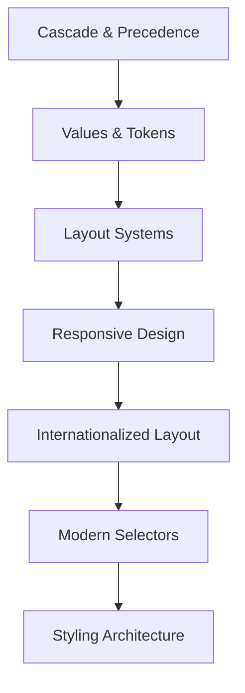
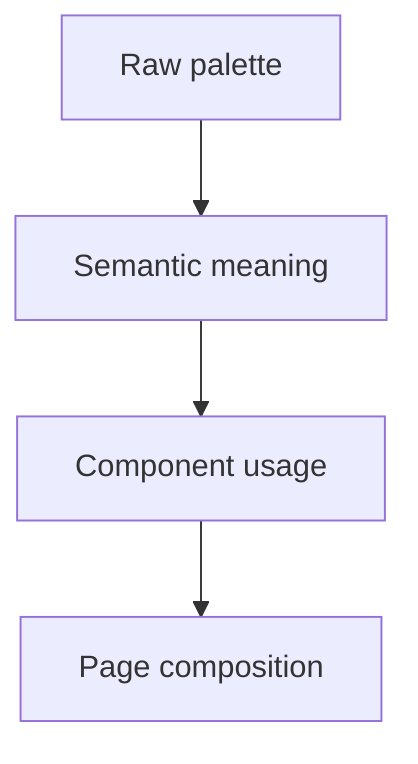
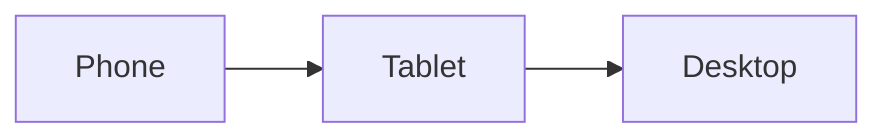
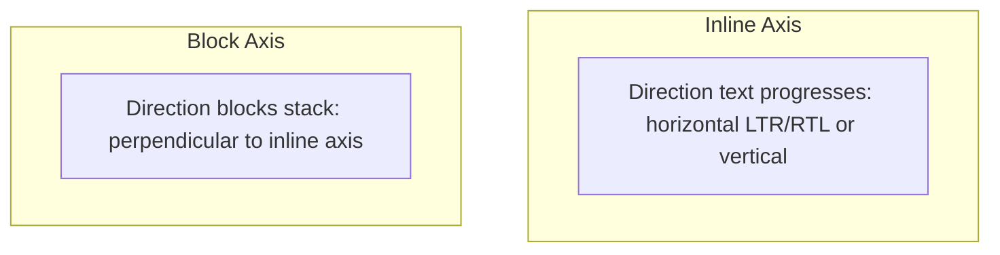
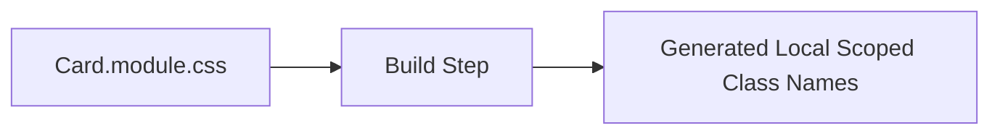
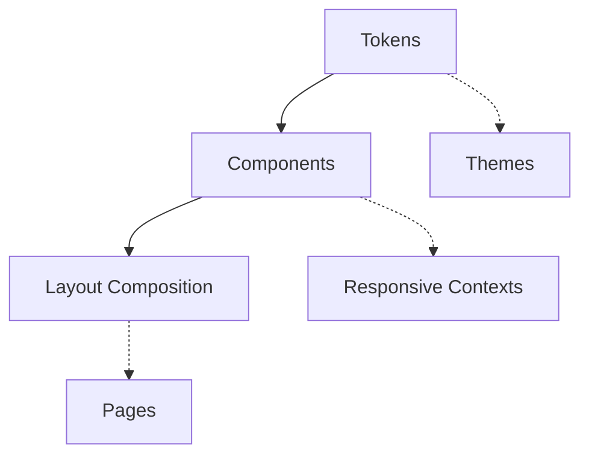

# Modern CSS Architecture & Layout Systems

From cascade decisions to responsive, internationalized component systems

**Chapter 3**

Polla Fattah

---

## Today's goal

Stop treating CSS as a collection of visual fixes.

Today we will use CSS as:

- a **precedence system**;
- a **value and token system**;
- a **layout system**;
- a **responsive system**;
- an **internationalization system**;
- and an **architecture for change**.

---

## By the end of today you can

- explain why a CSS declaration wins or loses;
- use cascade layers to control ownership;
- distinguish raw tokens from semantic tokens;
- choose normal flow, Flexbox, Grid, or positioning intentionally;
- use intrinsic sizing, `minmax()`, `clamp()`, and `subgrid`;
- distinguish viewport responsiveness from container responsiveness;
- build direction-independent layouts with logical properties;
- use modern selectors without creating specificity traps;
- compare plain CSS, CSS Modules, utility CSS, and CSS-in-JS by problem;
- design a responsive multilingual catalogue without JavaScript measurement.

---

## CSS is a system, not decoration

A dashboard must answer architectural questions:

- What happens when the page narrows?
- What happens when a card moves into a narrow sidebar?
- How do cards align when descriptions have different lengths?
- How do long translations affect the layout?
- Which rule wins when a library and the application disagree?
- How can one design decision update the whole interface?

These are system-design questions expressed through CSS.

---

## The chapter's progression



The goal is not to memorise properties. It is to make CSS behaviour
predictable enough to change safely.

---

## The cascade is the foundation

```html
<button class="action primary">Submit request</button>
```

```css
button  { background: gray; }
.action { background: blue; }
.primary { background: green; }
```

The cascade decides which declaration supplies the final value.

The answer is not always “the last rule”.

---

## Why declarations compete

Candidate declarations may differ by:

1. origin and importance;
2. cascade layer;
3. specificity;
4. scope or proximity where relevant;
5. source order.

The useful question is:

> **Why did this declaration win?**

That question is more valuable than memorising a score.

---

## Browser, user, and author styles

The page starts with more than our stylesheet:

- the browser supplies user-agent styles;
- users may supply preferences or styles;
- the author supplies application styles.

An unstyled `<h1>` is already bold, large, and separated from nearby text.

Author CSS is not the only styling authority. This matters especially for
accessibility preferences and `!important` declarations.

---

## Inheritance is an architectural tool

```css
body {
  color: #222;
  font-family: system-ui, sans-serif;
}
```

Descendant text normally receives these values without repeating them on every
element.

Properties such as `color` and `font-family` commonly inherit. Properties such
as `margin`, `padding`, `border`, and `width` normally do not.

Use inheritance for broad design decisions, then override at meaningful
boundaries.

---

## Specificity is not a quality ranking

```css
.card h2 { color: navy; }

#dashboard .card h2.title {
  color: purple;
}
```

The second selector is harder to override, but that does not make it better.

High specificity increases the cost of future changes.

Prefer a selector that is easy to reason about and easy to replace.

---

## Do not reduce specificity to arithmetic alone

Specificity is one stage in the cascade, not the entire cascade.

Before comparing selectors, ask:

- Are both declarations in the same origin?
- Are they in the same layer?
- Is one declaration important?
- Is a scoped rule involved?
- Only then: which selector is more specific?

The browser is resolving a precedence system, not grading CSS style.

---

## Source order is the final tie-breaker

```css
.notice { color: blue; }
.notice { color: green; }
```

When the earlier cascade stages tie, the later declaration wins.

Source order is useful for intentional overrides. It is dangerous when a
stylesheet becomes a sequence of unexplained patches.

---

## Cascade layers make ownership explicit

```css
@layer reset, base, components, utilities;

@layer reset { /* normalize browser differences */ }
@layer base { /* element defaults and typography */ }
@layer components { /* cards, forms, navigation */ }
@layer utilities { /* small explicit overrides */ }
```

The layer order is declared once. A later layer can win without requiring an
increasingly specific selector.

---

## Layer precedence comes before specificity

```css
@layer base {
  #app .button { color: blue; }
}

@layer components {
  button { color: green; }
}
```

The simple selector in the later `components` layer can win over the highly
specific selector in the earlier `base` layer.

This lets architecture control precedence before selector complexity grows.

---

## A practical layer architecture

```css
@layer reset, tokens, base, components, utilities, overrides;
```

Possible ownership:

| Layer | Responsibility |
|---|---|
| `reset` | predictable browser baseline |
| `tokens` | custom properties and theme values |
| `base` | elements, typography, document defaults |
| `components` | reusable UI boundaries |
| `utilities` | small intentional helpers |
| `overrides` | explicit application exceptions |

The names matter less than the stable ownership contract.

---

## Custom properties participate in the cascade

```css
:root {
  --color-accent: #1464a0;
}

.button {
  background: var(--color-accent);
}
```

Custom properties are live CSS values. They inherit, cascade, and can be
overridden by component or theme boundaries.

They are more powerful than text replacement.

---

## Custom properties can represent decisions

```css
.card {
  --card-gap: 1rem;
  gap: var(--card-gap);
}

.card--compact {
  --card-gap: 0.5rem;
}
```

The component keeps one layout rule. A meaningful boundary changes the value.

This is different from searching and replacing every `1rem` in a project.

---

## Raw tokens and semantic tokens

Raw token:

```css
--blue-600: #1464a0;
```

Semantic token:

```css
--color-action-primary: var(--blue-600);
```

Components should usually consume semantic meaning. If the brand palette
changes, the component should not need to know the replacement colour.

---

## Token ownership has direction



Avoid letting a component reach backward into arbitrary raw palette values.

Stable semantic names reduce the blast radius of visual change.

---

## Theming with custom properties

```css
:root {
  --surface-page: #ffffff;
  --text-primary: #172a42;
}

[data-theme="dark"] {
  --surface-page: #0c2238;
  --text-primary: #f5f7fa;
}

body {
  background: var(--surface-page);
  color: var(--text-primary);
}
```

The component stays attached to meaning. The theme changes the values.

---

## Start with normal flow

Normal flow is the layout system already provided by the browser.

```html
<main>
  <h1>Catalogue</h1>
  <p>Results appear below the heading.</p>
  <ul>...</ul>
</main>
```

Let content determine height and let blocks participate in the document before
reaching for positioning.

---

## Positioning changes the relationship

```css
.badge {
  position: absolute;
  inset-block-start: 0.5rem;
  inset-inline-end: 0.5rem;
}
```

Absolute positioning can be correct for a badge anchored to a card. It is a
poor replacement for a page layout system when content can grow or translate.

Use fixed and sticky positioning with equally explicit viewport and scrolling
assumptions.

---

## Flexbox is one-dimensional

Use Flexbox when items are primarily arranged along one main axis:

```css
.toolbar {
  display: flex;
  align-items: center;
  justify-content: space-between;
  gap: 1rem;
}
```

The main axis follows `flex-direction`. The cross axis is perpendicular to it.

---

## Main axis and cross axis

```css
.toolbar {
  display: flex;
  flex-direction: row;
}
```

For a row:

- the main axis is inline/horizontal in the usual LTR case;
- the cross axis is block/vertical.

Use `justify-content` for main-axis distribution and `align-items` for
cross-axis alignment. Always consider writing direction before describing an
axis as “left” or “right”.

---

## Flex sizing is not just alignment

```css
.toolbar__search {
  flex: 1 1 20rem;
  min-inline-size: 0;
}
```

Flex sizing considers:

- the flex basis;
- grow and shrink factors;
- available free space;
- minimum sizes;
- intrinsic content size.

`min-inline-size: 0` can be necessary when a flexible child must be allowed to
shrink rather than force overflow.

---

## Grid is two-dimensional

```css
.catalogue {
  display: grid;
  grid-template-columns: repeat(3, minmax(0, 1fr));
  gap: 1.25rem;
}
```

Grid describes rows and columns together. It is a strong choice when the
relationship between both axes matters.

---

## Grid tracks express constraints

```css
.catalogue {
  grid-template-columns:
    repeat(auto-fit, minmax(min(100%, 16rem), 1fr));
}
```

This says:

- create as many tracks as fit;
- do not make a card narrower than its useful minimum;
- share remaining space between tracks.

The layout responds to available space without a device list.

---

## Intrinsic sizing asks the content

```css
.label {
  inline-size: fit-content;
}
```

Useful intrinsic concepts include:

- `min-content`: the smallest size without avoidable breaking;
- `max-content`: the size needed by the unwrapped content;
- `fit-content()`: a bounded content-aware size.

Intrinsic sizing is especially important when translations and user content
change the amount of text.

---

## Alignment is a separate decision

```css
.card-grid {
  display: grid;
  place-items: start stretch;
}
```

Do not mix up:

- track sizing;
- item alignment inside a track;
- content distribution across tracks.

The right property depends on which relationship you are trying to control.

---

## Grid or Flexbox?

| Question | Prefer |
|---|---|
| Is the layout mainly one axis? | Flexbox |
| Are rows and columns both meaningful? | Grid |
| Does content define a small toolbar? | Flexbox |
| Does the page define a shared card matrix? | Grid |
| Does one element need to distribute remaining space? | Flexbox |

They are complementary systems, not competing religions.

---

## Nested Grid has a boundary

A nested grid creates a new grid context:

```css
.card-list { display: grid; }
.card { display: grid; }
```

The inner card does not automatically inherit the outer grid's tracks. This is
often correct, but it means related content may fail to align across siblings.

---

## `subgrid` shares tracks intentionally

```css
.cards {
  display: grid;
  grid-template-columns: repeat(3, 1fr);
}

.card {
  display: grid;
  grid-template-rows: subgrid;
  grid-row: span 3;
}
```

`subgrid` allows descendants to participate in the parent grid's track sizing.
It is useful when card headings, descriptions, and actions should align across
cards with different content lengths.

---

## Do not use `subgrid` automatically

Use it when shared track alignment is a real requirement.

Avoid it when:

- cards have independent internal structure;
- the extra coupling makes the component harder to reuse;
- a simpler normal flow is sufficient;
- the alignment is only decorative.

Layout power should follow a demonstrated relationship.

---

## Responsive design is not a device list

Avoid designing only for:



Real interfaces encounter:

- split-screen windows;
- zoom;
- long translations;
- embedded cards;
- sidebars;
- accessibility text size changes;
- unusual aspect ratios.

Responsive design responds to constraints, not product labels for devices.

---

## Begin with a fluid layout

```css
.page {
  inline-size: min(100% - 2rem, 72rem);
  margin-inline: auto;
}

.title {
  font-size: clamp(1.75rem, 4vw, 3.5rem);
}
```

Let the interface adapt continuously before adding a breakpoint.

---

## Media queries answer environment questions

```css
@media (width < 48rem) {
  .site-nav {
    display: none;
  }
}
```

Media queries respond to the viewport or other environment features:

- viewport width;
- colour scheme;
- pointer precision;
- reduced motion;
- contrast preferences;
- print.

They are not the only responsive tool.

---

## Container queries answer component-space questions

```css
.catalogue-shell {
  container: catalogue / inline-size;
}

@container catalogue (width < 36rem) {
  .catalogue-toolbar {
    flex-direction: column;
  }
}
```

The component responds to the space it actually receives, whether that space
comes from the page, a sidebar, or a nested layout.

---

## Media queries and container queries differ

| Question | Tool |
|---|---|
| Is the viewport narrow? | Media query |
| Is this component's parent narrow? | Container query |
| Does the user prefer reduced motion? | Media query |
| Should a card switch from horizontal to vertical? | Container query |

Container queries do not replace media queries. They solve a different scope of
responsive reasoning.

---

## Name containers when the relationship matters

```css
.results-panel {
  container: results / inline-size;
}

@container results (width > 42rem) {
  .result-card { grid-template-columns: 1fr auto; }
}
```

Names make the component's dependency explicit and avoid accidental reliance
on an unrelated ancestor container.

---

## Container query units

```css
.card-title {
  font-size: clamp(1rem, 3cqi, 1.6rem);
}
```

Container-relative units include:

- `cqw` and `cqh`;
- `cqi` and `cqb` for logical axes;
- `cqmin` and `cqmax`.

Use them when the component's typography or spacing should track its container.

---

## Responsive typography needs limits

```css
h1 {
  font-size: clamp(2rem, 5vw, 4.5rem);
  line-height: 1.05;
}
```

`clamp(min, preferred, max)` prevents a fluid value from becoming unusably
small or excessively large.

Readable text is a layout constraint, not a decorative afterthought.

---

## Modern viewport units

Some mobile viewport units distinguish the small, dynamic, and large viewport:

```css
.app-shell {
  min-block-size: 100dvb;
}
```

Choose viewport units according to whether browser UI changes should affect the
layout. Do not assume every mobile viewport is a stable `100vh` rectangle.

---

## Responsive images belong to layout

```html

```

Image dimensions, aspect ratios, loading behaviour, and object fitting affect
layout stability and performance together.

---

## CSS has logical axes

Prefer logical properties when the interface can change direction:

```css
.card {
  margin-inline: auto;
  padding-block: 1rem;
  padding-inline: 1.25rem;
  border-inline-start: 0.25rem solid var(--color-accent);
}
```

This expresses the relationship instead of hard-coding physical left and
right values.

---

## Inline and block are relationships



In horizontal English text these often resemble horizontal and vertical.
In RTL or vertical writing modes, the physical interpretation changes.

Logical CSS keeps the component contract stable.

---

## Direction-independent components

```css
.toolbar {
  display: flex;
  gap: 1rem;
  margin-inline-start: auto;
}

.status {
  border-inline-start: 0.3rem solid var(--status-color);
  padding-inline-start: 0.75rem;
}
```

Test the component with different `dir` values rather than copying the whole
stylesheet and swapping every physical property.

---

## Some things should not mirror

Direction-aware layout does not mean every visual symbol flips.

Consider separately:

- text and reading order;
- navigation arrows;
- media-play controls;
- brand marks;
- charts and geographic maps;
- numbers and code.

The correct decision follows meaning, not a blanket mirror operation.

---

## Modern selectors express relationships

CSS can now describe relationships more directly:

```css
/* Group alternatives without repeating a block */
:is(.primary, .secondary) { border-radius: 0.5rem; }

/* Match without adding specificity */
:where(.card h2) { margin-block-end: 0.5rem; }
```

Use these features to make intent clearer, not to hide an unmaintainable
selector strategy.

---

## `:has()` selects based on a relationship

```css
.field:has(input:invalid) {
  border-color: var(--color-error);
}
```

The parent can respond to the state of a descendant without JavaScript merely
to add a class.

Still check whether the selector expresses a stable relationship and whether a
class would make the ownership clearer.

---

## CSS nesting needs readable boundaries

```css
.card {
  padding: 1rem;

  & > h2 {
    margin-block: 0;
  }

  &:hover {
    box-shadow: 0 0.5rem 1rem rgb(0 0 0 / 12%);
  }
}
```

Nesting can keep a component's local rules together. Deep nesting still creates
coupling and should not replace a clear component contract.

---

## User preferences are part of responsiveness

```css
@media (prefers-reduced-motion: reduce) {
  *, *::before, *::after {
    animation-duration: 0.01ms !important;
    animation-iteration-count: 1 !important;
    transition-duration: 0.01ms !important;
    scroll-behavior: auto !important;
  }
}
```

Other preferences can affect colour, contrast, and interaction assumptions.
Responsive design includes the user's environment, not only its dimensions.

---

## Motion should communicate something

Use motion to communicate:

- a change of state;
- a relationship between locations;
- progress or feedback;
- continuity during an interaction.

Avoid motion that delays reading, causes discomfort, or exists only because a
component has an animation library available.

---

## Styling architecture is a dependency system

Every approach answers questions about:

- where styles live;
- how names are scoped;
- how styles are composed;
- how themes are represented;
- how overrides work;
- how unused styles are removed;
- how runtime and build-time costs are distributed.

The right choice depends on the project's constraints and ownership boundaries.

---

## Plain CSS

Strengths:

- native browser model;
- no framework requirement;
- easy to inspect in DevTools;
- supports layers, custom properties, and modern selectors.

Risks:

- unclear naming can create collisions;
- global ownership can become ambiguous;
- unused styles need a deliberate strategy.

Architecture is still required even when no tool generates the CSS.

---

## Component-oriented CSS and CSS Modules

Component-oriented CSS groups styles around an interface boundary.

CSS Modules add build-time scoping:



They reduce accidental collisions, but they do not decide:

- token ownership;
- layout responsibility;
- accessibility;
- responsive strategy;
- whether a component boundary is well designed.

---

## Utility-first CSS

Utility classes make small decisions explicit in markup:

```html
<div class="grid gap-4 md:grid-cols-3"></div>
```

Benefits can include consistency and fast composition. Costs can include noisy
markup, difficult component-level meaning, or a false belief that utilities
remove architecture.

Utilities are a vocabulary, not a complete design system.

---

## CSS-in-JS is not one technology

CSS-in-JS can mean different things:

- runtime style generation;
- build-time extraction;
- component-local syntax;
- theme-aware value functions;
- atomic style generation.

Compare the actual tool's runtime cost, debugging model, SSR behaviour,
accessibility support, and ownership boundaries—not the category label.

---

## Compare problems, not fashion

Ask:

- How many teams own the styles?
- Do styles need to work without a framework runtime?
- How important is runtime theming?
- What is the build and delivery environment?
- How will developers debug the final CSS?
- How will shared components evolve?

Choose the smallest architecture that meets the real constraints.

---

## The running catalogue interface

We will build a responsive multilingual catalogue with:

- semantic page structure;
- a toolbar;
- summary cards;
- a product grid;
- theme tokens;
- container-aware cards;
- RTL-safe spacing;
- reduced-motion support.

The interface is a test of relationships, not a gallery of CSS tricks.

---

## Establish the cascade and tokens

```css
@layer reset, tokens, base, components, utilities;

@layer tokens {
  :root {
    --surface-page: #f5f7fa;
    --surface-card: #ffffff;
    --text-primary: #172a42;
    --color-accent: #1d588c;
    --space-3: 0.75rem;
  }
}
```

Start by deciding who owns values and who owns component rules.

---

## Build the page layout

```css
.page {
  display: grid;
  grid-template-columns: minmax(0, 1fr);
  gap: var(--space-6);
  inline-size: min(100% - 2rem, 80rem);
  margin-inline: auto;
}

@media (width > 60rem) {
  .page { grid-template-columns: 16rem minmax(0, 1fr); }
}
```

The page breakpoint responds to the viewport. The components inside it should
still respond to the space each one receives.

---

## Build the toolbar with Flexbox

```css
.toolbar {
  display: flex;
  flex-wrap: wrap;
  align-items: center;
  gap: 0.75rem;
}

.toolbar__search {
  flex: 1 1 18rem;
  min-inline-size: min(100%, 12rem);
}
```

Wrapping is part of the design. It is better than forcing every control into a
single row that cannot contain translated labels.

---

## Build the product grid with Grid

```css
.product-grid {
  display: grid;
  grid-template-columns: repeat(
    auto-fit,
    minmax(min(100%, 16rem), 1fr)
  );
  gap: 1rem;
}
```

The grid expresses a useful minimum and lets the available container determine
how many columns fit.

---

## Adapt cards to their container

```css
.product-grid { container: products / inline-size; }

.product-card {
  display: grid;
  gap: 0.75rem;
}

@container products (width > 42rem) {
  .product-card {
    grid-template-columns: 1fr auto;
  }
}
```

The card does not need to know whether the product grid is on the full page or
inside a sidebar.

---

## Use `subgrid` only for a shared alignment

```css
.product-card {
  grid-template-rows: subgrid;
  grid-row: span 3;
}
```

If product names, descriptions, and actions should line up across a row,
`subgrid` can share the parent tracks.

If cards do not need shared rows, keep their internal layout independent.

---

## Make the catalogue RTL-safe

```css
.catalogue {
  padding-inline: 1rem;
  margin-inline: auto;
}

.status {
  border-inline-start: 0.25rem solid var(--status-color);
  padding-inline-start: 0.75rem;
}
```

Test English, Arabic, and Sorani Kurdish content with long labels. Do not
assume that replacing `left` with `right` is localization.

---

## Respect reduced motion

```css
@media (prefers-reduced-motion: reduce) {
  .catalogue * {
    transition: none;
    animation: none;
  }
}
```

The user preference is a real requirement. It belongs in the component's
architecture and verification, not only in a final accessibility audit.

---

## CSS architecture has dependencies



When a component reaches into page-specific selectors, or a page owns a
component's internal spacing, the dependency direction becomes unclear.

Good CSS makes change flow through deliberate boundaries.

---
## Misconceptions to leave behind (Part 1)

| Misconception | Better model |
|---|---|
| Specificity decides every conflict. | Origin, layers, specificity, and order all matter. |
| The most specific selector is best. | The most maintainable selector is usually better. |
| Flexbox replaced Grid. | Flexbox and Grid solve different dimensional problems. |
| Grid replaced Flexbox. | Tool choice follows the relationship being laid out. |
| Responsive means phone/tablet/desktop. | Respond to constraints and user environment. |
---
## Misconceptions to leave behind (Part 2)

| Misconception | Better model |
|---|---|
| Container queries replace media queries. | They answer different scope questions. |
| RTL means swap every left and right. | Use logical properties and inspect meaning. |
| CSS variables are text substitution. | They cascade, inherit, and change at runtime. |
| CSS Modules solve architecture. | Scoping helps; ownership and layout still need design. |
| Utility CSS removes architecture. | A utility vocabulary still needs rules and boundaries. |
---

## The practical lab

Build a **responsive multilingual catalogue**.

The runnable implementation belongs in the separate Playground repository. The
practical instructions define the evidence that the layout works.

---

## Practical stages 1–3

1. Establish semantic HTML and a small token layer.
2. Add `reset`, `base`, `components`, and `utilities` cascade layers.
3. Convert raw values into semantic tokens and add light/dark theme values.

At each stage, inspect which layer and token supplied the final style.

---

## Practical stages 4–6

4. Build the page layout with normal flow and Grid.
5. Build the toolbar with wrapping Flexbox.
6. Build the product grid with `minmax()` and intrinsic sizing.

Test narrow widths and long translated labels before adding more breakpoints.

---

## Practical stages 7–9

7. Demonstrate `subgrid` where card rows must align.
8. Add container queries for cards and the toolbar.
9. Make spacing, borders, and alignment direction-independent.

Use DevTools to test the same component in more than one container.

---

## Practical stages 10–12

10. Respect reduced motion.
11. Use `:where()`, `:is()`, `:has()`, or nesting where they make relationships clearer.
12. Draw the CSS architecture and document ownership boundaries.

The final deliverable is an explainable system, not merely a screenshot.

---

## Try it yourself

Take one product card and test it in four environments:

- wide page content;
- narrow sidebar content;
- English text;
- Arabic or Sorani Kurdish text.

Record one layout decision that remains valid in all four environments and one
decision that must adapt.

---
## Troubleshooting questions (Part 1)

| Symptom | First question |
|---|---|
| A rule will not win | Which layer, specificity, origin, and order are involved? |
| A flexible item overflows | Is its minimum size preventing shrinkage? |
| Cards do not align | Is shared track alignment actually required? |
| A component breaks in a sidebar | Is it using a viewport query instead of a container query? |
---
## Troubleshooting questions (Part 2)

| Symptom | First question |
|---|---|
| Arabic text collides with controls | Are logical properties and direction boundaries correct? |
| A theme change needs many edits | Are components consuming semantic tokens? |
| Motion is uncomfortable | Is reduced motion handled at the component boundary? |
---

## Completion check

- I can explain why a declaration wins.
- I can use cascade layers to represent ownership.
- I can distinguish raw tokens from semantic tokens.
- I can choose Flexbox, Grid, or normal flow for a reason.
- I can use intrinsic sizing and `minmax()` without a device list.
- I can explain when `subgrid` is useful.
- I can distinguish media queries from container queries.
- I can use logical properties for direction-independent layout.
- I can respect reduced motion and long translated content.
- I can compare styling architectures by project constraints.
- I completed the responsive multilingual catalogue practical.

---

# Next: Modern JavaScript & Asynchronous Programming

Chapter 4: lexical scope, closures, asynchronous work, promises, cancellation,
and the event loop as an application runtime.

**Modern Front-End Engineering**
