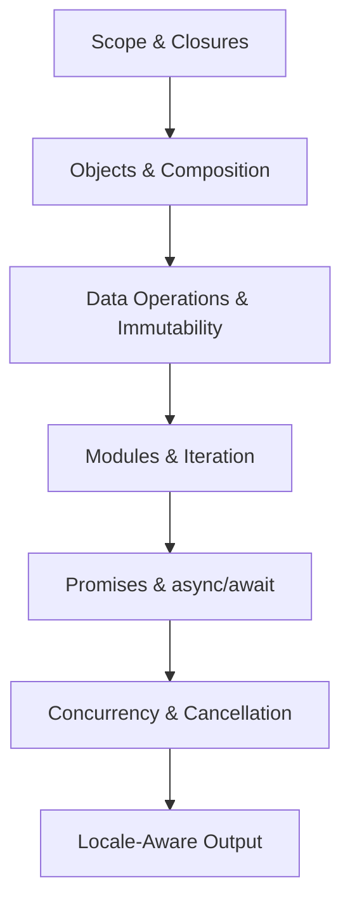
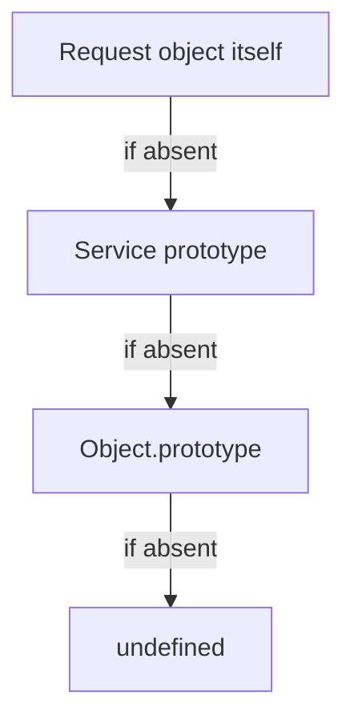
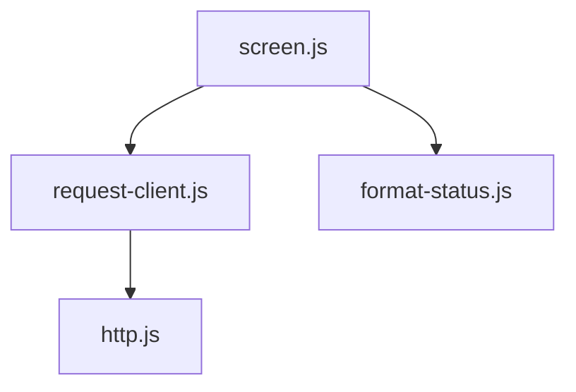
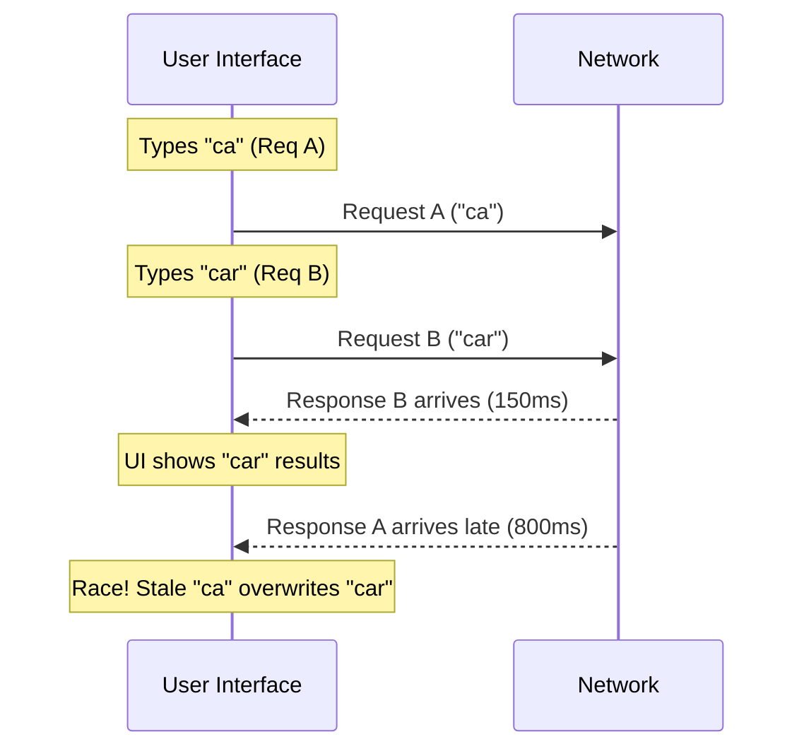
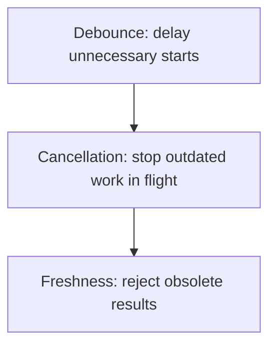
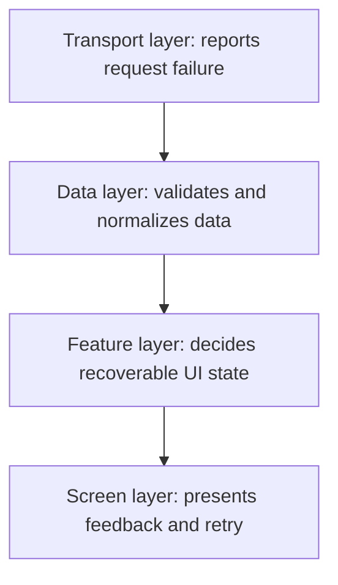
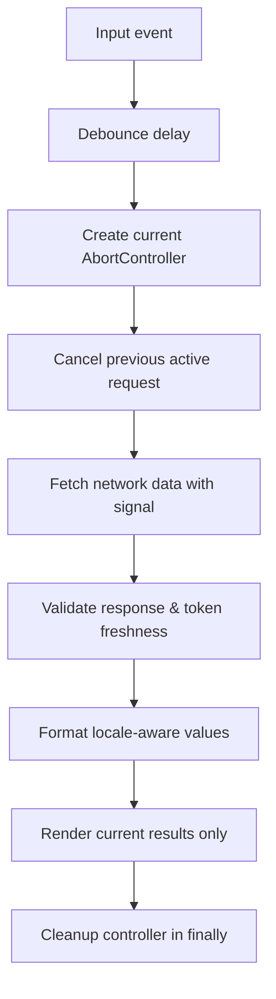

# Modern JavaScript & Asynchronous Programming

Control state, boundaries, timing, cancellation, and data flow

**Chapter 4**

Polla Fattah

---

## Today's goal

Move beyond syntax toward the language model needed for modern front-end work.

We will connect:

- scope and closures;
- objects and composition;
- data transformation and immutability;
- modules and dynamic loading;
- promises and asynchronous execution;
- concurrency, races, and cancellation;
- locale-aware output.

---

## By the end of today you can

- explain where a JavaScript binding lives;
- use closures deliberately without confusing them with copied values;
- describe prototype delegation and why classes do not remove it;
- choose data transformation methods for clarity;
- update nested state without accidental mutation;
- design module boundaries and dynamic imports;
- distinguish sequential work from concurrent work;
- handle rejected promises and cancellation explicitly;
- prevent stale results from winning a race;
- format numbers, dates, and plurals for a locale.

---

## The chapter's progression



The core idea is:

> **Modern JavaScript controls state, boundaries, timing, and data flow.**

---

## Lexical scope: where a name can be used

```js
const applicationName = "Citizen Portal";

function showName() {
  console.log(applicationName);
}

showName();
```

The function can look outward to the scope that surrounds it.

An outer scope cannot look inward into a function's private bindings.

Scope follows the source-code structure. It is lexical, not based on which
function happened to call another function at runtime.

---

## Block scope is a lifetime boundary

```js
if (loggedIn) {
  const message = "Welcome back";
  console.log(message);
}

console.log(message); // ReferenceError
```

Practical rule:

- prefer `const` by default;
- use `let` when reassignment is required;
- understand that both respect block scope;
- treat a block as a useful lifetime boundary.

---

## Closures retain bindings

```js
function createCounter() {
  let count = 0;

  return function increment() {
    count += 1;
    return count;
  };
}

const counter = createCounter();
counter(); // 1
counter(); // 2
```

`createCounter()` finished, but `increment` retains access to its lexical
environment.

The closure does not copy `count`. It retains access to the binding.

---

## Closures appear everywhere in front-end code

```js
function attachFilter(input, applyFilter) {
  input.addEventListener("input", () => {
    applyFilter(input.value);
  });
}
```

The callback remembers `input` and `applyFilter` from the surrounding scope.

Common uses include:

- event handlers;
- callback configuration;
- private state factories;
- debounced functions;
- memoized computations;
- request controllers.

---

## Closures can keep data alive

```js
function createLogger(records) {
  return (message) => {
    records.push({ message, at: Date.now() });
  };
}
```

As long as the returned logger is reachable, `records` remains reachable too.

Closures provide privacy and state, but they can also retain large objects,
DOM nodes, or subscriptions longer than intended.

Release listeners, timers, and references when the feature is destroyed.

---

## Objects have a prototype model

An object can delegate property lookup to another object through its prototype.

```js
const service = {
  describe() {
    return "public service";
  }
};

const request = Object.create(service);
request.id = 1042;
request.describe(); // delegated lookup
```

The object does not need to own every method directly.

---

## Prototype delegation is not copying

Property lookup conceptually follows:



This affects identity, mutation, method lookup, and debugging. Understand the
delegation even when your code uses class syntax.

---

## Classes are syntax over prototypes

```js
class RequestRecord {
  constructor(id) {
    this.id = id;
  }

  describe() {
    return `Request ${this.id}`;
  }
}
```

The method is associated with the class prototype. Class syntax improves
readability for some designs; it does not replace JavaScript's prototype model.

---

## Composition is often simpler than inheritance

Instead of a deep hierarchy:


compose focused capabilities:

```js
const record = {
  ...withIdentity(1042),
  ...withStatus("in-review"),
  ...withLocale("ar")
};
```

Composition can reduce coupling and make a capability easier to reuse or
replace.

---

## Destructuring names the data you need

```js
const request = {
  id: 1042,
  status: "in-review",
  applicant: { name: "Sara" }
};

const {
  id,
  status,
  applicant: { name }
} = request;
```

Destructuring can make data flow obvious, but avoid extracting so much that the
source of a value becomes difficult to follow.

---

## Rest and spread have different jobs

```js
const { id, ...details } = request;
const updated = { ...request, status: "approved" };
```

- rest collects the remaining values;
- spread expands values into a new object or array.

Both are shallow operations.

---

## Spread is not a deep copy

```js
const original = { preferences: { theme: "dark" } };
const copy = { ...original };

copy.preferences.theme = "light";
console.log(original.preferences.theme); // light
```

The outer object is new. The nested object is still shared.

Know which references remain shared before calling something an immutable
update.

---

## Optional chaining is a guarded lookup

```js
const phone = applicant?.contacts?.primaryPhone;
```

It is useful when a value is legitimately absent.

It does not:

- validate the data shape;
- supply a meaningful fallback;
- prove that a missing value is acceptable;
- repair a broken API contract.

Use it where absence is part of the model, not everywhere as a blanket guard.

---

## Nullish coalescing preserves meaningful zeroes

```js
const pageSize = settings.pageSize ?? 20;
```

`??` falls back only for `null` or `undefined`.

That differs from `||`:

```js
0 || 20   // 20
0 ?? 20   // 0
```

Choose the operator according to the domain meaning of empty strings, zero,
false, null, and undefined.

---

## Transform collections by intent

```js
const labels = requests.map(request => request.statusLabel);
const open = requests.filter(request => request.status === "open");
const selected = requests.find(request => request.id === id);
const hasUrgent = requests.some(request => request.priority === "urgent");
const allValid = fields.every(field => field.valid);
```

Each method communicates a different question. Prefer the method whose name
matches the operation.

---

## Use `reduce()` when it clarifies

```js
const totals = requests.reduce((summary, request) => {
  summary[request.status] = (summary[request.status] ?? 0) + 1;
  return summary;
}, {});
```

`reduce()` can express aggregation, but it can also hide a complicated
algorithm inside one callback.

Use a loop or named helper when the steps matter more than compactness.

---

## Immutable update patterns

```js
const nextState = {
  ...state,
  filters: {
    ...state.filters,
    status: "open"
  }
};
```

The update creates new references along the changed path and preserves
unrelated references.

This helps state systems compare identity and makes change boundaries visible.

---

## Identity and change detection

```js
const same = state.filters === nextState.filters; // false
const sameList = state.requests === nextState.requests; // true
```

Identity can communicate which part of a state tree changed.

That does not mean every object must be recreated on every update. Preserve
references when the value did not change.

---

## Do not turn immutability into dogma

Mutation can be reasonable when:

- the object is local to one operation;
- no other consumer observes it;
- the mutation improves clarity or performance;
- ownership is explicit.

The architectural question is not “mutation or no mutation?”

It is:

> **Who can observe this value, and what change signal do they rely on?**

---

## ES Modules create boundaries

```js
// format-status.js
export function formatStatus(status) {
  return status.replaceAll("-", " ");
}

// screen.js
import { formatStatus } from "./format-status.js";
```

Modules provide:

- explicit dependencies;
- module scope;
- reusable exports;
- a graph the build tool can inspect.

Modules are architecture, not only file organization.

---

## Named and default exports

Named exports make the public vocabulary explicit:

```js
export function parseRequest() {}
export function validateRequest() {}
```

Default exports can represent one primary value:

```js
export default class RequestClient {}
```

Choose a consistent convention. Avoid making consumers guess whether a module
has one canonical thing or a set of named capabilities.

---

## Module scope is private by default

```js
const cache = new Map();

export function getCached(key) {
  return cache.get(key);
}
```

`cache` is not a global just because the module can access it. Consumers see
only what the module exports.

This is a useful boundary for implementation details and state ownership.

---

## The module graph is a dependency graph



The graph affects:

- evaluation order;
- bundling;
- caching;
- code splitting;
- circular-dependency risk;
- ownership and testing boundaries.

Design imports as deliberately as public API calls.

---

## Dynamic imports load on demand

```js
button.addEventListener("click", async () => {
  const { openReport } = await import("./report.js");
  openReport();
});
```

Dynamic imports can reduce initial work and defer rarely used features.

They add asynchronous failure, loading state, and chunk-boundary concerns. A
dynamic import is not free merely because it is written in one line.

---

## Iteration is more than `for` loops

An iterable provides a protocol for producing values over time.

```js
for (const request of requests) {
  renderRequest(request);
}
```

Arrays, strings, Maps, Sets, DOM collections, and custom objects can participate
in iteration.

The protocol separates “how values are produced” from “how they are consumed.”

---

## Iterators produce one value at a time

```js
const iterator = ["queued", "open"].values();
iterator.next(); // { value: "queued", done: false }
iterator.next(); // { value: "open", done: false }
iterator.next(); // { value: undefined, done: true }
```

The `done` flag is part of the contract. Iterators can represent sequences that
are calculated lazily rather than stored as a complete array.

---

## Generators pause and resume

```js
function* statuses() {
  yield "queued";
  yield "in-review";
  yield "approved";
}
```

Generators provide a convenient way to define an iterator. They can model
progressive work, but they do not automatically make expensive work
asynchronous or cancellable.

---

## Async iteration represents arriving values

```js
for await (const event of stream) {
  renderEvent(event);
}
```

Async iteration is useful when values arrive over time. The consumer still needs
to understand completion, errors, backpressure, and cancellation.

---

## From callbacks to promises

Callbacks can express completion and failure, but nested workflows become hard
to compose:

```js
loadUser(id, user => {
  loadRequests(user, requests => {
    render(requests);
  }, handleError);
}, handleError);
```

Promises represent a future result and provide composable success and failure
paths.

---

## A promise represents a future result

```js
const request = fetch("/api/requests/1042");

request.then(response => response.json())
  .then(data => render(data))
  .catch(error => showError(error));
```

A promise is not the result itself. It represents a pending, fulfilled, or
rejected computation.

---

## Creating promises is an ownership decision

```js
function wait(ms) {
  return new Promise(resolve => {
    setTimeout(resolve, ms);
  });
}
```

Create a promise when adapting a callback or exposing an asynchronous contract.

Do not wrap an API in a new promise without a reason; unnecessary wrappers can
hide errors and complicate cancellation.

---

## Promise chaining carries values forward

```js
fetch("/api/requests")
  .then(response => response.json())
  .then(requests => requests.filter(isVisible))
  .then(renderRequests);
```

Each handler returns the value or promise for the next step.

Returning nothing intentionally passes `undefined`; forgetting to return is a
common source of a broken chain.

---

## Promise errors propagate through the chain

```js
loadRequests()
  .then(validateResponse)
  .then(renderRequests)
  .catch(error => showError(error));
```

An exception or rejection skips forward to the next compatible rejection
handler. Place recovery at the boundary that can actually decide what to do.

---

## `async` and `await` improve expression

```js
async function loadScreen() {
  const response = await fetch("/api/requests");
  const requests = await response.json();
  renderRequests(requests);
}
```

`await` makes a promise result available inside the function. It does not turn
the browser into a blocking environment.

---

## Async functions always return promises

```js
async function answer() {
  return 42;
}

answer().then(console.log); // 42
```

Even a plain return value is wrapped in a fulfilled promise. Callers must still
decide how to handle rejection.

---

## Handle errors at the right boundary

```js
async function loadScreen() {
  try {
    const response = await fetch("/api/requests");
    if (!response.ok) throw new Error(`HTTP ${response.status}`);
    return await response.json();
  } catch (error) {
    showRecoverableError(error);
    throw error;
  }
}
```

Do not catch an error merely to log it and then pretend the operation succeeded.

---

## Not every failure is a network error

An async operation can fail because:

- the request was blocked or offline;
- the server returned a non-2xx response;
- the body was invalid JSON;
- validation rejected the data;
- rendering code threw;
- the user cancelled the work;
- a stale result was deliberately ignored.

Your error model should preserve the difference when the UI needs it.

---

## Sequential work is sometimes correct

```js
const user = await loadUser();
const permissions = await loadPermissions(user.id);
```

The second operation depends on the first. Sequential execution expresses that
dependency.

The cost is that total time includes both waits.

---

## Accidental sequential work is a performance bug

```js
const categories = await loadCategories();
const featured = await loadFeatured();
```

If the requests are independent, this waits unnecessarily.

Start independent work together, then await the combined result.

---

## `Promise.all()` expresses all-or-nothing coordination

```js
const [categories, featured] = await Promise.all([
  loadCategories(),
  loadFeatured()
]);
```

The operations start without waiting for one another. The combined promise
fulfils when all fulfil and rejects when one rejects.

Use it when one failure should prevent the combined result from being used.

---

## `Promise.allSettled()` preserves every outcome

```js
const results = await Promise.allSettled([
  loadRecommendations(),
  loadAnnouncements(),
  loadOptionalMetrics()
]);
```

Use it when partial success is meaningful and each result needs its own status.

The choice communicates product behaviour, not only JavaScript preference.

---

## Concurrency is not parallelism

Several asynchronous operations can be in flight at once while JavaScript
continues on its event loop.

That does not mean JavaScript is running those callbacks on several CPU cores.

Concurrency is about overlapping waiting and coordinating completion.

Parallelism is about simultaneous execution.

---

## Race conditions can happen in one thread



If every response renders immediately, request A can overwrite the newer
result for `care`.

Single-threaded JavaScript does not remove ordering races between asynchronous
operations.

---

## Race conditions are correctness problems

The question is not only:

> Which request finished last?

It is:

> Which result is still valid for the current user intent?

Freshness is an application rule. The network does not know which response the
user currently cares about.

---

## Strategy 1: ignore stale results

```js
let latestQuery = "";

async function search(query) {
  latestQuery = query;
  const result = await fetchResults(query);
  if (query !== latestQuery) return;
  renderResults(result);
}
```

This is simple and safe when the old work is harmless. It still spends the
resources needed to finish the old request.

---

## Strategy 2: cancel outdated work

```js
let controller;

async function search(query) {
  controller?.abort();
  controller = new AbortController();
  const response = await fetch(`/api/search?q=${query}`, {
    signal: controller.signal
  });
  return response.json();
}
```

Cancellation can save work and communicate that the previous intent is no
longer relevant.

The UI must distinguish cancellation from an unexpected failure.

---

## AbortController is a general signal

```js
const controller = new AbortController();

fetch(url, { signal: controller.signal });
timer(signal, controller.signal);

controller.abort();
```

The signal is a shared cancellation contract. The operation decides how to
listen and clean up when the signal aborts.

---

## Cancellation is an application design problem

Ask:

- What work belongs to the cancelled intent?
- Who owns the controller?
- What resources need cleanup?
- Should cancellation be silent or visible?
- Can a new operation replace the old one safely?
- What happens if cancellation occurs after the result arrives?

Adding `AbortController` without defining ownership only moves the ambiguity.

---

## Debouncing delays the start of work

```js
function debounce(callback, delay) {
  let timer;
  return (...args) => {
    clearTimeout(timer);
    timer = setTimeout(() => callback(...args), delay);
  };
}
```

Debouncing waits for a pause in input before starting work.

It reduces the number of operations. It does not cancel a request that already
started.

---

## Debouncing and cancellation solve different problems



Search interfaces often need all three.

---

## Error propagation needs an owner



Do not let every layer catch and replace the same error with a vague message.

Each boundary should add context or make a decision.

---

## `finally` is for cleanup

```js
setLoading(true);

try {
  await loadResults();
} catch (error) {
  showError(error);
} finally {
  setLoading(false);
}
```

Use `finally` for work that should occur after success, failure, or
cancellation: loading flags, controller references, locks, and temporary UI
state.

---

## Avoid unhandled promise rejections

Every promise chain needs an intentional owner:

```js
void saveDraft().catch(error => {
  reportSaveFailure(error);
});
```

If a caller intentionally starts background work, make that intent visible and
attach a failure path. A rejected promise should not disappear silently.

---

## Internationalization is more than translation

Locale-aware interfaces consider:

- language and script;
- number formatting;
- currencies;
- dates and time zones;
- relative time;
- plural rules;
- segmentation;
- direction and layout.

Do not concatenate English assumptions into strings and call the result
localized.

---

## Format numbers with `Intl.NumberFormat`

```js
const formatter = new Intl.NumberFormat("ar-IQ", {
  maximumFractionDigits: 2
});

formatter.format(12345.67);
```

The locale controls grouping, decimal conventions, digits, and other display
rules. Formatting belongs near presentation, not in the domain value itself.

---

## Currency is a meaning, not a symbol

```js
new Intl.NumberFormat("en-US", {
  style: "currency",
  currency: "USD"
}).format(1234.5);
```

Do not hard-code a dollar sign or assume that the currency code determines the
entire visual format.

Keep the numeric amount and currency identity separate until presentation.

---

## Dates need a locale and a time-zone decision

```js
new Intl.DateTimeFormat("en-GB", {
  dateStyle: "medium",
  timeZone: "Asia/Baghdad"
}).format(date);
```

Formatting is not the same as deciding what instant or calendar meaning the
application intends. Store and transmit a clear temporal representation.

---

## Relative time communicates change

```js
const relative = new Intl.RelativeTimeFormat("en", { numeric: "auto" });
relative.format(-1, "day"); // yesterday
```

The correct unit and rounding policy are application decisions. A relative
label should not hide the exact timestamp when the exact time matters.

---

## Plural rules are grammatical rules

```js
const plural = new Intl.PluralRules("en");
plural.select(1); // one
plural.select(2); // other
```

Different languages have different plural categories. Avoid building messages
with `count === 1 ? "item" : "items"` as a universal model.

---

## `Intl.Segmenter` respects language boundaries

```js
const segmenter = new Intl.Segmenter("ar", {
  granularity: "word"
});

for (const part of segmenter.segment(text)) {
  console.log(part.segment);
}
```

String length and substring boundaries are not always equivalent to visible
words or user-perceived characters.

---

## A cancelable search: step 1

Debounce the user's input so each keystroke does not immediately start work:

```js
const scheduleSearch = debounce((query) => {
  runSearch(query);
}, 250);
```

This controls the rate of starts. It does not yet control in-flight requests.

---

## A cancelable search: step 2

Cancel the previous request when a newer query becomes authoritative:

```js
let activeController;

async function runSearch(query) {
  activeController?.abort();
  activeController = new AbortController();

  const response = await fetch(`/api/search?q=${encodeURIComponent(query)}`, {
    signal: activeController.signal
  });

  return response.json();
}
```

The feature owns the controller because it owns the current search intent.

---

## A cancelable search: step 3

Handle cancellation separately from failure:

```js
try {
  const results = await runSearch(query);
  renderResults(results);
} catch (error) {
  if (error.name === "AbortError") return;
  showSearchError(error);
}
```

Cancellation is expected control flow. It should not flash an error message for
the user.

---

## A cancelable search: the complete contract



Each arrow is a boundary where an error, race, or ownership decision can occur.

---

## The practical lab

Build a **cancelable locale-aware search**.

The runnable Vite and TypeScript implementation will live in the separate
Playground repository. This deck describes the JavaScript behaviour and the
evidence to collect.

---

## Practical stages 1–3

1. Use closure state for a small search controller or cache.
2. Apply immutable updates to the search state.
3. Split the feature into modules with clear imports and exports.

Write down which module owns the current query, results, and cancellation
controller.

---

## Practical stages 4–6

4. Dynamically import an optional result formatter or panel.
5. Compare sequential and concurrent independent requests.
6. Create a deliberate race condition by delaying responses differently.

Observe how a correct build can still show incorrect stale data.

---

## Practical stages 7–9

7. Prevent stale results from replacing newer results.
8. Add `AbortController` cancellation.
9. Add input debouncing.

Test rapid typing, clearing the input, slow responses, cancellation, and
network failure separately.

---

## Practical stages 10–11

10. Add locale-aware numbers, dates, plurals, and direction.
11. Draw the asynchronous flow and label every ownership boundary.

The final diagram should show what starts work, what can cancel it, what can
reject, and what is allowed to update the UI.

---

## Try it yourself

Choose one asynchronous feature in an application you know.

Answer:

- Can two operations be in flight together?
- What makes an old result stale?
- Who owns cancellation?
- Which failures are expected user flow?
- Where should locale formatting happen?

Write one explicit contract before changing the code.

---
## Troubleshooting questions (Part 1)

| Symptom | First question |
|---|---|
| A variable is unavailable | Which lexical scope owns it? |
| A callback uses old state | Which binding did the closure retain? |
| A promise chain returns `undefined` | Did each handler return its next value? |
| Independent requests are slow | Are they accidentally awaited sequentially? |
---
## Troubleshooting questions (Part 2)

| Symptom | First question |
|---|---|
| Old search results appear | What defines freshness and cancellation? |
| Loading never ends | Is cleanup in `finally`? |
| Cancellation shows as an error | Is `AbortError` handled separately? |
| Dates look different by machine | Is locale and time zone explicit? |
---

## Completion check

- I can explain lexical scope and closures.
- I understand prototype delegation beneath class syntax.
- I can choose clear collection transformations.
- I can update nested state while preserving useful identity boundaries.
- I can design a module graph with explicit dependencies.
- I can distinguish sequential work from concurrent work.
- I can explain promise rejection and error ownership.
- I can identify and prevent stale asynchronous results.
- I can use cancellation and debouncing for different purposes.
- I can format numbers, dates, plurals, and text for a locale.
- I completed the cancelable locale-aware search practical.

---

# Next: TypeScript, Runtime Contracts & Safe Data Boundaries

Chapter 5: static types, inference, runtime validation, trusted boundaries,
and the difference between what a compiler knows and what a browser receives.

**Modern Front-End Engineering**
