# State Management, Routing & Form Architecture

Put every value where it belongs

**Chapter 8**

Polla Fattah

---

## Today's goal

Stop treating all state as the same kind of problem.

We will connect:

- local, shared, domain, server, URL, form, persistent, and derived state;
- ownership, reducers, stores, and state machines;
- routing as application state architecture;
- paths, parameters, history, loading, and navigation UX;
- controlled, uncontrolled, and hybrid forms;
- validation, dirty state, dynamic fields, and multistep workflows;
- state placement in a routed administrative catalogue.

---

## By the end of today you can

- classify a value before choosing a state tool;
- keep state close to its practical owner;
- explain why server data is not ordinary global state;
- model URL state as a serializable public view;
- design history and back-button behavior intentionally;
- separate form drafts from domain models;
- distinguish touched, dirty, validation, and submission state;
- use reducers and state machines for explicit transitions;
- choose local state, context, or a store proportionately;
- review a feature for duplicated or misplaced state.

---

## The central principle

> **State architecture is the deliberate placement of values according to ownership, lifetime, sharing, persistence, and transition rules.**

The right question is not “which state library should we use?”

The better question is “what kind of state is this, and who is responsible for it?”

---

## The chapter's progression

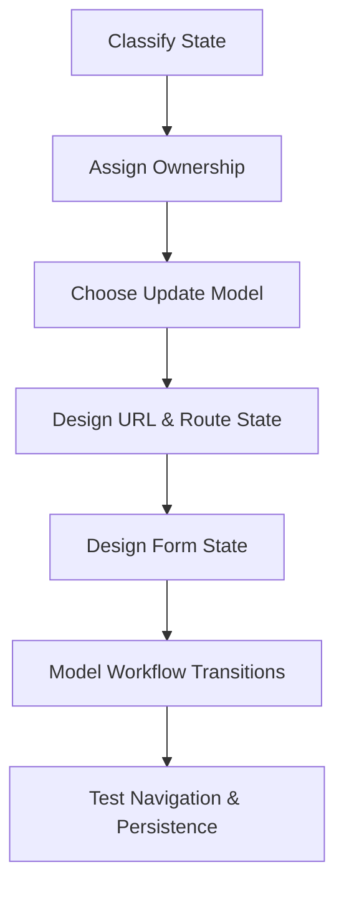

Tools come after the state model, not before it.

---

## “State” is not one thing

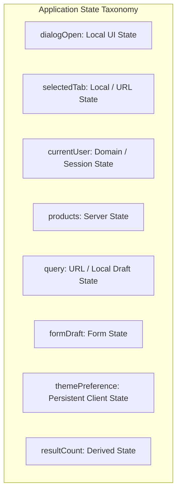

The category predicts who owns the value and how it should change.

---
## A practical state taxonomy (Part 1)

| Category | Typical lifetime | Example |
|---|---|---|
| local UI | one component or feature | modal open |
| shared UI | several nearby components | selected tab |
| domain | business workflow | approval status |
| server | remote source | product list |
---
## A practical state taxonomy (Part 2)

| Category | Typical lifetime | Example |
|---|---|---|
| URL | shareable view | page and filters |
| form | unfinished input | draft email |
| persistent | across sessions | theme preference |
| derived | calculated | filtered results |
---

## Local UI state

```tsx
const [isOpen, setIsOpen] = useState(false);
const [focusedIndex, setFocusedIndex] = useState(0);
```

Local state is usually:

- interaction-specific;
- short-lived;
- not useful to unrelated routes;
- safe to discard when the component leaves the tree.

Keep it local unless another owner genuinely needs it.

---

## Shared UI state

```text
Tabs.List  ↔ selectedTab ↔ Tabs.Panel
```

Shared UI state coordinates a small group of related components.

Use a parent, compound component context, or a local feature store when the relationship is real.

Do not promote it globally merely because more than one component reads it.

---

## Domain state

```ts
type ApprovalState =
  | { status: "draft" }
  | { status: "submitted"; submittedAt: string }
  | { status: "approved"; approvedBy: string }
  | { status: "rejected"; reason: string };
```

Domain state represents business meaning and rules.

It should not be confused with whether a modal is open or a request is currently loading.

---

## Server state is a different category

Server state has:

- a remote owner;
- latency and failure;
- freshness and staleness;
- caching concerns;
- invalidation rules;
- multiple possible consumers.

Treating it as one ordinary global variable usually loses important behavior.

---

## Server state is not “just another global variable”

```text
request → pending → success / error
             ↓
       cache and freshness
             ↓
     refetch / invalidate / retry
```

The state includes the lifecycle of synchronization, not only the latest payload.

---

## Cached data needs an ownership policy

Ask:

- who populated the cache?
- when is it stale?
- who invalidates it after a mutation?
- can two requests race?
- can an older response overwrite a newer one?
- what happens offline?

Caching is architecture, not merely a performance toggle.

---

## URL state is public view state

```text
/catalogue?query=phone&sort=price&page=2
```

URL state can survive:

- reloads;
- sharing;
- bookmarks;
- back and forward navigation;
- opening the view in another tab.

That makes it valuable—but also part of the public contract.

---

## Form state is unfinished work

```text
draft value
touched fields
dirty fields
validation messages
submission status
server errors
```

A draft is not automatically a valid domain object.

Form architecture should represent the journey from incomplete input to accepted data.

---

## Persistent client state has a migration problem

```text
localStorage → parse → version check → migrate → trusted preferences
```

Persisted values can outlive the code that created them.

Treat storage as an external boundary and design for old or malformed versions.

---

## Derived state should usually be calculated

```ts
const visibleProducts = products
  .filter(matchesQuery)
  .sort(compareProducts);
```

If `visibleProducts` is directly calculable from source state, storing it separately creates another value that can become stale.

Use memoization only when repeated computation is measurably expensive.

---

## Ownership: who is responsible?

For every value, ask:

- who decides it?
- who needs to read it?
- who changes it?
- how long should it survive?
- should it be shareable or persisted?
- what external system owns the truth?

The answers identify the correct boundary better than a favorite library does.

---

## Keep state as close as practical

```text
smallest common owner
        ↓
components that genuinely need the value
```

Local ownership reduces coordination and update scope.

Move state outward only when a real consumer, lifecycle, or synchronization rule requires it.

---

## State should move outward for a reason

Good reasons include:

- two siblings must coordinate;
- a route must own the view;
- a server cache is shared;
- a workflow spans multiple screens;
- another system must synchronize with the value.

“It might be useful later” is not an ownership rule.

---

## Global state has a cost

Global state can create:

- invisible dependencies;
- broad update scope;
- unclear ownership;
- difficult isolated tests;
- stale values that survive too long;
- accidental coupling between features.

Make a value global because its lifetime and sharing demand it, not because global access is convenient.

---

## Reducers make transitions explicit

```ts
type Action =
  | { type: "searchChanged"; query: string }
  | { type: "submitted" }
  | { type: "reset" };

function reducer(state: State, action: Action): State {
  switch (action.type) {
    case "searchChanged": return { ...state, query: action.query };
    case "submitted": return { ...state, status: "submitted" };
    case "reset": return initialState;
  }
}
```

The transition vocabulary makes state changes inspectable and testable.

---

## Unidirectional data flow

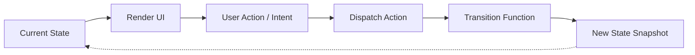

One direction makes it easier to answer:

- what caused this value?
- which action changed it?
- which consumers should update?

It does not mean every value belongs in one global store.

---

## Stores are boundaries, not magic containers

A store should define:

- the state it owns;
- actions or methods that change it;
- selectors or derived values;
- effects and external dependencies;
- initialization and cleanup.

If a store becomes the home for every value, it has stopped communicating ownership.

---

## Reducers versus stores

| Reducer | Store |
|---|---|
| transition function | longer-lived owner |
| often pure | may coordinate effects |
| easy to test as input/output | may expose selectors and subscriptions |
| useful inside local features | useful for shared domain workflows |

They can be combined. Neither is automatically the correct scale.

---

## State machines make workflows visible

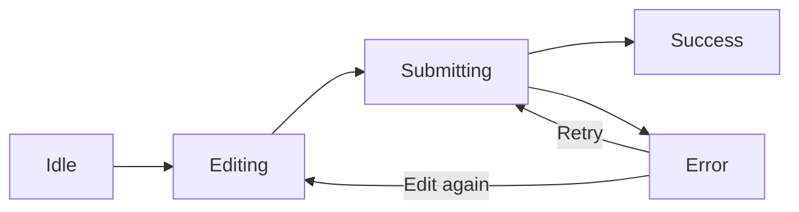

State machines are useful when legal transitions matter more than storing a collection of booleans.

---

## Replace impossible boolean combinations

Avoid:

```ts
isLoading = true;
isSuccess = true;
isError = true;
```

Prefer one explicit status:

```ts
type Status = "idle" | "loading" | "success" | "error";
```

The model should make impossible states difficult to represent.

---

## Routing is state architecture

A route decides more than the address.

It can determine:

- which feature is active;
- which data loads;
- which layout persists;
- what can be shared;
- what the back button restores;
- which code is loaded.

Routing is a state-lifetime and ownership decision.

---

## Paths represent resource identity

```text
/products
/products/p-42
/orders/o-17
```

Use a path segment when the value identifies the resource or nested location being viewed.

The route should speak domain language, not reveal component filenames.

---

## Route parameters identify a resource

```ts
const { productId } = route.params;
```

Validate the parameter before using it as a domain identifier.

The string from the URL is external input, not automatically a valid `ProductId`.

---

## Query parameters describe a view

```text
/products?query=phone&sort=price&page=2
```

Query parameters are suitable for filters, sorting, pagination, search, and other shareable view choices.

They should be serializable, parseable, and stable enough to form a public contract.

---

## Path parameter or query parameter?

```text
Path:  /products/p-42
       “which resource?”

Query: /products?sort=price
       “how should this collection be viewed?”
```

Use the semantic distinction, not personal preference.

---

## Nested routes express nested ownership

```text
/admin
  /catalogue
    /products
    /products/:id/edit
```

Parent routes can own layout, permissions, data context, and persistent navigation while child routes own the active view.

---

## Layout routes preserve context

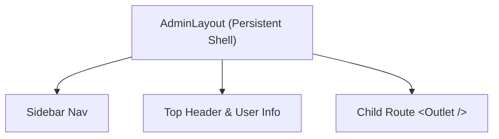

The layout can remain mounted while the child changes.

This preserves navigation context and avoids rebuilding shared structure unnecessarily.

---

## Navigation changes state and history

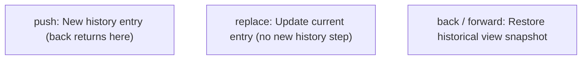

Choose history semantics deliberately.

Typing a filter may replace the current entry.

A meaningful page transition may push a new entry.

---

## Redirects are state transitions

Redirect when:

- a user lacks access;
- a resource moved;
- a form completed a workflow;
- a canonical URL should replace an invalid one.

Preserve useful context where appropriate, and avoid redirect loops that obscure the actual state.

---

## File-based routing is a convention

File structure can make routes discoverable:

```text
routes/
  products/index.tsx
  products/$productId.tsx
  products/$productId/edit.tsx
```

It helps organize the map, but it does not decide which state belongs in the route or how transitions should behave.

---

## The URL is state

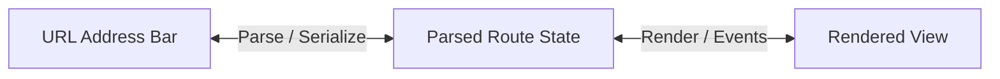

Do not copy URL values into local state without a clear ownership reason.

Two sources of truth create synchronization work and surprising back-button behavior.

---

## Shareable state belongs naturally in the URL

Good candidates:

- search query;
- filters;
- sorting;
- pagination;
- selected public tab;
- view density when sharing it matters.

If another person opens the URL, the meaningful view should be reconstructable.

---

## What usually should not go in the URL?

Avoid placing:

- passwords or secrets;
- sensitive personal data;
- large drafts;
- ephemeral hover state;
- internal implementation details;
- values that cannot be serialized safely.

The URL is visible, copyable, logged, and often shared.

---

## URL state should have one owner

Avoid:

```text
URL query ↔ local query ↔ debounced query ↔ server query
```

Define the stages explicitly:

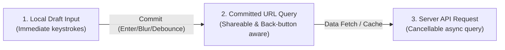

Each stage has a different purpose and transition.

---

## Parse URL state at the boundary

```ts
type CatalogueQuery = {
  query: string;
  page: number;
  sort: "relevance" | "price";
};
```

Parsing should:

- provide defaults;
- reject or normalize invalid values;
- clamp unsafe ranges;
- preserve only supported vocabulary;
- return a trusted view model.

---

## Example: URL-based filtering

```ts
const params = new URLSearchParams(location.search);

const state = {
  query: params.get("query") ?? "",
  sort: parseSort(params.get("sort")),
  page: parsePage(params.get("page")),
};
```

The view consumes `state`, not raw strings from `location.search`.

---

## Routing UX is part of architecture

A route transition should define:

- pending feedback;
- loading behavior;
- error boundaries;
- scroll restoration;
- focus placement;
- unsaved-change handling;
- code-loading behavior.

The route is a user interaction, not merely a URL replacement.

---

## Pending navigation needs visible feedback

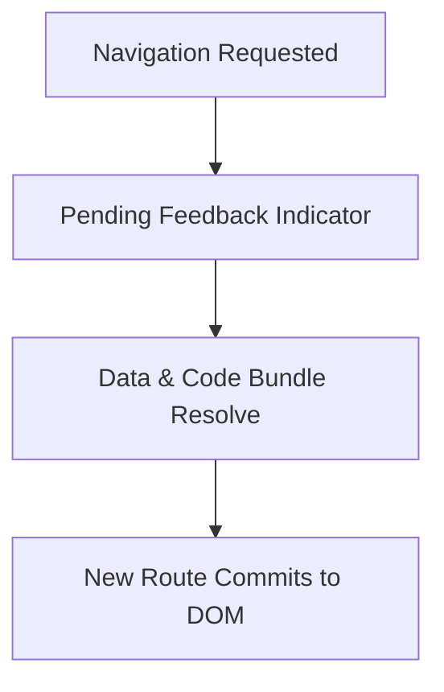

Keep the current context understandable while the next view is loading.

Avoid showing a blank screen for an operation that can preserve useful layout.

---

## Loading states should belong to the right scope

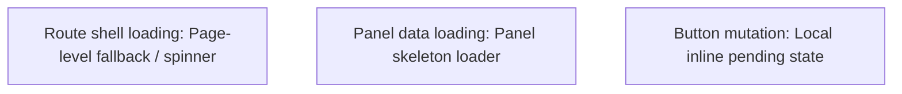

One global spinner often hides which part of the interface is actually unavailable.

---

## Route errors are part of the route contract

Model distinct causes:

- invalid route parameter;
- missing resource;
- permission failure;
- network failure;
- unexpected application error.

The user should receive the recovery action appropriate to the cause.

---

## Scroll restoration is state restoration

Decide whether navigation should:

- restore the previous scroll position;
- start a new route at the top;
- preserve a nested panel's scroll;
- maintain position while query filters update.

Surprising scroll behavior makes a correct route feel broken.

---

## Focus after navigation is accessibility state

After a route changes, move focus to a meaningful landmark or heading when appropriate.

Do not leave keyboard users at an old location with no indication that the view changed.

Focus management belongs to the route transition boundary.

---

## State preservation across routes is a choice

Ask:

- should the parent layout remain mounted?
- should the child form survive route changes?
- should a tab selection be encoded in the URL?
- should changing an ID reset local state?

Route nesting, component identity, and state ownership work together.

---

## Route-level code splitting

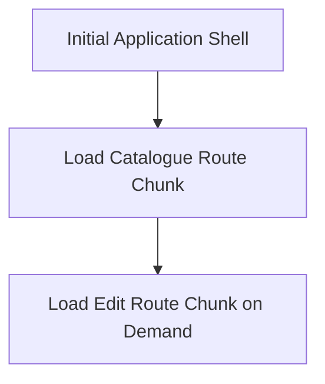

Splitting at route boundaries can reduce initial work and align code loading with user navigation.

The route model and build model should reinforce one another.

---

## Form architecture is state architecture

A form includes more than input values:

```text
values + touched + dirty + validation + submission + server errors
```

Design these lifecycles explicitly instead of allowing them to emerge from scattered event handlers.

---

## Controlled forms

```tsx
<input
  value={email}
  onChange={event => setEmail(event.target.value)}
/>
```

Benefits:

- immediate application visibility;
- easy derived feedback;
- explicit formatting and validation;
- synchronization with other state.

Costs include rerenders, wiring, and more code for large forms.

---

## Uncontrolled forms

```tsx
<form onSubmit={handleSubmit}>
  <input name="email" defaultValue="" />
</form>
```

The browser owns current input values until submission or a deliberate read.

Native form behavior can be simple, efficient, and accessible when the application does not need every keystroke.

---

## Hybrid form architectures

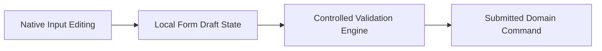

Use control where coordination is needed and native behavior where it is enough.

Do not choose one mode for ideological reasons.

---

## Form values are not automatically domain values

```text
input value: "42"
domain value: 42

input value: ""
domain value: undefined or validation failure
```

Forms represent unfinished, string-heavy input.

Parse and validate before constructing a domain command.

---

## Keep the form model separate when useful

```ts
type ProductDraft = {
  title: string;
  price: string;
  categoryId: string;
};

type ProductCommand = {
  title: string;
  priceCents: number;
  categoryId: CategoryId;
};
```

The draft supports editing.

The command represents validated intent.

---

## Touched state records interaction

```text
touched: false → user focused and left field → true
```

Use it to decide when a field-level message should appear.

Touched does not mean the value changed and does not mean the value is valid.

---

## Dirty state records change from an initial value

```text
dirty = currentDraft !== initialDraft
```

Dirty state answers whether there may be unsaved work.

It is different from touched state: a user can touch a field and return it to its original value.

---

## Validation has several layers

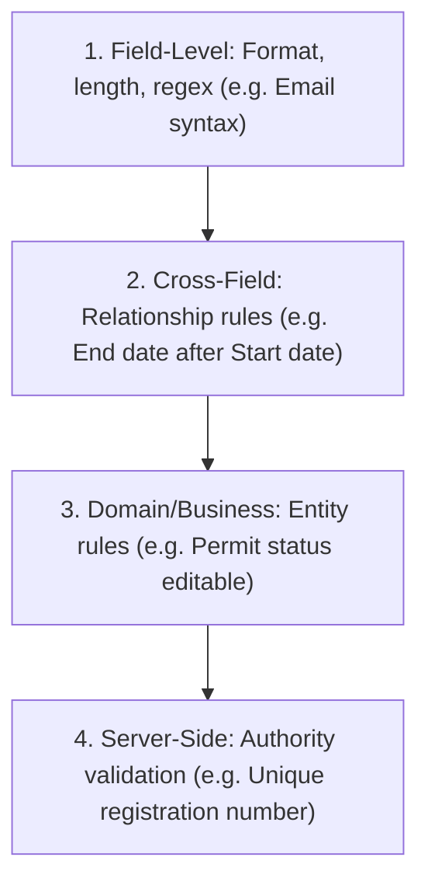

Keep the layer visible so the UI can show the right message and recovery path.

---

## Derive validation where practical

```ts
const emailError = email.length === 0
  ? "Email is required"
  : isEmail(email) ? undefined : "Email is invalid";
```

Do not store every validation message if it can be derived from the current draft and interaction state.

Store server results and asynchronous validation when they are not directly calculable.

---

## Cross-field validation needs the whole draft

```ts
if (draft.password !== draft.confirmPassword) {
  return { confirmPassword: "Passwords do not match" };
}
```

The validation owner should receive the relevant model rather than forcing fields to synchronize through unrelated global state.

---

## Dynamic fields need stable identity

```ts
type LineItemDraft = {
  key: string;
  productId: string;
  quantity: string;
};
```

Use a stable draft key for rows that can be inserted, removed, or reordered.

Index identity can move input values to a different line item.

---

## Dynamic field operations are domain actions

```text
add line item
remove line item
move line item
change quantity
```

Represent these operations explicitly in a reducer or form API.

Scattered array mutations make dirty state, validation, and focus behavior harder to preserve.

---

## Multistep forms are workflows

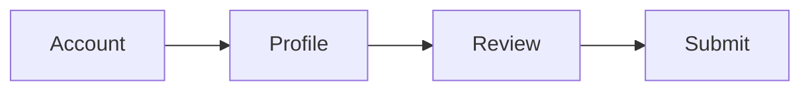

Each step needs:

- an entry condition;
- validation scope;
- persistence policy;
- back behavior;
- recovery from invalid or stale data.

Treat the wizard as a state machine when transitions are meaningful.

---

## URL and multistep forms can work together

```text
/onboarding/profile
/onboarding/review
```

Put the current step in the URL when it should survive reload, sharing, or navigation.

Keep sensitive drafts and unfinished values in an appropriate private owner.

---

## A wizard state machine

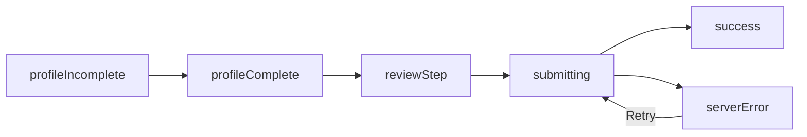

Explicit transitions prevent the UI from entering a review step without the required data.

---

## When native HTML is enough

Prefer native forms when:

- fields are simple;
- browser validation is adequate;
- every keystroke need not update application state;
- submission can read `FormData`;
- accessibility should follow platform behavior.

Native behavior is a feature, not an implementation failure.

---

## When a form library is justified

A library can help with:

- many fields and nested structures;
- reusable validation patterns;
- touched and dirty tracking;
- field arrays;
- controlled/uncontrolled integration;
- performance and subscription granularity.

Adopt it for repeated complexity, not for a two-field form.

---

## Administrative catalogue: classify before building

```text
URL: query, filters, sort, page
server: products, categories
local UI: modal, focused row
form: draft product, touched, dirty, errors
derived: visible rows, result count
persistent: table density preference
```

The map explains where each value should live.

---

## Avoid duplicating URL state

Bad:

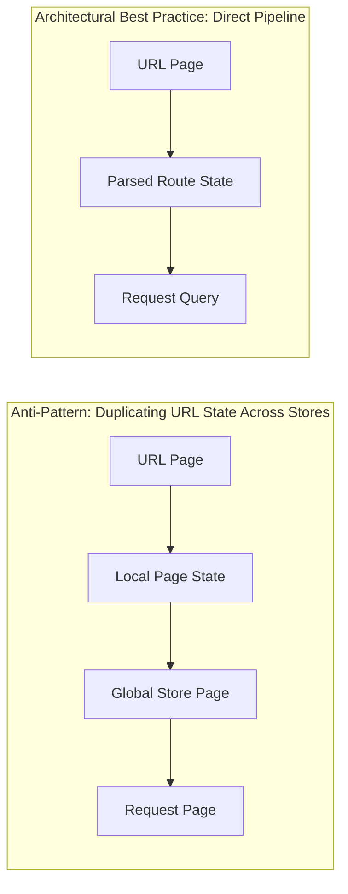

Create a local draft only when editing and committing are intentionally different states.

---

## Avoid copying server data into the form too early

```text
server product → form draft when edit begins
```

This is a deliberate transition, not a continuous mirror.

After editing starts, the draft can diverge safely until save or reset.

Keep server freshness and local unsaved work conceptually separate.

---

## Modal state should stay local unless navigation owns it

```text
click “delete” → local confirmation modal
```

Put the modal in the URL only when the modal itself should be deep-linkable, restorable, or part of browser history.

Not every visible state deserves a route.

---

## Selected tabs: local or URL?

Use local state when:

- the tab is ephemeral;
- sharing the selection is not useful;
- back navigation should not record every change.

Use URL state when:

- the selected view is meaningful to share;
- reload should preserve it;
- browser history should restore it.

---

## Pagination, sorting, and search

These often belong in the URL because they define the collection view.

But distinguish:

```text
local suggestion input → committed search parameter
```

The user can type freely without creating a history entry for every keystroke, then commit the meaningful query deliberately.

---

## Persistent preferences are not route state

```text
table density → local storage preference
current page  → URL state
```

A preference follows the user across views.

A route value describes one navigable view.

Their lifetimes and ownership differ.

---

## One value can change category over time

```text
search draft       local form state
committed search   URL state
server results     server state
cached results     server cache
```

The value's role changes through explicit transitions.

Do not force every stage into one state container.

---

## A state placement decision tree

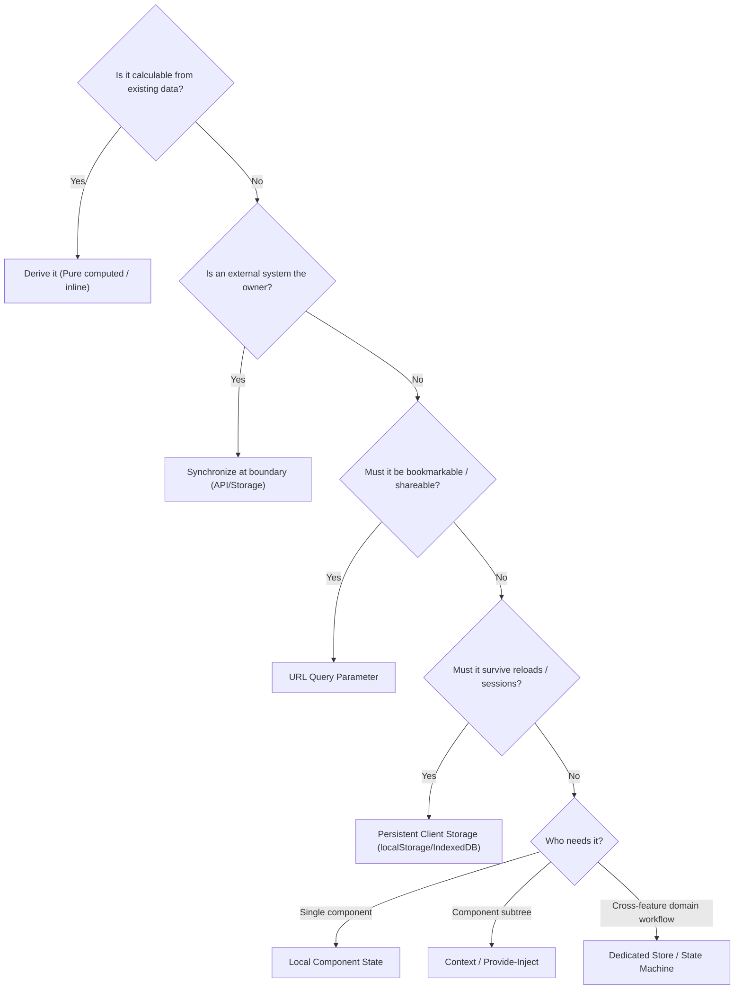

This is a reasoning aid, not a mechanical law.

---

## Common state smells

Watch for:

- state copied from props without a reset rule;
- derived values stored as state;
- everything placed in a global store;
- one value duplicated in URL and component state;
- effects used to synchronize local copies;
- server data copied into forms continuously.

Each smell suggests competing owners.

---

## Routing smells

Warning signs:

- route reflects implementation rather than domain;
- important view state disappears on refresh;
- back button behaves surprisingly;
- child navigation destroys useful parent context;
- a rarely used route inflates the initial bundle;
- invalid parameters reach data-fetching code unparsed.

---

## Form smells

Warning signs:

- every keystroke updates a global store;
- validation is duplicated across fields and submit handlers;
- draft and domain models are forced to be identical;
- dirty and touched flags are synchronized manually everywhere;
- a multistep form uses unrelated booleans instead of transitions.

---

## React URL-state catalogue

```tsx
const query = useSearchParams();
const state = parseCatalogueQuery(query);

return (
  <CatalogueFilters
    value={state}
    onChange={next => navigate({ search: serialize(next) })}
  />
);
```

The URL owns committed view state.

The component receives a parsed model rather than raw strings.

---

## Vue URL-state catalogue

```ts
const route = useRoute();
const router = useRouter();
const state = computed(() => parseCatalogueQuery(route.query));

function update(next: CatalogueQuery) {
  router.replace({ query: serialize(next) });
}
```

Again, compare ownership and transitions rather than framework syntax.

---

## Forms in React and Vue

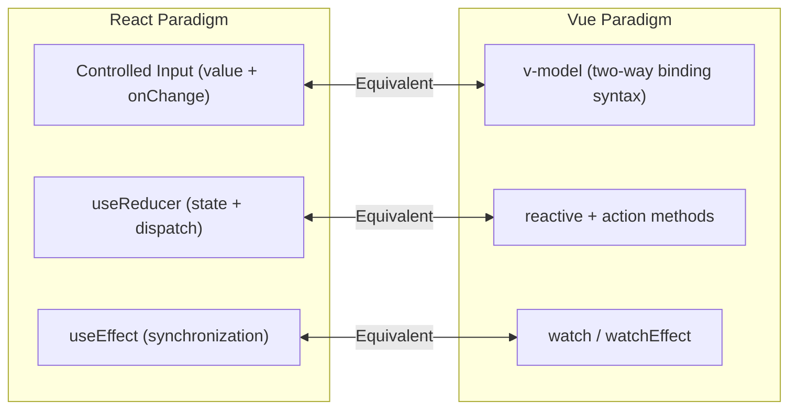

The important design questions remain:

- what is the draft?
- what is valid?
- what is submitted?
- who owns the transition?

---

## A complex edit form model

```ts
type EditState = {
  draft: ProductDraft;
  initial: ProductDraft;
  touched: Set<string>;
  errors: Record<string, string>;
  status: "idle" | "saving" | "saved" | "error";
};
```

The model separates current values, comparison baseline, interaction history, validation, and submission lifecycle.

---

## A form reducer makes operations visible

```ts
type FormAction =
  | { type: "fieldChanged"; name: string; value: string }
  | { type: "fieldBlurred"; name: string }
  | { type: "submitted" }
  | { type: "reset" };
```

Explicit actions make it possible to test dirty state, touched state, validation, and reset behavior as transitions.

---

## Route plus form interaction

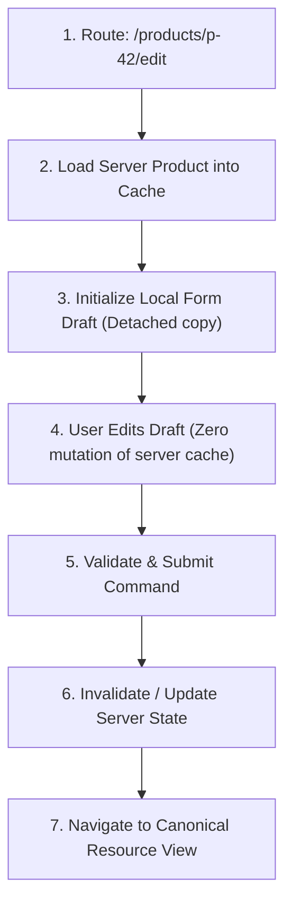

Each arrow is a deliberate ownership transition.

---

## Unsaved changes need a policy

When a dirty form meets navigation, decide:

- block and confirm;
- autosave;
- preserve a draft;
- discard explicitly;
- allow navigation and make loss clear.

Do not let a route unmount silently destroy work the user believes is still present.

---

## Persistence for long forms

Persist only what is appropriate:

- version the draft;
- exclude secrets;
- expire stale drafts;
- validate on restore;
- show the user what was restored;
- provide clear reset behavior.

Persistence is another external boundary with lifecycle and privacy decisions.

---

## Local state versus context versus store

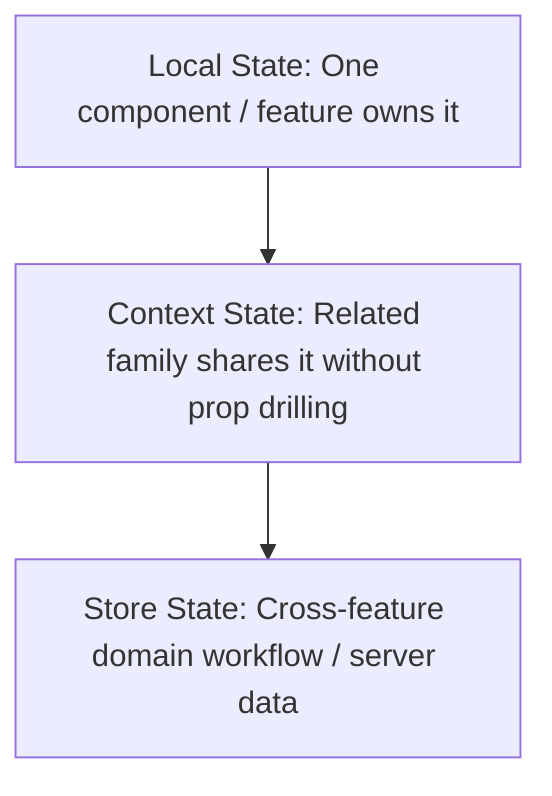

Start with the smallest scope that satisfies the real consumers.

---

## Server state versus client state

```mermaid
flowchart TD
    S1["Server Data: Remote owner, asynchronous, stale, refetchable"]
    S2["Client UI State: Local user choices, immediate interaction, ephemeral"]
    S3["Domain State: Business transitions, validated models, domain rules"]
```

The same object may be represented in more than one layer, but each representation needs a clear owner and synchronization rule.

---

## URL state versus persistent state

```mermaid
flowchart LR
    URL["URL State: Current shareable view & navigation bookmark"]
    Storage["Persistent Storage: Long-lived preference or offline draft across sessions"]
```

The URL is visible and navigable.

Persistence survives beyond one route and may need migration.

Do not use one as a substitute for the other.

---

## State ownership and testing

Clear ownership makes focused tests possible:

- parser tests for URL state;
- reducer tests for transitions;
- form tests for validation and dirty behavior;
- route tests for history and redirects;
- server-state tests for loading and stale responses.

If every test needs the whole application, ownership may be too global.

---

## State ownership and team scale

As a team grows, implicit ownership becomes expensive.

Document:

- which module owns a value;
- which API changes it;
- what is public URL state;
- what is cached server data;
- what can be persisted;
- which transitions are legal.

Architecture reduces coordination cost when boundaries are explicit.

---

## Practical lab: Routed Administrative Catalogue

Build a catalogue whose filters, sorting, pagination, and selected view are represented in the URL when they should survive reload, sharing, and history navigation.

Then add a routed edit form with explicit ownership for draft, validation, server state, and workflow transitions.

---

## Practical stages 1–4: inventory and URL state

1. Create the state inventory.
2. Build URL-based filters.
3. Parse and validate query parameters.
4. Keep server state separate.

Verification: a copied URL reconstructs the same meaningful view without exposing sensitive data.

---

## Practical stages 5–8: local UI and editing

5. Add local modal state.
6. Convert editing to a route.
7. Create a complex edit form.
8. Track touched and dirty state.

Do not copy server data into a continuously synchronized global form object.

---

## Practical stages 9–12: validation and transitions

9. Add cross-field validation.
10. Add dynamic fields with stable keys.
11. Add a reducer.
12. Model the workflow as a state machine.

Make invalid combinations and illegal transitions visible in the model.

---

## Practical stages 13–16: resilient navigation

13. Add navigation UX.
14. Add route-level code splitting.
15. Add persistence with versioning and validation.
16. Create the final state map.

Include loading, error, retry, unsaved-change, and back/forward behavior.

---

## Practical extension: debounced server search

Add:

```mermaid
flowchart LR
    Input["Local Keystrokes"] --> Debounce["Debounce Timer"]
    Debounce --> Cancel["AbortController (Cancel in-flight)"]
    Cancel --> Cache["Server-State Cache (Query Result)"]
```

Keep the local suggestion draft separate from the committed URL query.

Ensure an old response cannot overwrite a newer query's result.

---

## Try this yourself

For a product editor, decide where these values belong:

```text
modal open
product ID
draft title
server product
page number
selected tab
dirty flag
filtered rows
```

Write the owner and lifetime beside each one before writing components.

---
## Troubleshooting guide (Part 1)

| Symptom | Likely cause |
|---|---|
| URL and input disagree | Two owners exist for the same value |
| Back button feels noisy | Every transient edit pushed history |
| Refresh loses the view | Shareable state stayed local |
| Old API data overwrites new data | Server-state race lacks cancellation or identity |
---
## Troubleshooting guide (Part 2)

| Symptom | Likely cause |
|---|---|
| Form loses work on navigation | Dirty policy is undefined |
| Validation flickers | Draft, touched, and errors are conflated |
| Store contains everything | State categories were never classified |
| Child route feels like a full reset | Parent context or layout is not preserved |
---

## Completion checklist

- [ ] every important value has a category and owner;
- [ ] derived values are not duplicated unnecessarily;
- [ ] server state has freshness and failure semantics;
- [ ] URL state is serializable, validated, and shareable;
- [ ] history semantics are intentional;
- [ ] form drafts are separate from accepted domain commands;
- [ ] dirty, touched, and validation state have distinct meanings;
- [ ] reducers or state machines model meaningful transitions;
- [ ] persistence is versioned and safe;
- [ ] route and form behavior is tested from the user's perspective.

---
## Misconceptions to leave behind (Part 1)

| Misconception | Better mental model |
|---|---|
| State management means choosing a library | First classify ownership and lifetime |
| All shared state belongs in a global store | Share only across real consumers |
| Server data becomes ordinary client state | It has freshness, cache, and synchronization rules |
| The URL is just routing | It is public, serializable view state |
| Every option belongs in the URL | Ephemeral and sensitive values have other owners |
| Forms are collections of controlled inputs | Forms are workflows with drafts and transitions |
---
## Misconceptions to leave behind (Part 2)

| Misconception | Better mental model |
|---|---|
| Controlled forms are always better | Choose based on coordination needs |
| Draft and domain models must match | Input representation can differ from accepted data |
| Dirty and touched mean the same thing | They record different interaction facts |
| A reducer is only for global state | Local complex transitions benefit too |
| Back/forward is only the router's problem | History behavior is product architecture |
---

## The chapter in one sentence

> **Classify state by ownership and lifetime, keep one clear source of truth, and make routing and forms explicit state machines for the user’s journey.**

---

## Next: Chapter 9

The next chapter will build on state architecture with:

- resilient asynchronous data flows;
- request lifecycle design;
- caching, invalidation, and optimistic updates;
- loading and error boundaries;
- race-free server synchronization.

---

## Questions

Which value in your current application has two owners?

What should happen to it on reload, sharing, back navigation, and an interrupted request?
