# Real-Time Communication, Offline Systems & Client Persistence

Design for disconnection

**Chapter 10**

Polla Fattah

---

## Today's goal

Build front-end systems that remain understandable when messages arrive, networks disappear, and local work must synchronize later.

We will connect:

- polling, long polling, SSE, WebSockets, and WebRTC;
- connection state, ordering, duplication, backpressure, and reconnection;
- cookies, browser storage, IndexedDB, and Cache Storage;
- service-worker lifecycle and caching strategies;
- offline reads, offline writes, outboxes, and synchronization;
- identity, conflicts, eventual consistency, and background sync;
- a field-inspection architecture that works without a permanent connection.

---

## By the end of today you can

- choose the simplest communication model that satisfies the requirement;
- prevent overlapping polls and stale live updates;
- design SSE and WebSocket message envelopes;
- model connection state as user-visible state;
- distinguish transport delivery from application semantics;
- choose browser storage by data meaning and lifetime;
- explain service-worker install, activate, and fetch interception;
- design cache-first, network-first, and stale-while-revalidate policies;
- persist drafts and queued operations offline;
- synchronize with idempotency, retry limits, and conflict detection.

---

## The central lesson

> **Real-time and offline behavior are not switches; they are explicit policies for communication, persistence, synchronization, identity, and recovery.**

The network may be delayed, duplicated, reordered, unavailable, or partially available.

The application must make those conditions meaningful rather than pretending they cannot happen.

---

## The chapter's progression

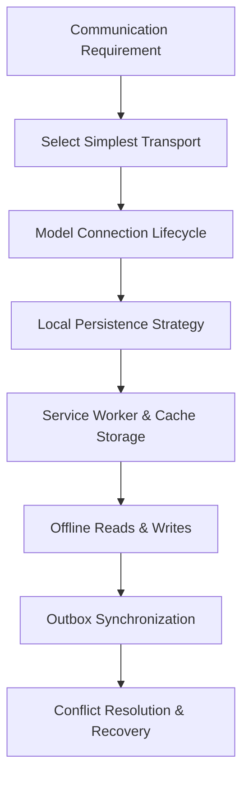

Complexity should be earned by a real product requirement.

---

## “Real-time” is a requirement, not one technology

Ask:

- how fresh must the data be?
- who sends updates?
- is communication one-way or two-way?
- can a short delay be accepted?
- must work continue without a network?
- are messages durable or disposable?

The answers narrow the transport and persistence choices.

---

## Start with the simplest communication model

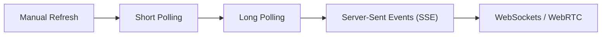

Use the least complex model that satisfies freshness and interaction needs.

Do not add a bidirectional socket when periodic reads are sufficient.

---

## Polling is repeated HTTP

```ts
setInterval(async () => {
  const updates = await fetch("/api/updates");
  render(await updates.json());
}, 10_000);
```

Polling is easy to deploy, observe, authorize, and cache.

Its cost is repeated requests even when nothing changed and delayed delivery between intervals.

---

## Polling interval is a trade-off

```text
short interval → fresher data, more requests and battery use
long interval  → less work, more visible delay
```

Choose based on the business meaning of freshness, not an arbitrary “real-time” label.

---

## Poll only when useful

Pause or reduce polling when:

- the document is hidden;
- the user leaves the relevant route;
- the device is offline;
- the data is not visible or actionable;
- a long-lived connection already supplies updates.

Resume with an explicit refresh when the user returns.

---

## Avoid overlapping poll requests

```ts
let active: AbortController | undefined;

async function poll() {
  active?.abort();
  active = new AbortController();
  return fetch("/api/updates", { signal: active.signal });
}
```

If a request takes longer than the interval, a naive timer can create concurrent requests and out-of-order responses.

---

## Long polling is still repeated HTTP

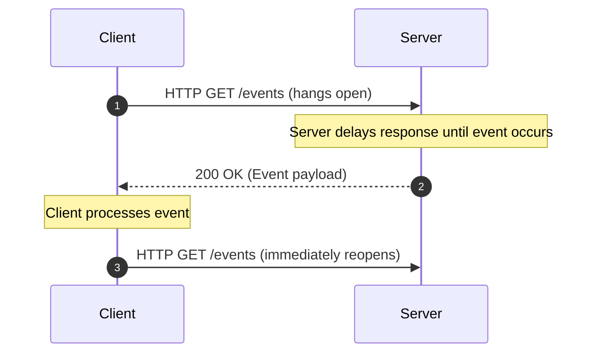

Long polling reduces empty responses while preserving an HTTP-shaped deployment model.

It still needs cancellation, timeout, reconnection, and duplicate handling.

---

## Server-Sent Events are one-way streams

```ts
const events = new EventSource("/api/events");

events.onmessage = event => {
  const message: unknown = JSON.parse(event.data);
  handleEvent(message);
};
```

SSE is useful when the client sends commands through ordinary HTTP and the server streams updates back.

---

## SSE architecture

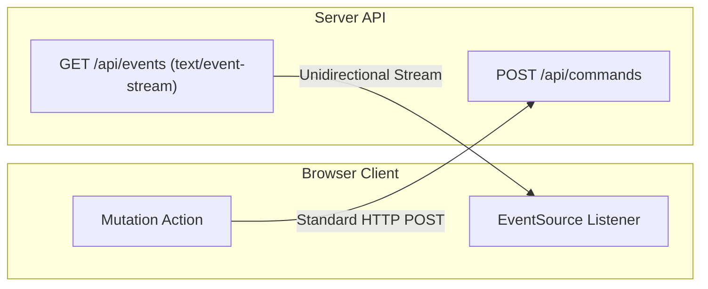

The one-way direction simplifies some authorization and infrastructure concerns compared with a fully bidirectional socket.

---

## When SSE fits well

Use SSE for:

- notifications;
- progress updates;
- monitoring dashboards;
- assignment changes;
- server-generated status events.

It is a poor fit when the client must exchange frequent messages in both directions over one connection.

---

## Commands over HTTP, events over SSE

```mermaid
sequenceDiagram
    autonumber
    participant App as Browser Client
    participant API as Municipal REST API
    participant SSE as SSE Stream Server

    App->>API: POST /assignments/a-1/complete (HTTP)
    API-->>App: 200 OK { id: "a-1", status: "completed" }
    API->>SSE: Broadcast domain event
    SSE-->>App: event: assignment.updated
data: { id: "a-1", status: "completed" }
```

Keeping commands and events separate can make authorization, retries, and audit behavior clearer.

The event remains an announcement; the server remains authoritative.

---

## Named SSE events improve intent

```ts
events.addEventListener("assignment.updated", event => {
  const payload: unknown = JSON.parse(event.data);
  handleAssignmentUpdate(payload);
});
```

Named events avoid one generic handler having to infer every message kind from an unstructured payload.

---

## SSE reconnect is part of the contract

An interrupted stream should define:

- reconnect delay;
- maximum or bounded backoff;
- authentication refresh;
- missed-event recovery;
- duplicate-event handling;
- user-visible connection status.

Reopening the stream alone does not guarantee that no update was missed.

---

## Events need identity when necessary

```json
{
  "id": "event-1042",
  "type": "assignment.updated",
  "version": 8,
  "entityId": "assignment-7"
}
```

An event ID or entity version lets the client detect duplicates, gaps, and stale updates.

---

## WebSockets are bidirectional transports

```text
client ⇄ persistent WebSocket connection ⇄ server
```

They fit interactive collaboration, presence, chat, live controls, and high-frequency two-way communication.

They also create more lifecycle and protocol responsibility.

---

## WebSocket architecture

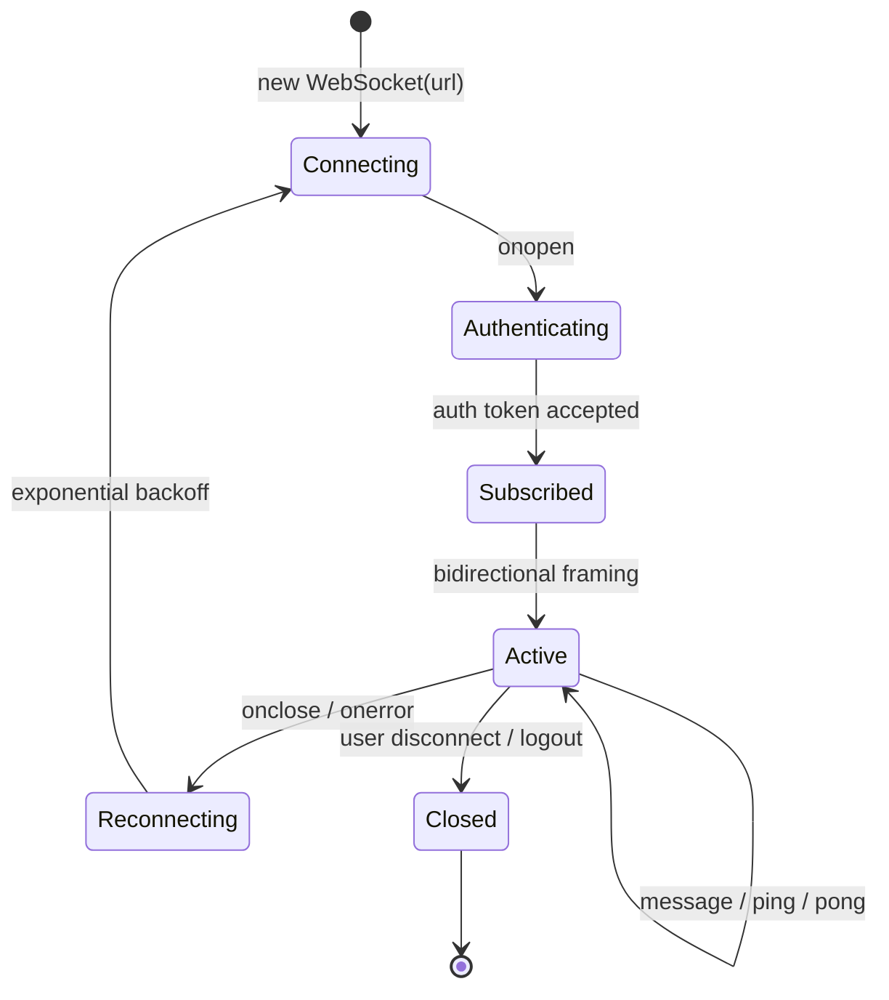

The socket is one part of the application architecture, not the architecture itself.

---

## A WebSocket is a transport, not an application protocol

The transport does not decide:

- message types;
- authentication refresh;
- ordering guarantees;
- idempotency;
- authorization;
- persistence;
- conflict resolution;
- missed-event recovery.

Those rules belong in the message protocol and domain design.

---

## Design message envelopes deliberately

```ts
type Message = {
  id: string;
  type: "assignment.updated" | "inspection.acknowledged";
  version: number;
  occurredAt: string;
  payload: unknown;
};
```

An envelope gives the client enough information to route, validate, order, and observe messages.

---

## Runtime validation still applies

```ts
socket.addEventListener("message", event => {
  const value: unknown = JSON.parse(event.data);
  const message = parseMessage(value);
  if (!message.ok) return showProtocolError(message.error);
  applyMessage(message.data);
});
```

TypeScript cannot guarantee that a remote peer sent the expected data.

---

## Connection state is UI state

```ts
type ConnectionState =
  | { status: "offline" }
  | { status: "connecting" }
  | { status: "connected" }
  | { status: "reconnecting"; attempt: number }
  | { status: "failed"; message: string };
```

Users need to know whether an action is live, queued, delayed, or unavailable.

---

## Reconnection is not “just reopen the socket”

After reconnecting, the client may need to:

- refresh credentials;
- resubscribe;
- request a snapshot;
- replay safe commands;
- detect missed versions;
- discard obsolete local assumptions.

Reconnect is a synchronization sequence.

---

## Snapshot plus events is a robust pattern

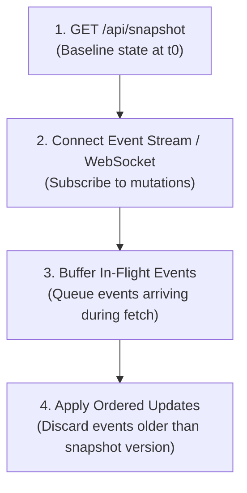

The snapshot provides a baseline.

Events provide changes after that baseline.

The protocol must define the race between reading the snapshot and subscribing.

---

## Ordering cannot be assumed

Messages can arrive:

- late;
- out of order;
- duplicated;
- after a reconnect;
- from an earlier connection.

Use sequence numbers, versions, timestamps with care, or a server reconciliation step.

---

## Duplicates are normal in reliable systems

At-least-once delivery can repeat a message.

Make handlers idempotent where possible:

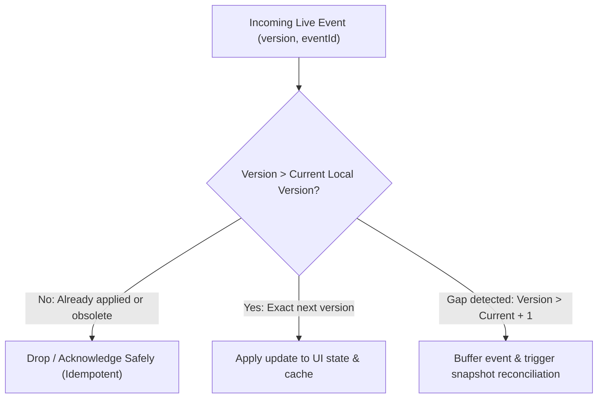

Exactly-once behavior is usually an application-level illusion built from IDs and state.

---

## Backpressure protects the client

If messages arrive faster than the UI or storage can process them, define a policy:

- coalesce updates;
- drop obsolete intermediate states;
- pause subscriptions;
- apply batches;
- request a fresh snapshot;
- show degraded status.

Unbounded queues turn a temporary burst into a memory and responsiveness problem.

---

## WebSocket reconnect needs bounded backoff

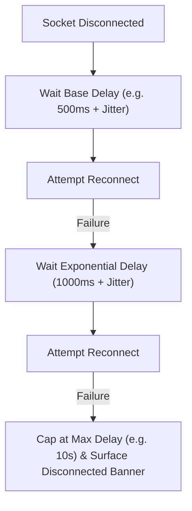

Add jitter and stop retrying when the failure is permanent, such as invalid credentials or forbidden access.

---

## Polling, SSE, or WebSocket?

| Requirement | Good starting point |
|---|---|
| occasional freshness | polling |
| server-to-client stream | SSE |
| high-frequency two-way interaction | WebSocket |
| intermittent network with durable work | HTTP plus local outbox |
| peer media/data | WebRTC |

The product requirement should choose the transport.

---

## WebRTC is a different kind of real-time

WebRTC is designed for peer media and data.

It still needs:

- signaling;
- identity and authorization;
- NAT traversal;
- relay infrastructure;
- connection lifecycle;
- application-level message rules.

It is not a replacement for ordinary server events.

---

## Signaling establishes a connection

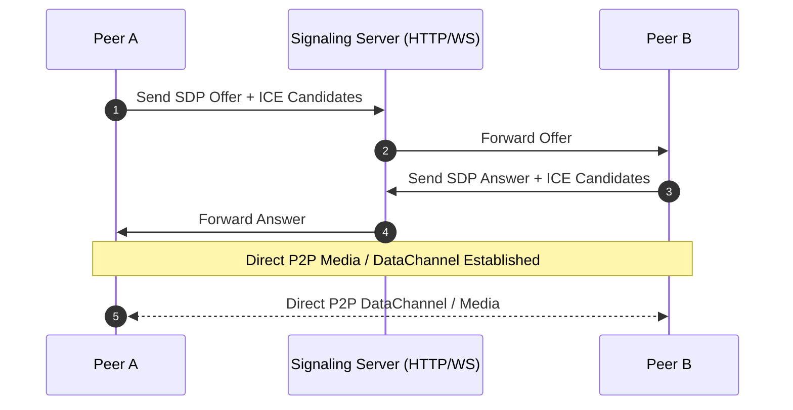

The signaling channel helps peers exchange connection information.

The actual media or data path may then be direct or relayed.

---

## NAT traversal and relay

Some network environments prevent direct peer connectivity.

STUN can help discover a reachable address.

TURN can relay traffic when direct connection fails.

Real-time architecture must budget for the cases where the ideal path is unavailable.

---

## Client persistence starts with meaning

Ask what must survive:

- reload;
- tab close;
- browser restart;
- route change;
- offline time;
- service-worker update.

Choose storage after defining lifetime, size, sensitivity, and access pattern.

---

## Cookies

Cookies are sent with requests according to domain, path, and policy rules.

They are useful for server-managed sessions but require careful security attributes:

```text
Secure + HttpOnly + SameSite + limited scope
```

Do not use cookies as a general client database.

---

## `localStorage`

```ts
localStorage.setItem("theme", "dark");
const theme = localStorage.getItem("theme");
```

It is convenient for small string preferences and simple drafts.

It is synchronous, string-only, quota-limited, and not a secure store.

---

## `localStorage` is synchronous

Large reads and writes can block the main thread.

Avoid using it for large datasets, frequent updates, or high-volume logs.

For larger asynchronous data, consider IndexedDB or an application-specific persistence layer.

---

## `localStorage` stores strings

```ts
localStorage.setItem("settings", JSON.stringify(settings));

const raw = localStorage.getItem("settings");
const value: unknown = raw === null ? null : JSON.parse(raw);
```

Validate versions and shape on read. Data written by the application is still an external runtime boundary after reload.

---

## `sessionStorage` has a shorter lifetime

It is scoped to a browser tab session.

It can suit temporary per-tab state that should survive reload but not a new tab or later session.

The same string-only and synchronous limitations still apply.

---

## Storage events coordinate tabs

```ts
window.addEventListener("storage", event => {
  if (event.key === "theme") applyTheme(event.newValue);
});
```

Storage events can notify other documents, but they are not a durable event bus or a complete synchronization protocol.

---

## IndexedDB is an asynchronous local database

Use it for:

- larger structured data;
- offline records;
- drafts and outboxes;
- indexes and queries;
- data that should not block rendering.

The asynchronous API adds complexity, but supports a more appropriate data model.

---

## IndexedDB is transactional

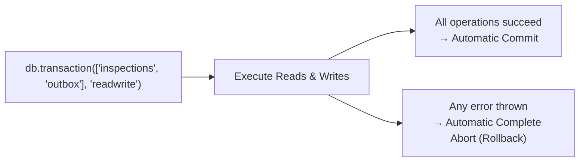

Group related updates so a draft and its outbox record cannot silently diverge.

Design transaction boundaries around invariants the application must preserve.

---

## IndexedDB is asynchronous

Plan for:

- request errors;
- aborted transactions;
- blocked upgrades;
- unavailable storage;
- concurrent tabs;
- schema migration.

The database is local, but it is still a failure-prone boundary.

---

## IndexedDB versioning is a migration contract

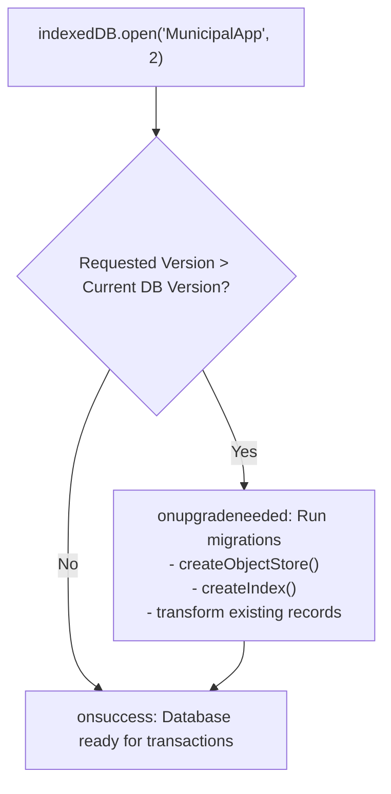

Test upgrades from realistic previous versions.

Do not assume users start with an empty database after a release.

---

## Cache Storage stores request/response pairs

```ts
const cache = await caches.open("app-assets-v1");
await cache.put(request, response.clone());
```

It fits resources retrieved through the Fetch model, especially assets and selected HTTP responses.

It is not interchangeable with a domain database.

---

## Cache Storage versus IndexedDB

| Cache Storage | IndexedDB |
|---|---|
| request/response pairs | structured application records |
| asset and HTTP-like retrieval | queries, indexes, transactions |
| service-worker friendly | domain/offline data friendly |
| cache strategy | persistence and synchronization model |

Choose based on data semantics, not only size.

---

## Storage is not guaranteed forever

Data may be evicted because of:

- quota pressure;
- user settings;
- browser policy;
- private browsing;
- device storage constraints;
- application cleanup.

Offline architecture must tolerate missing local data and rehydrate from the server when possible.

---

## Storage quotas affect product behavior

Large offline datasets need:

- size limits;
- eviction policy;
- user-visible storage status;
- cleanup rules;
- recovery when writes fail.

Do not promise indefinite offline history unless the platform and product support that promise.

---

## Choose storage by data semantics

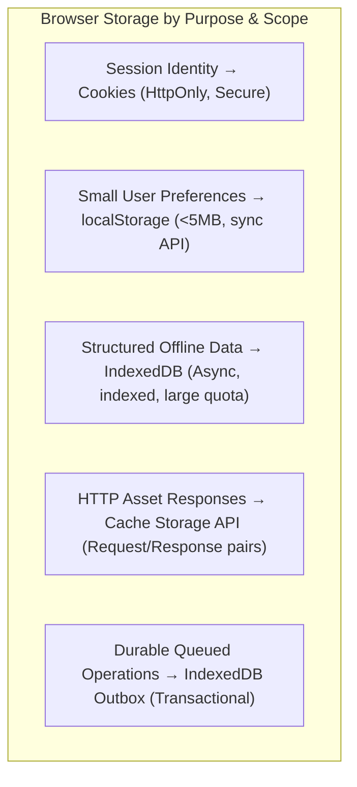

One application can use several stores with explicit ownership.

---

## Service workers run outside the page

```mermaid
flowchart LR
    Page["Active Browser Window / Page"] <-->|fetch() / Navigation| SW["Service Worker
(self.addEventListener('fetch'))"]
    SW <-->|Cache Match / Put| Cache["Cache Storage API"]
    SW <-->|Network Request| Net["Remote Network Server"]
```

The worker has a different lifecycle and execution context.

It can intercept fetches and support caching, but it does not automatically understand domain data or user intent.

---

## Secure context is required

Service-worker features generally require a secure context such as HTTPS, with localhost development commonly treated specially.

Deployment configuration is part of the offline architecture.

---

## Service-worker lifecycle

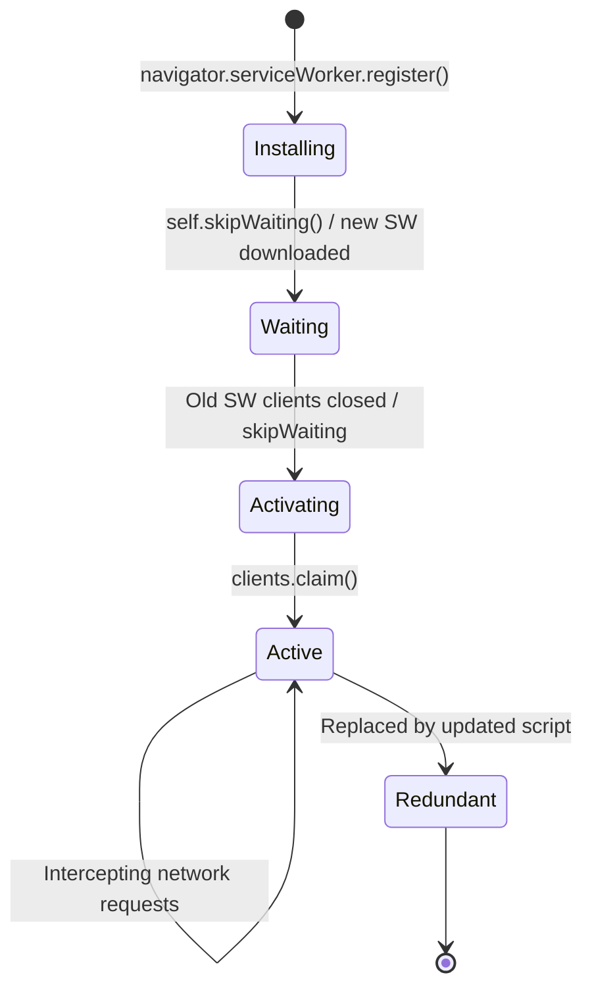

An updated worker may not control the current page immediately.

Design update messaging and cache compatibility rather than assuming an instant replacement.

---

## Installation prepares resources

```ts
self.addEventListener("install", event => {
  event.waitUntil(precacheAssets());
});
```

Installation should be bounded and versioned.

Do not make one missing optional asset prevent the entire application from installing unless that is intentional.

---

## Activation cleans up and takes ownership

```ts
self.addEventListener("activate", event => {
  event.waitUntil(deleteOldCaches());
});
```

Activation is a migration boundary for caches and control behavior.

Coordinate old and new asset versions so the page does not combine incompatible files.

---

## Fetch interception is policy code

```ts
self.addEventListener("fetch", event => {
  event.respondWith(handleRequest(event.request));
});
```

The worker must decide which requests it can safely handle and which should pass through.

Do not cache credentials, private data, or mutations accidentally.

---

## A service worker does not mean offline automatically

Offline support requires:

- a cache strategy;
- data persistence;
- a fallback UI;
- offline write behavior;
- synchronization;
- conflict policy;
- update and eviction handling.

Registration is only the start.

---

## Cache-first strategy

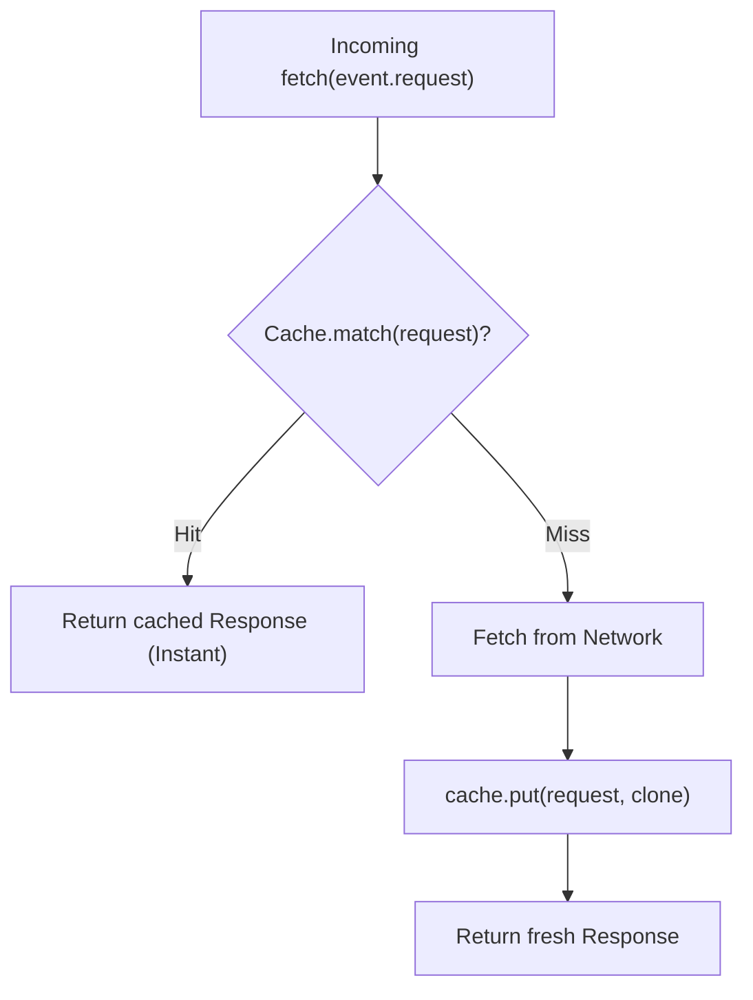

Good for versioned static assets or content where immediate availability is more important than freshness.

Risk: stale content can persist if versioning and invalidation are weak.

---

## Network-first strategy

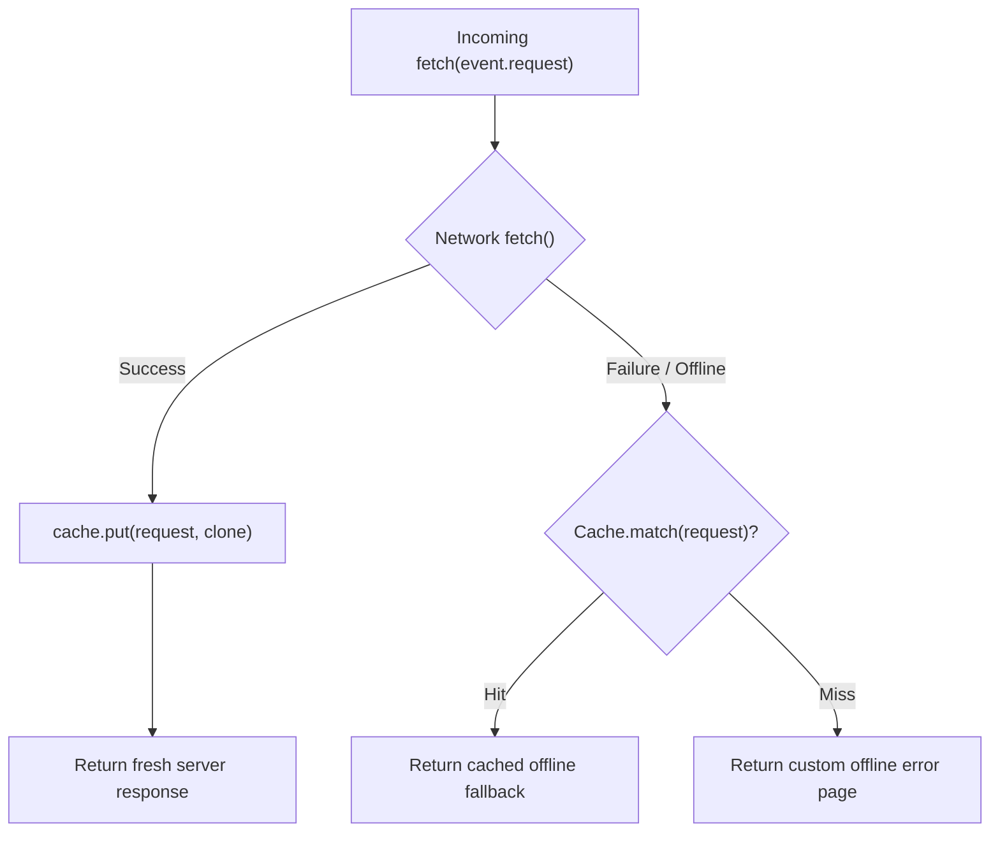

Good for data that should be fresh when connectivity exists but remain readable offline.

Risk: slow networks can delay the fallback unless timeouts are defined.

---

## Stale-while-revalidate

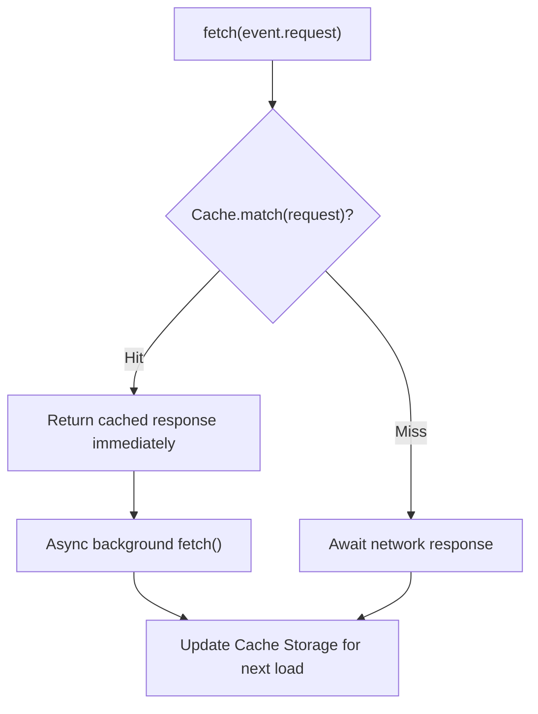

Good when fast display and eventual freshness are both useful.

The UI should communicate meaningful staleness.

---

## Network-only and cache-only

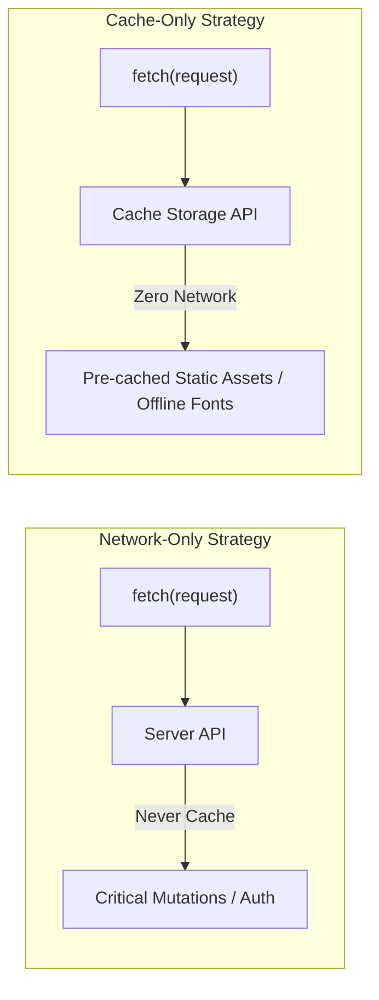

Do not apply one strategy to every request.

Mutation requests should not be silently treated like cacheable reads.

---

## Strategy matrix

| Data | Useful strategy |
|---|---|
| versioned assets | cache-first |
| current account data | network-first / query policy |
| readable offline catalogue | stale-while-revalidate |
| mutation command | network-only plus outbox when offline |
| private durable draft | IndexedDB, not public cache |

The right choice depends on authority, freshness, and recovery.

---

## Offline fallback is a product surface

An offline screen should explain:

- what remains available;
- which work is saved locally;
- what is waiting to sync;
- what cannot be done now;
- how the user can retry.

Offline is a mode with capabilities, not simply an error page.

---

## Offline-capable versus offline-first

```text
offline-capable → core paths work without connectivity when needed
offline-first    → local state is the primary interaction model
```

Offline-first is a larger product commitment involving conflict, identity, local storage, and synchronization.

Do not adopt it for a feature that only needs cached reading.

---

## `navigator.onLine` is only a hint

It can indicate a network interface state.

It does not prove:

- the server is reachable;
- authentication works;
- the request will succeed;
- the route is available;
- the network has useful bandwidth.

Treat actual requests and failures as stronger evidence.

---

## Offline reads

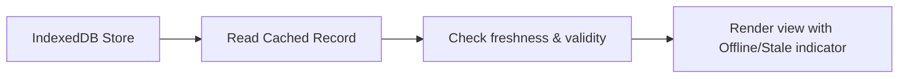

Offline reads should identify:

- when data was last synchronized;
- whether it is incomplete;
- whether an update is pending;
- when the next refresh can occur.

---

## Offline writes need durable intent

```mermaid
flowchart LR
    User["User Submits Form"] --> Split["Atomic Transaction"]
    Split --> Rec["Update Local Record"]
    Split --> Box["Enqueue Outbox Operation"]
    Box --> Sync["Background Sync Engine"]
```

Do not keep the only copy of a user's work in memory while waiting for the network.

Persist the draft or operation before telling the user it is safely queued.

---

## The outbox pattern

```mermaid
flowchart TD
    Cmd["User Action: Submit Inspection"] --> Tx["Atomic IndexedDB Transaction"]
    Tx -->|Write| Domain["Write local 'inspections' store (Status: PendingSync)"]
    Tx -->|Write| Outbox["Write 'outbox' store (Operation: CREATE_INSPECTION)"]
    Outbox --> Sync{"Sync Trigger
(Online event, page load, visibility)"}
    Sync --> Post["POST /api/inspections with Idempotency-Key"]
    Post -->|200 Ack| Done["Remove outbox record, update local status to Synced"]
    Post -->|Network Drop| Retry["Increment attempt count, schedule backoff retry"]
    Post -->|4xx Fatal| Dead["Mark outbox item FAILED, notify inspector"]
```

The transaction keeps local work and its synchronization intent together.

---

## Local identity versus server identity

An offline record may need:

```mermaid
classDiagram
    class InspectionRecord {
        +UUID localId "Generated client-side immediately (crypto.randomUUID())"
        +String serverId "Canonical ID assigned or confirmed by server (null while offline)"
        +UUID operationId "Unique idempotency token sent in outbox request"
        +String syncStatus "draft | pending_sync | syncing | synced | conflict"
        +Number version "Optimistic concurrency version tag"
    }
```

Do not use one identifier for three different meanings.

---

## Pending synchronization is user-relevant state

Show whether work is:

```mermaid
stateDiagram-v2
    [*] --> Draft: User edits record
    Draft --> PendingSync: User commits inspection
    PendingSync --> Syncing: Network available & outbox flush
    Syncing --> Synced: Server returns 200 OK
    Syncing --> PendingSync: Transient 5xx / timeout (retry)
    Syncing --> Failed: 422 validation / 403 forbidden
    Failed --> Draft: User edits data to fix validation
    Synced --> [*]
```

Users need confidence about whether their work is safe, not only whether the browser currently has a connection.

---

## Sync is not the same as retry

Retry repeats an operation after a transient failure.

Synchronization reconciles local intent with remote authority after time and possibly other changes.

It may need identity, ordering, conflict detection, and a new domain decision.

---

## Conflict example

```text
server inspection status: open
device A offline:         completed
device B online:          reassigned
```

When device A reconnects, blindly overwriting the server may destroy a newer decision.

The system needs a conflict policy.

---

## Conflict policies

```mermaid
flowchart TD
    subgraph ConflictResolution["Conflict Resolution Policies"]
        C1["Last Write Wins (LWW)
Clock timestamp determines winner (Risky)"]
        C2["Server Wins
Canonical authority; client state overwritten"]
        C3["Client Wins
Local user decision always takes precedence"]
        C4["Field-Level 3-Way Merge
Combine non-overlapping field edits"]
        C5["Manual User Resolution
Side-by-side visual diff prompt"]
    end
```

Choose based on data meaning and harm, not implementation convenience.

---

## Version-based conflict detection

```json
{
  "id": "inspection-7",
  "version": 12,
  "status": "open"
}
```

The client submits the version it edited.

The server rejects or resolves the operation when its current version differs.

---
## Operation logs make synchronization inspectable (Part 1)

| Field | Type | Description |
|---|---|---|
| `operationId` | `UUID` | Unique idempotency key for this synchronization action |
| `entity` | `string` | Target domain entity (e.g. `'inspection'`) |
| `command` | `string` | Action type (e.g. `'SUBMIT_REPORT'`) |
| `payload` | `JSON` | Complete serialized mutation payload |
---
## Operation logs make synchronization inspectable (Part 2)

| Field | Type | Description |
|---|---|---|
| `createdAt` | `timestamp`| Client timestamp when user performed action |
| `attempts` | `number` | Retry counter with maximum threshold |
| `status` | `enum` | `'pending_sync' \| 'syncing' \| 'failed'` |
---

## Eventual consistency is a user experience

After an offline action, local state may say “completed” while the server has not confirmed it.

Represent that distinction:

```text
locally complete, awaiting server confirmation
```

Do not present unconfirmed local intent as permanent server truth.

---

## Background Sync is an enhancement

Background Sync can help flush queued work when the browser decides conditions are suitable.

The application must still work when it is unavailable, delayed, or denied.

Provide a visible manual retry and foreground synchronization path.

---

## Periodic background sync needs restraint

Periodic work affects:

- battery;
- data usage;
- privacy;
- server load;
- freshness expectations.

Use it only when the product meaningfully benefits from background refresh.

---

## Service-worker update risk

An old page and a new worker can temporarily coexist.

Plan for:

- compatible cache names;
- atomic asset versions;
- schema migration;
- user messaging;
- safe activation timing.

Updating a worker is a deployment and data-migration concern.

---

## Cache versioning

```ts
const STATIC_CACHE = "app-shell-v3";
```

Version names make cleanup and incompatible asset replacement explicit.

Do not let old bundles and new runtime assumptions share one unbounded cache.

---

## Do not cache every API response forever

For each response, define:

- sensitivity;
- freshness;
- user scope;
- size;
- invalidation;
- offline usefulness;
- eviction.

Caching private data without a lifecycle can create security and correctness problems.

---

## User identity and offline data

When a user signs out or changes account, decide what happens to local data:

- delete it;
- encrypt or isolate it;
- keep only non-sensitive preferences;
- mark it for a specific identity;
- prevent another account from reading it.

Local persistence must respect authorization boundaries.

---

## Cache API is not authorization

A cached response existing on the device does not prove the current user may still access it.

Authorization remains a server and application decision.

Clear or revalidate private cached data when identity or permissions change.

---

## Progressive web apps are a capability set

A PWA may include:

- installability;
- service workers;
- offline assets;
- local data;
- push notifications;
- background synchronization.

Installability does not automatically imply offline data or reliable synchronization.

---

## The app shell is only one layer

```mermaid
flowchart TD
    subgraph OfflineFieldSystem["The Four Pillars of Offline Resilience"]
        P1["1. App Shell (Cache Storage)
HTML, CSS, JS bundles cached for 0ms offline boot"]
        P2["2. Local Data Store (IndexedDB)
Read-only municipal permits, checklists, inspector profiles"]
        P3["3. Durable Outbox (IndexedDB)
Queued operations preserved across reboots & browser closes"]
        P4["4. Synchronization Engine
Background queue consumer with exponential backoff & idempotency"]
    end
```

Caching HTML, CSS, and JavaScript does not solve domain data or mutation conflicts.

---

## Offline-first interaction

```text
local write is primary
server sync is eventual
```

This can produce excellent responsiveness, but it requires durable local models, conflict handling, and clear confirmation states.

---

## Network-first interaction

```text
server is primary
local cache is fallback or acceleration
```

This is often appropriate for authoritative records where stale edits are risky and connectivity is usually available.

---

## Select the offline scope

Possible scopes:

```mermaid
flowchart TD
    L1["Level 1: Offline Shell Only
App boots to static frame with 'No Connection' banner"]
    L2["Level 2: Offline Read Cache
User can browse previously viewed permits and checklists"]
    L3["Level 3: Offline Drafts
Unsaved form inputs persist across reboots in IndexedDB"]
    L4["Level 4: Offline Queued Outbox
Inspectors complete inspections offline; synced upon reconnect"]
    L5["Level 5: Full Local-First Workflow
CRDTs / multi-device peer synchronization with zero central locks"]
    L1 --> L2 --> L3 --> L4 --> L5
```

Choose the smallest scope that solves the user problem.

---

## Real-time plus offline together

```mermaid
stateDiagram-v2
    state Online {
        [*] --> Streaming
        Streaming: WebSocket / SSE live events update local store
    }
    state Offline {
        [*] --> Autonomous
        Autonomous: Reads from IndexedDB; writes queued in Outbox
    }
    state Reconnecting {
        [*] --> Heartbeat
        Heartbeat: Egress probe succeeds
        Heartbeat --> FlushOutbox: Send queued operations with Idempotency-Key
        FlushOutbox --> InvalidateQueries: Refresh canonical server state
    }
    Online --> Offline: Connection lost
    Offline --> Reconnecting: Network regained
    Reconnecting --> Online: All operations settled
```

One local data model can be the bridge between live updates and offline work.

---

## A reconnect sequence

```mermaid
flowchart TD
    A["1. Connectivity Hint (online event / window focus)"] --> B["2. Heartbeat Ping (verify real internet egress)"]
    B --> C["3. Validate Auth Token / Refresh Session"]
    C --> D["4. Fetch Server Version Vector / Changes"]
    D --> E["5. Flush Pending Outbox Operations with Idempotency"]
    E --> F["6. Detect & Resolve Concurrent Conflicts"]
    F --> G["7. Reconcile UI & Invalidate Fresh Server Queries"]
```

The order matters. Sending stale operations before understanding current server state can create avoidable conflicts.

---

## Avoid double-applying events

```text
outbox command succeeds → local record updated
server event arrives     → same change announced
```

Use operation IDs or server versions to recognize that the local optimistic change and remote event refer to one operation.

---

## Data freshness after reconnect

After a long offline period, cached data may be:

- outdated;
- structurally migrated;
- revoked by permissions;
- superseded by a conflict;
- incomplete.

Revalidate and communicate the result rather than silently labeling it current.

---

## Practical project: Offline-Capable Field Inspections

Build a field-inspection application that can read assignments, save drafts, queue completed inspections, and recover when connectivity returns.

The practical combines live communication, persistence, service workers, outbox sync, idempotency, and conflict decisions.

---

## Practical stages 1–3: communication models

1. Implement polling.
2. Prevent poll overlap.
3. Replace polling with SSE.

Measure freshness, request count, cancellation, and behavior when the tab is hidden or offline.

---

## Practical stages 4–7: live connection design

4. Compare SSE and WebSocket.
5. Add connection state.
6. Design reconnection.
7. Explore WebRTC conceptually.

Write down which message guarantees the application actually needs: ordering, identity, duplication handling, and recovery.

---

## Practical stages 8–10: persistence foundations

8. Add local preferences.
9. Add IndexedDB.
10. Register a service worker.

Test reload, tab close, unavailable storage, upgrade, and a missing or malformed local record.

---

## Practical stages 11–13: caching and offline reads

11. Implement cache-first assets.
12. Implement network-first data.
13. Add an offline fallback.

Make the strategy visible in the UI and document which requests are safe to cache.

---

## Practical stages 14–17: offline writes and sync

14. Build an offline draft.
15. Create the outbox.
16. Synchronize on reconnect.
17. Add conflict detection.

Verification: records survive reload, duplicate submission is prevented or detected, and permanent failures remain recoverable.

---

## Practical stages 18–20: operational hardening

18. Treat Background Sync as an enhancement.
19. Version the service-worker cache.
20. Draw the full architecture.

The app must remain useful without Background Sync and must explain what is waiting to synchronize.

---

## Practical extension: conflict resolution

Simulate a record changed on the server while the client was offline.

Compare:

```text
server wins
client wins
field merge
manual resolution
```

Record which policy is safest for inspection evidence and why.

---

## Try this yourself

Design the local records for one inspection:

```text
inspection
draft
outbox operation
server version
local ID
operation ID
sync status
```

Then define the transaction that persists the draft and the queued operation together.

---
## Troubleshooting guide (Part 1)

| Symptom | Likely cause |
|---|---|
| Poll responses arrive out of order | Requests overlap without identity or cancellation |
| Reconnected socket misses updates | No snapshot or event-version recovery |
| Same event changes data twice | Handler lacks idempotency identity |
| Offline work disappears on reload | Only in-memory state was used |
| Service worker is registered but offline fails | No request strategy or local data model |
---
## Troubleshooting guide (Part 2)

| Symptom | Likely cause |
|---|---|
| Old assets break with new worker | Cache versioning and activation are unsafe |
| Duplicate inspection is created | No idempotency key or server deduplication |
| Local data leaks across accounts | Persistence is not scoped or cleared on identity change |
| Sync retries forever | Permanent failures lack a terminal state |
---

## Completion checklist

- [ ] the transport matches the actual freshness and direction requirements;
- [ ] polling and live connections have cancellation and reconnection policy;
- [ ] messages have validation and identity where needed;
- [ ] connection state is visible to users;
- [ ] storage is chosen by semantics and lifetime;
- [ ] service-worker caches are versioned and scoped;
- [ ] offline writes are durable before being acknowledged locally;
- [ ] outbox operations have IDs, retry limits, and terminal failures;
- [ ] synchronization detects duplicates, ordering issues, and conflicts;
- [ ] the app remains useful without optional background capabilities.

---
## Misconceptions to leave behind (Part 1)

| Misconception | Better mental model |
|---|---|
| Real-time means WebSocket | Choose the simplest transport that fits |
| Polling is outdated | Polling is often clear and sufficient |
| SSE and WebSocket are the same | Direction and protocol responsibilities differ |
| Reopening a socket solves reconnect | Reconnect also needs resync and recovery |
| Messages arrive exactly once | Design for duplicates and reordering |
| `localStorage` is a database | It is synchronous string storage |
---
## Misconceptions to leave behind (Part 2)

| Misconception | Better mental model |
|---|---|
| App-written local data is trusted | Reloaded storage is a runtime boundary |
| Service-worker registration means offline | Strategies, persistence, and recovery are still needed |
| `navigator.onLine` proves connectivity | It is only a hint |
| Retry and synchronization are identical | Sync reconciles local intent with remote state |
| Background Sync is guaranteed | It is an enhancement, not the foundation |
| Every application should be offline-first | Choose an offline scope from user need |
---

## The chapter in one sentence

> **Design communication, persistence, and synchronization as explicit stateful systems that remain safe when connectivity is slow, absent, duplicated, or restored.**

---

## Next: Chapter 11

The next chapter will build on resilient client architecture with:

- security boundaries and threat modeling;
- authentication and authorization;
- browser security policies;
- safe handling of untrusted content;
- defensive application design.

---

## Questions

When the network disappears during an important user action, what exactly is saved, what is queued, what is visible, and what happens when the server has changed meanwhile?
