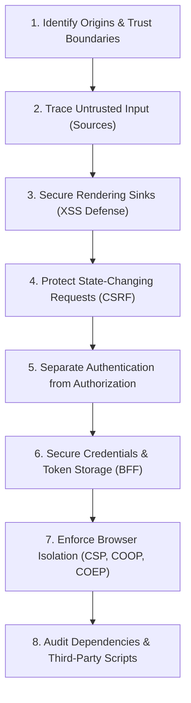
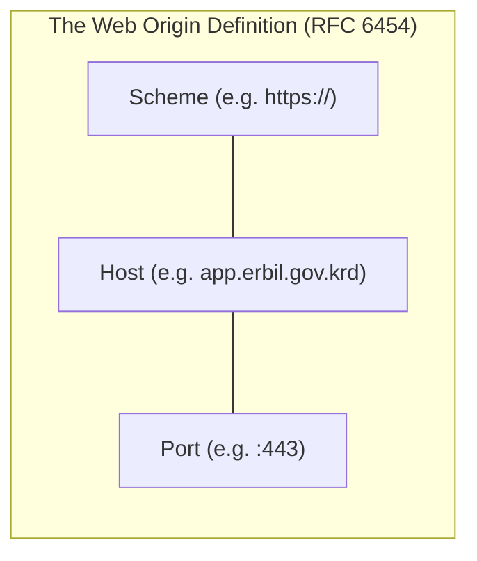
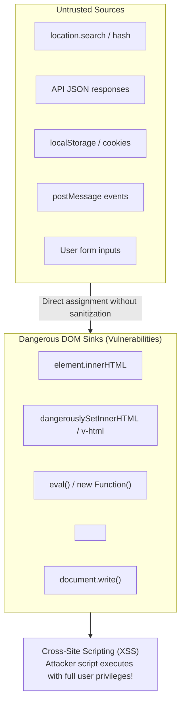
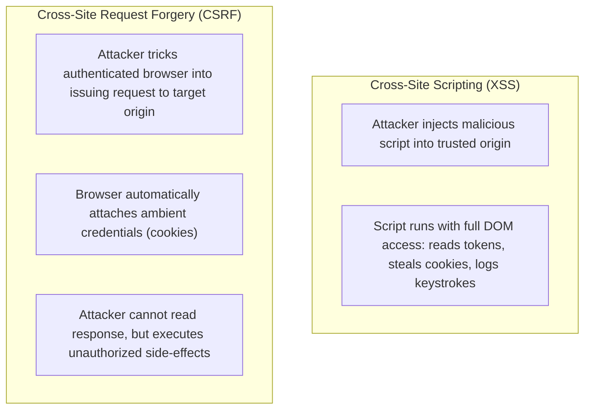
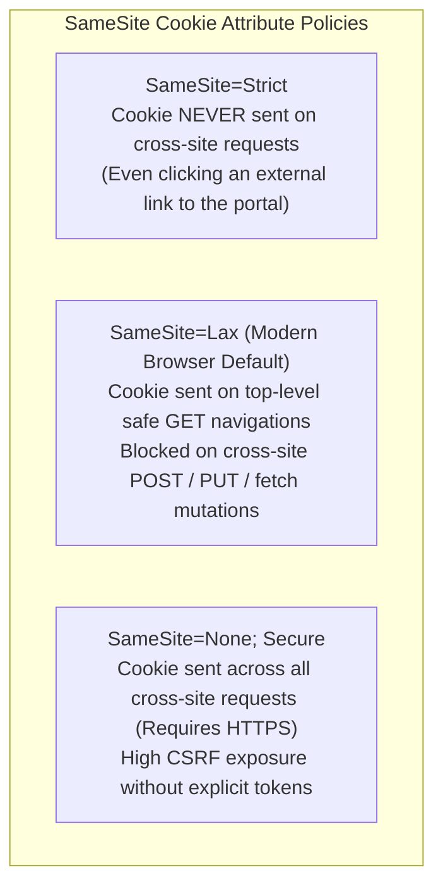
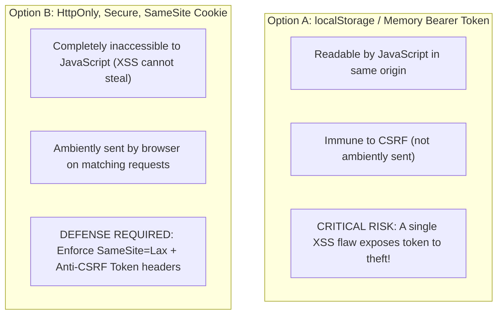
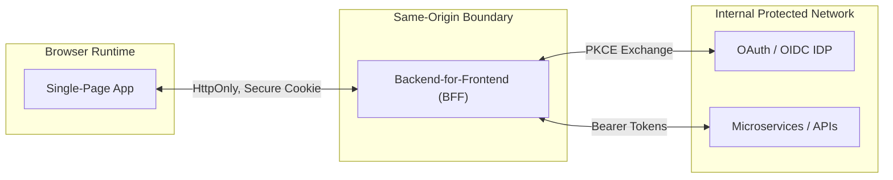
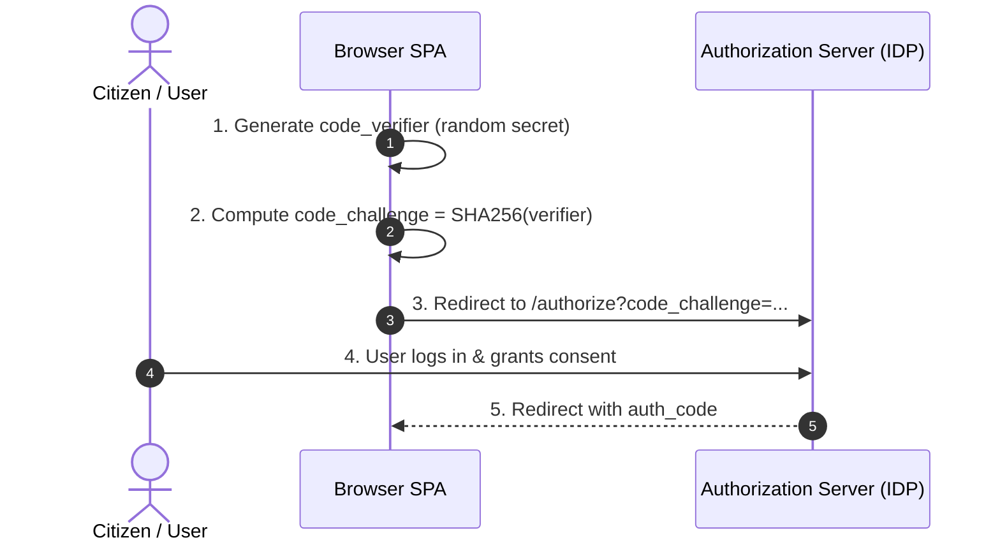
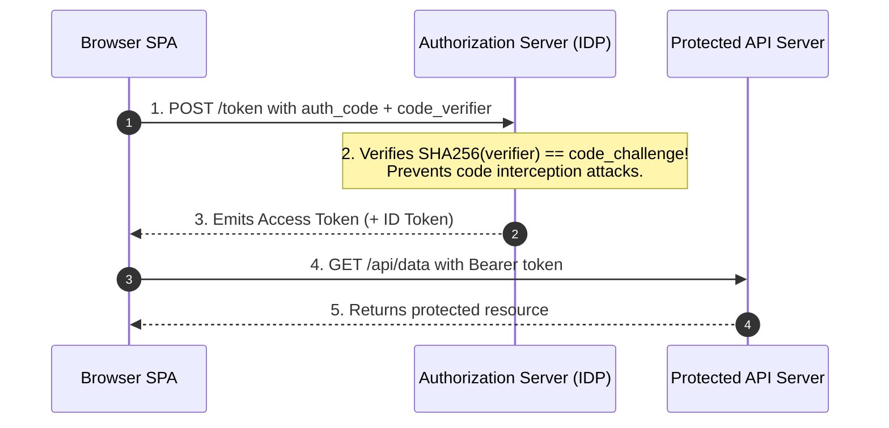
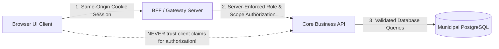

# Front-End Security, Authentication & Browser Isolation

Design the boundary before the attack

**Chapter 13**

Polla Fattah

---

## Today's goal

Treat the browser as a security runtime with explicit trust boundaries.

We will connect:

- origins, same-origin policy, and CORS;
- XSS, encoding, sanitization, CSP, and Trusted Types;
- CSRF, cookies, sessions, and logout;
- authentication, authorization, bearer tokens, OAuth, and PKCE;
- BFF architecture and token storage trade-offs;
- secrets, SRI, dependencies, and third-party scripts;
- clickjacking, framing, COOP, COEP, and CORP;
- secure messaging, iframes, logging, and a review checklist.

---

## By the end of today you can

- identify the origin and trust boundary of a browser request;
- explain what CORS does and does not protect;
- trace untrusted input from source to dangerous sink;
- prefer safe text rendering and reviewed sanitization;
- use CSP as defense in depth;
- distinguish XSS from CSRF and authentication from authorization;
- choose cookie, BFF, or browser-token architecture deliberately;
- explain OAuth authorization code flow with PKCE;
- keep secrets out of browser bundles and URLs;
- review third-party, framing, messaging, and isolation risks.

---

## The central principle

> **Front-end security comes from layered trust boundaries, not from one framework feature, header, token format, or browser flag.**

Ask where data comes from, who can read it, who can change it, and which layer must enforce the decision.

---

## The security review progression



Security is a system of related controls, not a checklist of isolated switches.

---

## The browser is a multi-origin runtime

```text
page origin
API origin
identity-provider origin
CDN origin
embedded iframe origin
third-party script origin
```

The browser applies different rules to interactions among these origins.

Your architecture must make those relationships intentional.

---

## What is an origin?

An origin is the combination of:



Examples:

```text
https://app.example.com
https://api.example.com
http://app.example.com
https://app.example.com:8443
```

Small differences can produce different origins.

---

## Same-origin examples

```text
https://app.example.com/page
https://app.example.com/api
```

These share an origin when scheme, host, and port match.

Paths differ, but origin policy is not path policy.

---

## Origin is not the same as site

Cookies and browser policies sometimes reason about a broader “site” concept based on registrable domains.

Do not use “same site” and “same origin” interchangeably.

They affect different browser mechanisms.

---

## Same-origin policy

The same-origin policy restricts how a document can read or interact with resources from another origin.

It is a browser protection boundary.

It does not mean cross-origin activity is impossible.

---

## Same-origin policy is not “no cross-origin activity”

Browsers may allow controlled cross-origin actions such as:

- loading images;
- submitting forms;
- embedding frames;
- sending requests;
- loading scripts under policy rules.

The key question is often whether the initiating page can read the response or control the embedded context.

---

## Cross-origin reads are the core concern

```text
page → cross-origin request → response
                         ↘ browser may block script access
```

CORS controls whether browser JavaScript may read a cross-origin response.

It is not a universal firewall around the server.

---

## Browser storage is origin-scoped

```text
https://app.example.com storage
≠
https://other.example.com storage
```

Storage isolation helps protect data between origins.

It does not protect an origin from XSS that executes inside that origin.

---

## CORS is a server permission

```http
Access-Control-Allow-Origin: https://app.example.com
```

The server tells the browser which origin may read a response.

The browser enforces the permission for script access.

---

## CORS is not authentication

CORS does not prove who the user is.

It does not issue a session, validate an access token, or decide whether a user may update a record.

Authentication and authorization remain server responsibilities.

---

## CORS does not protect the server from non-browser clients

```text
browser CORS policy ≠ server access control
```

Command-line clients, native apps, scripts, and attackers can send requests without browser CORS enforcement.

The server must authenticate, authorize, validate, and rate-limit independently.

---

## Simple and preflighted CORS requests

Some cross-origin requests can proceed with a browser permission check.

Others trigger an `OPTIONS` preflight describing:

- intended method;
- requested headers;
- requested origin.

The server must explicitly allow the operation before the browser sends the actual request.

---

## Preflight is not a failure

```mermaid
sequenceDiagram
    autonumber
    actor Browser as Browser Client (https://app.erbil.gov.krd)
    participant API as Municipal API (https://api.erbil.gov.krd)

    Browser->>API: OPTIONS /permits/104 (Preflight)
Origin: https://app.erbil.gov.krd
Access-Control-Request-Method: PUT
Access-Control-Request-Headers: Content-Type
    Note over API: API verifies origin in allowed whitelist
    API-->>Browser: 204 No Content
Access-Control-Allow-Origin: https://app.erbil.gov.krd
Access-Control-Allow-Methods: GET, PUT, POST
Access-Control-Allow-Headers: Content-Type
    Browser->>API: PUT /permits/104 (Actual Mutation Request)
    API-->>Browser: 200 OK (Resource updated)
```

Preflight is a safety mechanism.

If it fails, inspect origin, method, headers, credentials, and server policy rather than disabling security blindly.

---

## Credentials and CORS need alignment

Credentialed requests require coordinated policy:

- explicit allowed origin;
- allowed credentials;
- cookie attributes;
- server authentication;
- CSRF protection where relevant.

Wildcard origins are not a substitute for a deliberate credential policy.

---

## CORS errors often reveal architecture problems

A CORS failure may indicate:

- API and app origins were not designed together;
- development proxy hid production behavior;
- credential policy is unclear;
- a public/private boundary is ambiguous;
- the browser is being asked to call a server that should be behind a BFF.

Fix the boundary, not only the console message.

---

## Development proxies can hide CORS

```text
development: browser → same-origin proxy → API
production:   browser → cross-origin API
```

Test production-like origins before shipping.

Otherwise the first real CORS behavior appears in deployment.

---

## XSS is more than `<script>` tags

Cross-site scripting occurs when attacker-controlled data becomes executable or dangerous browser content.

Possible paths include:

- HTML injection;
- event-handler attributes;
- dangerous URLs;
- script-capable SVG;
- template or expression injection;
- DOM APIs that interpret strings as markup.

---

## Safe rendering by default

```ts
element.textContent = userText;
```

Prefer APIs and framework bindings that treat values as text.

Escaping by default is useful, but still inspect escape hatches and URL/style contexts.

---

## Dangerous escape hatches

Treat these as security-sensitive:

```text
innerHTML
dangerouslySetInnerHTML
v-html
document.write
eval / Function
unreviewed HTML renderers
```

Every escape hatch needs a documented trust boundary and a reviewed input policy.

---

## Encoding and sanitization are different

```text
output encoding → display a value as text in one context
sanitization    → remove or constrain allowed markup and behavior
```

Encoding is context-specific.

Sanitization is a policy for permitting a restricted subset of content.

Neither should be applied blindly to every output context.

---

## Prefer text over HTML

```ts
messageElement.textContent = message;
```

If the product requirement is text, do not create an HTML parsing problem.

Rich HTML should be an explicit feature with an explicit content policy.

---

## DOM-based XSS



The server does not need to be involved.

Client code can create XSS by moving an untrusted value into a dangerous sink.

---

## Sources and sinks

```text
source: location.search, storage, API, form, postMessage
sink:   innerHTML, script URL, eval, unsafe style, HTML parser
```

Security review traces values from source to sink and asks what validation or encoding occurs between them.

---

## `textContent` is safer for text

```ts
const status = document.querySelector("#status");
status?.textContent = externalValue;
```

It creates a text node rather than parsing markup.

Use the simplest API that matches the content requirement.

---

## URL handling needs context

```ts
link.href = userProvidedUrl;
```

Validate:

- allowed schemes;
- allowed hosts when appropriate;
- relative versus absolute behavior;
- redirect policy;
- display text separately from destination.

Text escaping alone does not make every URL safe.

---

## Avoid `eval()`-style execution

Never turn untrusted strings into code through:

- `eval()`;
- `Function()`;
- string-based timers;
- dynamic script construction;
- template expression interpreters without a trusted boundary.

If the product needs expressions, design a constrained language and parser rather than executing JavaScript.

---

## Sanitizing rich HTML

If rich content is required:

1. define the allowed elements and attributes;
2. sanitize with a maintained, reviewed library;
3. sanitize near the trust boundary;
4. preserve the sanitized representation;
5. render through one controlled component;
6. test dangerous payloads and URL contexts.

Do not assume a generic “clean HTML” label communicates the policy.

---

## Sanitization should happen near the trust boundary

```text
external content → validate/sanitize → trusted rich-text model → renderer
```

Repeated ad hoc sanitization in every component creates inconsistent policies and missed sinks.

---

## Content Security Policy is defense in depth

CSP can restrict what the browser may execute or load if an injection reaches the page.

It should support safe architecture, not justify unsafe rendering.

```http
Content-Security-Policy: default-src 'self'
```

Start from the resources the application actually needs.

---

## `default-src` establishes a baseline

More specific directives can control:

```text
script-src
style-src
img-src
connect-src
font-src
frame-src
object-src
```

The policy should be reviewed with application dependencies and deployment origins.

---

## Script policies matter most

Avoid broad script permissions where possible.

Prefer:

- external scripts from known origins;
- nonces or hashes for deliberate inline code;
- removal of inline handlers;
- restricted dynamic execution.

`unsafe-inline` and `unsafe-eval` should be treated as explicit trade-offs, not defaults.

---

## Nonces authorize specific inline scripts

```http
Content-Security-Policy: script-src 'nonce-random-per-response'
```

The server places the same unpredictable nonce on an intentionally permitted script.

Never reuse a predictable or long-lived nonce.

---

## CSP report-only mode

Report-only mode helps discover violations before enforcement.

Use it to:

- inventory real dependencies;
- identify inline scripts;
- find unexpected connections;
- observe third-party behavior;
- refine the policy.

Then move to enforcement intentionally.

---

## CSP and third-party scripts

Third-party scripts expand the policy and trust surface.

For each script, ask:

- what data can it read?
- what can it send?
- what happens if it changes?
- can it be removed or isolated?
- is its origin and integrity controlled?

Allowing a script is granting code execution in the page's origin.

---

## Trusted Types

Trusted Types can require dangerous DOM sinks to receive approved trusted values rather than arbitrary strings.

They can make unsafe paths harder to reach accidentally.

They are a design constraint and enforcement layer, not a substitute for understanding the content policy.

---

## Trusted Types are not sanitization by themselves

A policy can create trusted HTML only after applying a reviewed sanitizer or construction rule.

```text
string → reviewed policy → TrustedHTML → controlled sink
```

The policy is where the security decision lives.

---

## CSRF and XSS are different



They can interact, but the defenses and threat paths differ.

---

## CSRF tokens

For cookie-authenticated mutations, a server can require a token that an attacker site cannot read.

```text
session cookie + request-specific CSRF proof
```

Validate the token on the server for state-changing operations.

---

## CSRF applies to state-changing requests

Protect operations such as:

- create;
- update;
- delete;
- change email;
- change password;
- transfer or purchase.

Do not rely on a request method name alone; define which operations change state.

---

## SameSite cookies reduce cross-site sending



SameSite is valuable defense in depth, but consider legacy behavior, integrations, and the operation's risk.

---

## Origin and Referer checks

For sensitive mutations, the server may verify request metadata such as `Origin` or `Referer` according to a documented policy.

These checks complement, rather than replace, appropriate session and CSRF design.

---

## Cookie authentication

```http
Set-Cookie: session=…; HttpOnly; Secure; SameSite=Lax
```

Cookies can keep session credentials out of JavaScript.

They still require:

- CSRF consideration;
- expiration and rotation;
- scope control;
- logout and revocation behavior.

---

## `HttpOnly`

`HttpOnly` prevents JavaScript from reading the cookie value.

It can reduce token theft through direct storage access.

It does not prevent XSS code from making requests as the user while the page is open.

---

## `Secure`

`Secure` tells the browser to send the cookie only over HTTPS.

It protects transport confidentiality for the cookie, but does not solve application authorization or compromised client code.

---

## Cookie `Domain` and `Path`

Narrow scope where possible.

Broad domain cookies increase the set of subdomains and applications that participate in the session boundary.

Path is routing scope, not a complete security boundary for all cookie behavior.

---

## Session fixation and rotation

Rotate session identity when privilege changes, such as after login.

This prevents an attacker from setting or learning a session identifier that remains valid after authentication.

Expire and revoke sessions according to risk and product requirements.

---

## Logout is a security transition

Logout may need to:

- revoke or expire the server session;
- clear client state;
- clear private caches;
- stop live connections;
- remove pending user-specific data;
- prevent back-navigation from revealing sensitive content.

It is more than hiding a button.

---

## Authentication versus authorization

```text
authentication → who is this?
authorization   → what may this identity do here?
```

The front end can reflect permissions.

The server must enforce them.

---

## Front-end authorization is not security enforcement

```tsx
{canDelete && <DeleteButton />}
```

This improves user experience.

It does not protect the delete endpoint if an attacker sends the request directly.

Every sensitive server operation must enforce authorization independently.

---

## Permissions should come from an authoritative model

Avoid deriving critical permissions solely from:

- hidden UI controls;
- route names;
- client booleans;
- decoded but unverified payloads;
- stale local storage.

The server should return or enforce a permission model the client can safely present.

---

## Bearer tokens

```http
Authorization: Bearer access-token
```

Anyone who possesses a bearer token may use it within its scope and lifetime.

Protect issuance, storage, transport, scope, expiry, and revocation.

---

## Browser token storage is a trade-off



There is no universal slogan that replaces threat modeling and architecture.

---

## Prefer architecture over token folklore

Choose based on:

- XSS exposure;
- CSRF exposure;
- same-origin or cross-origin deployment;
- backend control;
- mobile/native clients;
- refresh and revocation needs;
- third-party integrations.

A BFF can change the browser's credential boundary substantially.

---

## Backend-for-Frontend topology



A BFF acts as an application-specific gateway for the front-end.

---

## Operational capabilities of a BFF

A Backend-for-Frontend can:

- **Hold server credentials:** keep sensitive API keys and tokens out of browser memory;
- **Manage sessions:** issue encrypted `HttpOnly`, `SameSite=Strict` cookies to the SPA;
- **Aggregate responses:** combine multiple downstream microservice calls into one tailored payload;
- **Perform edge transformations:** translate internal protocols without client complexity.

It replaces direct client token management with a hardened same-origin boundary.

---

## OAuth is delegated authorization

OAuth allows a client to obtain access to resources through an authorization server.

It is not automatically a login protocol.

OpenID Connect adds an identity layer for authentication scenarios.

---

## OAuth roles

```text
resource owner
client
authorization server
resource server
```

Keep the roles distinct when reasoning about tokens and trust.

---

## Authorization Code flow

```text
browser → authorization server
        ← authorization code
browser → backend/token endpoint with code
        ← access token / session
browser → resource server through chosen architecture
```

The code is exchanged rather than delivering an access token directly through the browser redirect.

---

## PKCE Phase 1: Authorization request



The browser receives an authorization code, not a sensitive token.

---

## PKCE Phase 2: Token redemption & verification



PKCE ensures an intercepted code cannot be redeemed without the original secret verifier.

---

## Avoid legacy implicit token delivery

Delivering tokens directly in a browser redirect has a broader leakage and handling surface.

Use modern authorization code patterns with PKCE where appropriate, following the identity provider and platform guidance.

---

## Browser-based OAuth has its own threat model

Consider:

- redirect interception;
- authorization-code injection;
- open redirects;
- state and nonce validation;
- browser history and referrer leakage;
- token exposure to scripts;
- malicious extensions or compromised dependencies.

The browser is not a confidential client environment.

---

## OpenID Connect

OIDC adds identity claims and an ID token to OAuth-style authorization.

Use it when the application needs to authenticate the user through an identity provider.

Still validate issuer, audience, signature, nonce, time claims, and flow context on the server or trusted verifier.

---

## ID token versus access token

```text
ID token     → information for the client about authentication
Access token → authority presented to a resource server
```

Do not send an ID token to an API as if it were an access token.

Do not use a client-decoded payload as proof of authorization.

---

## JWT is a format, not an architecture

A JWT can be:

- signed or unsigned by a chosen algorithm policy;
- short-lived or long-lived;
- intended for one audience or another;
- used in different trust models.

The string shape does not make the authentication design secure.

---

## Token validation belongs at the resource server

The resource server must validate:

- signature and key policy;
- issuer;
- audience;
- expiry and not-before;
- scopes or permissions;
- token type and context.

The front end may display decoded information, but display is not verification.

---

## Front-end token decoding is not verification

```ts
const payload = JSON.parse(atob(token.split(".")[1]));
```

This can read a payload.

It does not prove that the token is authentic, current, intended for this API, or authorized for this action.

---

## Refresh tokens need stronger protection

Refresh tokens can create long-lived access.

Consider:

- whether the browser should receive them;
- rotation and reuse detection;
- secure cookie or BFF storage;
- revocation;
- device and session binding;
- logout behavior.

Do not treat refresh credentials like ordinary UI state.

---

## OAuth state and nonce

```text
state → binds the response to the initiating client flow
nonce → binds identity claims to the authentication request
```

Validate both in the correct flow and preserve them through redirects safely.

---

## Redirect URI validation

Authorization servers should require registered redirect URIs.

Avoid:

- wildcard redirect patterns;
- open redirect chains;
- accepting attacker-controlled return URLs;
- mixing trusted and untrusted redirect targets.

Redirect handling is a credential boundary.

---

## Open redirects

```text
/login?returnTo=https://attacker.example
```

Unvalidated redirects can:

- enable phishing;
- leak codes or tokens through chains;
- make trusted links misleading.

Allowlist internal destinations or use opaque server-side state.

---

## Secrets do not belong in front-end bundles

Anything shipped to the browser can be inspected by:

- users;
- browser extensions;
- automated tools;
- copied source maps;
- network observers under the user's control.

Server credentials and private keys must remain on trusted server infrastructure.

---

## Public API keys are a separate category

Some client identifiers are intentionally public and protected by:

- origin restrictions;
- quotas;
- limited scopes;
- server-side enforcement;
- monitoring.

Calling a value a “public key” does not make every key safe to expose.

---

## Environment variables are not a vault

```text
build-time client variable → likely embedded in public output
```

Use server-side secret management for confidential values.

Review compiled assets and source maps for accidental leakage.

---

## Subresource Integrity

```html
<script
  src="https://cdn.example/script.js"
  integrity="sha384-…"
  crossorigin="anonymous">
</script>
```

SRI lets the browser verify that a fetched resource matches an expected cryptographic digest.

It is useful for fixed external resources with stable content.

---

## What SRI protects against

SRI can detect a changed resource at the browser boundary.

It does not:

- make a trusted third-party script safe by itself;
- protect inline code;
- validate dynamic resource selection;
- replace CSP or dependency review;
- prevent a trusted script from doing harmful things.

---

## SRI and CORS

Cross-origin integrity checks require the resource to be delivered with appropriate CORS behavior.

Coordinate:

- `integrity` attribute;
- `crossorigin` mode;
- resource response headers;
- CDN deployment policy.

---

## Dependency supply-chain risk

Dependencies can execute code during:

- installation;
- build;
- development;
- application runtime.

Review packages by capability, maintenance, provenance, update behavior, and access to credentials.

---

## Build-time dependencies can be highly privileged

A build plugin may read:

- source files;
- environment variables;
- CI credentials;
- generated artifacts;
- deployment configuration.

Keep CI secrets scoped and avoid installing unnecessary tooling into privileged environments.

---

## Reduce supply-chain exposure

Use:

- minimal dependencies;
- lockfiles and review;
- trusted registries;
- vulnerability and behavior monitoring;
- restricted scripts where appropriate;
- separate build and deploy credentials;
- reproducible artifacts.

Pinning helps reproducibility but does not eliminate malicious or compromised code.

---

## Third-party scripts are full trust grants

A script executing in the page origin may read:

- DOM content;
- accessible application state;
- non-HttpOnly storage;
- user input;
- API responses visible to the page.

Load third-party code only when its capability and risk are justified.

---

## Clickjacking

Clickjacking tricks a user into interacting with a framed page or disguised control.

Protect sensitive pages with framing policy and deliberate embedding rules.

Do not rely on visual design alone to prevent deceptive framing.

---

## Prevent unauthorized framing

Relevant controls can include:

```http
Content-Security-Policy: frame-ancestors 'self'
```

and appropriate legacy-compatible headers where needed.

Allow only known embedding origins when framing is an actual product requirement.

---

## Browser isolation

Isolation policies help control interactions among browsing contexts and cross-origin resources.

They are useful for high-risk capabilities, cross-origin data, and protection from opener or embedding relationships.

They can also break integrations, so test before enforcement.

---

## COOP

Cross-Origin-Opener-Policy controls whether a document shares a browsing context group with cross-origin documents.

It can reduce `window.opener` relationships and support stronger isolation.

---

## `window.opener`

Opening a new window can create an opener relationship.

That relationship can enable unexpected navigation or cross-window interaction.

Use safe link behavior and appropriate opener policy for untrusted destinations.

---

## COEP

Cross-Origin-Embedder-Policy controls whether cross-origin resources can be embedded under the document's isolation requirements.

It may be needed for cross-origin isolated capabilities.

It can also require every dependency and integration to provide compatible headers.

---

## CORP

Cross-Origin-Resource-Policy lets a resource express which origins may load it in certain cross-origin contexts.

It is a resource-side policy, not the same as CORS or COEP.

---

## COOP, COEP, and cross-origin isolation

Together, appropriate COOP and COEP policies can establish a cross-origin isolated context for specific browser capabilities.

Check:

- workers;
- images and fonts;
- analytics;
- iframes;
- third-party libraries;
- CDN headers.

---

## CORS, CORP, and COEP are different

| Policy | Main question |
|---|---|
| CORS | may browser script read this response? |
| CORP | may this resource be loaded cross-origin in this context? |
| COEP | which embedded resources may this document accept? |

Use the policy that matches the boundary being controlled.

---

## Security headers need testing

Test headers in:

- production-like origins;
- authenticated and unauthenticated flows;
- embedded and popup scenarios;
- worker and asset loading;
- third-party integrations;
- error and redirect paths.

A header that “looks secure” but breaks recovery or silently disables a feature is not a finished design.

---

## Security architecture for a typical SPA



The front end presents permissions and handles UX.

The server owns enforcement, secrets, and trusted token validation.

---

## Cookie-session SPA

```text
browser ⇄ same-origin app/API
        cookie session
```

Review:

- HttpOnly, Secure, SameSite;
- CSRF tokens or equivalent controls;
- session rotation;
- logout and cache clearing;
- CORS avoidance through same-origin deployment where practical.

---

## OAuth SPA

```text
browser → authorization server → code + PKCE
       → chosen token/session boundary
```

Document:

- redirect URIs;
- state and nonce;
- token audience and scope;
- storage and refresh policy;
- logout and revocation;
- server-side validation.

---

## BFF architecture

```text
browser → BFF session
BFF     → access tokens and downstream APIs
```

The BFF can reduce browser token exposure and normalize multiple APIs.

It adds a service to deploy, observe, scale, and secure.

---

## Security UX matters

Good security behavior should tell users:

- what happened;
- whether their data was saved;
- whether they need to sign in;
- whether they lack permission;
- how to recover;
- whether an action is pending or rejected.

Do not reveal sensitive details merely to make an error sound precise.

---

## Error messages must not leak sensitive detail

Avoid exposing:

- whether a private account exists;
- stack traces;
- database structure;
- tokens;
- internal URLs;
- authorization details that aid enumeration.

Log diagnostic context securely and show a useful, bounded user message.

---

## Security and logging

Logs should support investigation without becoming a data leak.

Define:

- what identifiers are safe;
- what must be redacted;
- retention period;
- access controls;
- correlation IDs;
- incident response ownership.

Never log secrets simply because a request failed.

---

## Sensitive data in URLs

URLs can appear in:

- browser history;
- referrer headers;
- server logs;
- analytics;
- screenshots;
- copied links.

Do not place passwords, access tokens, private records, or sensitive form values in query strings or fragments without a very deliberate design.

---

## `postMessage` is an explicit cross-origin channel

```ts
window.postMessage(message, "https://trusted.example");
```

Use an exact target origin where possible.

Treat both outgoing and incoming messages as untrusted protocol data.

---

## Validate `postMessage` origin and shape

```ts
window.addEventListener("message", event => {
  if (event.origin !== "https://trusted.example") return;
  const message: unknown = event.data;
  handleValidatedMessage(message);
});
```

Check origin, source window when relevant, message type, and payload schema.

---

## Iframes are security boundaries

For an iframe, decide:

- which origin it uses;
- whether it needs sandboxing;
- which capabilities it receives;
- whether it may navigate or submit forms;
- how it communicates;
- who may frame your application.

Embedding is an architecture decision, not only a layout choice.

---

## Framework escaping is good - but not sufficient

React, Vue, and other frameworks make common text rendering safer by default.

They cannot decide:

- whether a URL is allowed;
- whether rich HTML should be sanitized;
- whether a third-party script is trustworthy;
- whether an API call is authorized;
- whether a token belongs in the browser.

Framework safety is one layer in a larger boundary model.

---

## Security review checklist: inputs and rendering

```text
Inputs
  URL, API, forms, storage, messages, third parties
Rendering
  text by default, reviewed HTML, safe URL and style contexts
```

Trace every untrusted source to its eventual sink.

---

## Security review checklist: requests and credentials

```text
Requests     validation, authorization, CSRF, retry behavior
Credentials  cookie/token scope, expiry, rotation, logout
```

Ask what happens when the request is replayed, delayed, cross-origin, or sent by a non-browser client.

---

## Security review checklist: browser policies

```text
CSRF, CORS, CSP, framing, COOP, COEP, CORP, SRI
```

Each policy should have:

- a threat it addresses;
- a scope;
- an owner;
- tested integrations;
- a failure and rollout plan.

---

## Security review checklist: authentication and authorization

Verify:

- identity is established through a supported flow;
- tokens are validated by the correct server;
- permissions are enforced server-side;
- client UI reflects but does not enforce authority;
- logout clears or revokes relevant state;
- redirects and callbacks are constrained.

---

## A layered security model

```text
browser policy
  → safe rendering
  → request protection
  → authentication
  → authorization
  → dependency and deployment controls
  → monitoring and recovery
```

No layer is perfect.

The value comes from reducing the impact when one assumption fails.

---

## Practical lab: Secure a Front-End Application Boundary

Review and harden a small application boundary involving untrusted input, cross-origin requests, cookies, OAuth-style redirects, and dangerous sinks.

The practical turns each security concept into an observable browser behavior and documented design decision.

---

## Practical stages 1–4: origins and CORS

1. Map the origins.
2. Observe a CORS failure.
3. Add explicit CORS permission.
4. Trigger a preflight.

Distinguish browser read permission from server authentication and authorization.

---

## Practical stages 5–10: rendering defenses

5. Demonstrate safe text rendering.
6. Identify a dangerous sink.
7. Add rich-text sanitization.
8. Add CSP in report-only mode.
9. Enforce a basic CSP.
10. Explore Trusted Types.

Document which content is text, which is approved rich HTML, and which sinks remain intentionally available.

---

## Practical stages 11–14: cookies and permissions

11. Implement a cookie session.
12. Add CSRF protection.
13. Experiment with SameSite.
14. Separate authentication and authorization.

Verification: hiding a control does not grant permission, and cookie-authenticated mutations have an explicit CSRF decision.

---

## Practical stages 15–18: identity architecture

15. Draw a BFF architecture.
16. Model OAuth authorization code plus PKCE.
17. Compare ID and access tokens.
18. Search the bundle for secrets.

Keep token validation and confidential credentials on the appropriate server boundary.

---

## Practical stages 19–24: browser isolation

19. Add SRI to a fixed external resource.
20. Inventory third-party trust.
21. Secure `postMessage`.
22. Explore framing policy.
23. Diagram COOP, COEP, and CORP.
24. Build the security architecture map.

Document affected integrations and failure behavior for every security change.

---

## Practical extension: compare session and bearer designs

Compare:

```text
same-origin session / BFF
browser-held bearer token
```

Evaluate XSS, CSRF, token exposure, refresh, logout, cross-origin APIs, and operational complexity.

Avoid declaring one architecture universally correct.

---

## Try this yourself

Trace one value from:

```text
URL → parser → component → DOM sink
```

Then repeat for:

```text
API → state → request → server authorization
```

Mark where validation, encoding, authentication, authorization, and logging occur.

---
## Troubleshooting guide (Part 1)

| Symptom | Likely cause |
|---|---|
| CORS fails in production only | Development proxy hid real origins |
| Browser blocks a request but curl succeeds | CORS governs browser reads, not server access |
| Escaped text still creates a dangerous link | URL context was not validated |
| CSP breaks analytics or workers | Dependencies were not inventoried before enforcement |
| CSRF token is missing on a mutation | Cookie session and request protection were not designed together |
---
## Troubleshooting guide (Part 2)

| Symptom | Likely cause |
|---|---|
| Hidden button is treated as authorization | Server enforcement is missing |
| Token payload looks valid | Decoding is not signature or audience validation |
| Logout leaves private data visible | Client caches, connections, or local storage were not cleared |
| iframe integration breaks after isolation headers | Policy was copied without testing dependencies |
---

## Completion checklist

- [ ] origins and cross-origin relationships are documented;
- [ ] CORS is treated as browser read permission, not server security;
- [ ] untrusted inputs and dangerous sinks are mapped;
- [ ] text rendering is preferred over HTML;
- [ ] rich HTML has a reviewed sanitization policy;
- [ ] CSP and Trusted Types are defense in depth;
- [ ] cookie mutations have CSRF protection decisions;
- [ ] authentication and authorization are separate;
- [ ] tokens and secrets stay within appropriate boundaries;
- [ ] third-party and browser-isolation policies are tested.

---
## Misconceptions to leave behind (Part 1)

| Misconception | Better mental model |
|---|---|
| CORS protects the API from attackers | It controls browser script read access |
| CORS failure means the server did not receive the request | Browser policy and server receipt differ |
| XSS means only `<script>` tags | Any attacker-controlled executable context can matter |
| Framework escaping makes XSS impossible | Escape hatches and context-specific sinks remain |
| Sanitization and encoding are the same | They solve different content problems |
| CSP prevents XSS by itself | It is defense in depth |
| CSRF and XSS are the same | They exploit different trust paths |
---
## Misconceptions to leave behind (Part 2)

| Misconception | Better mental model |
|---|---|
| HttpOnly prevents XSS | It limits direct cookie reads, not same-origin actions |
| Hidden controls enforce permission | Server authorization must enforce it |
| JWT means secure authentication | JWT is a format, not an architecture |
| ID and access tokens are interchangeable | They serve different audiences and purposes |
| `.env` values are secret | Client-exposed build values are public |
| Lockfiles eliminate supply-chain risk | They improve reproducibility, not trust |
| COOP, COEP, and CORP are interchangeable | Each controls a different browser boundary |
---

## The chapter in one sentence

> **Secure the browser application by tracing trust across origins, content, requests, identity, dependencies, and embedded contexts - and enforce each decision at the authoritative boundary.**

---

## Next: Chapter 14

The next chapter will build on secure architecture with:

- front-end testing strategy;
- confidence boundaries and test levels;
- behavior, integration, and browser verification;
- performance and resilience testing;
- quality workflows for production systems.

---

## Questions

Which value in your application crosses the most trust boundaries, and which layer currently makes the security decision about it?
