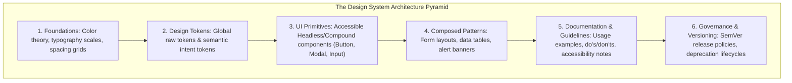
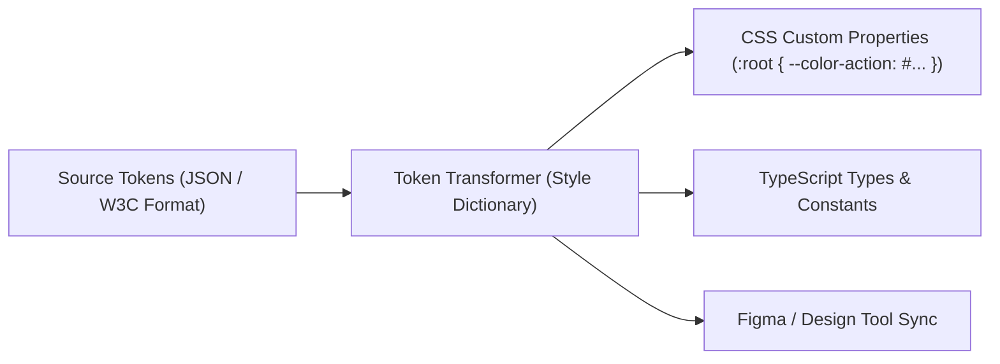
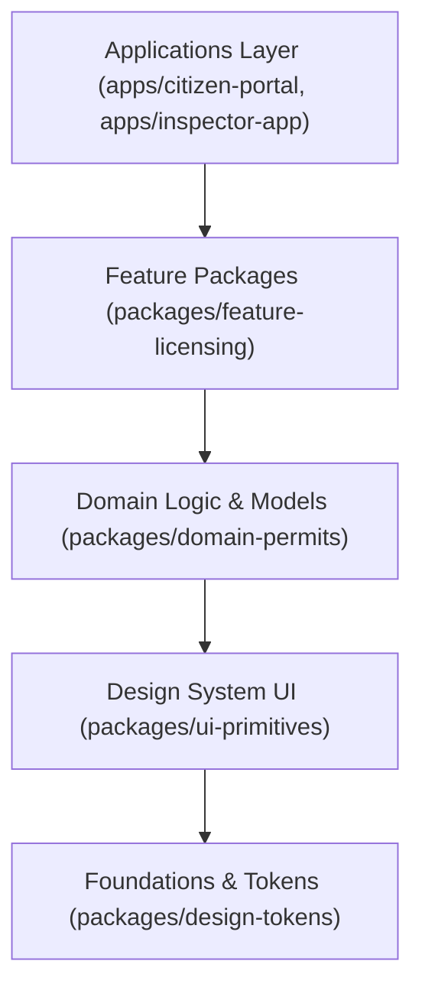
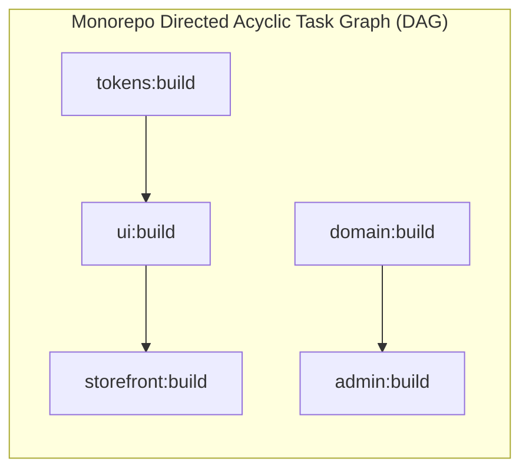
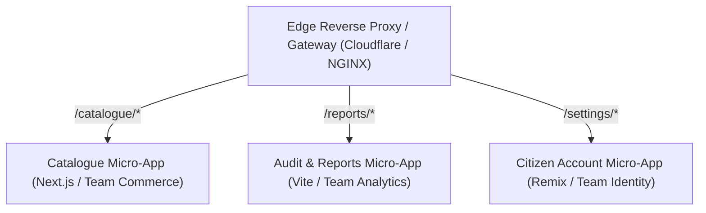
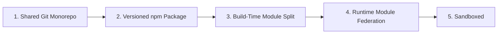
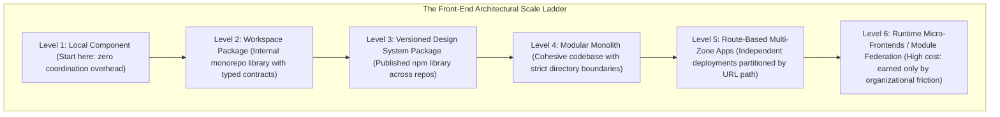

# Scaling Front-End Architecture: Design Systems, Monorepos & Micro-Frontends

Scale the boundaries, not the confusion

**Chapter 14**

Polla Fattah

---

## Today's goal

Understand how front-end architecture changes when products, packages, teams, and deployments grow.

We will connect:

- reusable components and design systems;
- tokens, themes, accessibility, documentation, and versioning;
- package APIs, ownership, workspaces, and monorepos;
- task graphs, affected builds, and caching;
- platform teams and golden paths;
- micro-frontend composition and runtime independence;
- Module Federation, contracts, failure containment, and observability;
- migration strategy and architecture decisions at scale.

---

## By the end of today you can

- distinguish a component library from a design system;
- define raw and semantic design tokens;
- design stable package APIs and release policies;
- decide when a monorepo or separate repositories help;
- model dependency direction and affected builds;
- explain why micro-frontends are organizational and deployment architecture;
- choose server, client, build-time, or runtime composition;
- design contracts, failure boundaries, and observability;
- evaluate Module Federation trade-offs;
- recognize when a modular monolith is the better answer.

---

## The central principle

> **Scale through explicit contracts, ownership, and failure boundaries—not through maximum sharing or maximum distribution.**

Every shared abstraction creates a coordination obligation.

Every independently deployed unit creates an integration obligation.

---

## Scale changes the nature of front-end problems

At small scale, a change may affect one application.

At larger scale, the same change may affect:

- several products;
- multiple teams;
- package consumers;
- release trains;
- shared tokens and accessibility;
- deployment and runtime contracts.

The architecture must make change impact visible.

---

## Technical scale and organizational scale differ

```text
technical scale → code, builds, bundles, runtime complexity
organizational scale → teams, ownership, coordination, release authority
```

A micro-frontend does not solve a team-ownership problem automatically.

A monorepo does not solve a dependency-design problem automatically.

---

## Reuse is not automatically good

Reuse can reduce:

- duplicated fixes;
- inconsistent behavior;
- accessibility defects;
- visual drift.

Reuse can also create:

- shared release coupling;
- generic APIs;
- cross-domain assumptions;
- difficult migration;
- a global dependency nobody can change.

Reuse is a decision with a cost.

---

## Prefer stable shared concepts

Good shared concepts often include:

```text
Button
Dialog
Field
Tabs
tokens and themes
```

Be careful sharing a component whose behavior is actually product-specific:

```text
ApprovalWorkflowPanel
RegionalTaxEditor
CataloguePricingCard
```

Share the stable concept, not the current visual coincidence.

---

## Component library versus design system

```text
component library → reusable implementation
design system     → product of principles, tokens, components, guidance, and governance
```

A design system includes how people choose, use, test, document, version, and evolve the components.

---

## A design system is a product

It has:

- users: product teams and customers;
- a roadmap;
- documentation;
- support expectations;
- release notes;
- migration paths;
- quality and accessibility goals;
- adoption feedback.

Treating it as “just a package” underestimates its operational work.

---

## Design-system architecture



The layers should have intentional dependency direction.

---

## Foundations define shared vocabulary

Foundations may include:

- color and contrast;
- typography;
- spacing;
- elevation;
- motion;
- layout;
- iconography;
- interaction states.

They should support product consistency without hiding meaningful product differences.

---

## Design tokens are named decisions

```json
{
  "color": {
    "brand": { "primary": "#2b5cff" }
  },
  "space": { "md": "1rem" }
}
```

Tokens make recurring design decisions inspectable and transformable across platforms.

---

## Raw and semantic tokens

```text
raw/foundation: blue-600, space-4, radius-2
semantic:       action-primary, surface-muted, focus-ring
```

Raw tokens describe values.

Semantic tokens describe meaning and can change when a theme or brand changes.

---

## Why semantic tokens matter

```css
--color-action-primary: var(--color-blue-600);
```

Components consume meaning:

```css
background: var(--color-action-primary);
```

The component need not know which palette value currently represents the primary action.

---

## Token interoperability

Tokens may be consumed by:

- CSS variables;
- JavaScript or TypeScript;
- native mobile platforms;
- design tools;
- documentation and testing tools.

Define naming, units, themes, fallbacks, and transformation rules so the token system remains coherent across outputs.

---

## A token pipeline



The pipeline should preserve semantic meaning, not only copy strings.

---

## CSS variables provide runtime tokens

```css
:root {
  --surface-page: white;
  --text-primary: #121212;
}

[data-theme="dark"] {
  --surface-page: #121212;
  --text-primary: white;
}
```

Runtime variables enable themes without rebuilding every component.

---

## Tokens are not a complete design system

Tokens do not define:

- keyboard behavior;
- accessible names;
- component states;
- content guidance;
- composition rules;
- error behavior;
- ownership or release policy.

They are a foundation, not the whole system.

---

## Component API stability matters more at scale

Every public prop, event, slot, CSS hook, and token name can have many consumers.

Before changing it, ask:

- who uses it?
- what behavior is relied upon?
- is the change additive?
- what migration path exists?
- can the old API be deprecated safely?

---

## Public versus internal component APIs

```text
public API  → documented, supported, versioned
internal API → implementation detail, changeable with local ownership
```

Do not expose every internal component just because it exists in the repository.

Small public surfaces are easier to keep reliable.

---

## Escape hatches need boundaries

Examples:

```text
custom class
render prop
slot
unstyled mode
as / component override
```

Escape hatches support real variation, but can undermine consistency and accessibility if unbounded.

Document what the consumer becomes responsible for when using one.

---

## Headless components at scale

Headless components can centralize:

- keyboard behavior;
- focus management;
- ARIA relationships;
- selection state;
- interaction lifecycle.

The consuming product controls presentation while inheriting a tested behavior contract.

---

## Accessibility is part of the component contract

For a dialog, tabs, menu, or combobox, the contract includes:

- roles;
- names;
- keyboard behavior;
- focus movement;
- disabled states;
- announcements;
- escape and dismissal rules.

Visual similarity is not enough for a shared component.

---

## Design-system documentation is an interface

Documentation should show:

- when to use the component;
- when not to use it;
- accessible behavior;
- controlled and uncontrolled modes;
- composition examples;
- supported variants;
- migration and deprecation notes.

Examples are part of the package's practical API.

---

## Component explorers create feedback loops

A component explorer can provide:

- isolated rendering;
- visual examples;
- interaction states;
- accessibility checks;
- visual regression targets;
- documentation source.

Keep examples representative of supported contracts rather than every possible boolean combination.

---

## Design-system versioning

Versioning must cover more than TypeScript signatures.

A release may change:

- visual output;
- keyboard behavior;
- ARIA structure;
- CSS variables;
- token meaning;
- generated assets;
- browser support.

Consumers need clear impact information.

---

## Semantic versioning is a communication contract

```text
PATCH → compatible fix
MINOR → compatible capability
MAJOR → consumer action may be required
```

Visual or accessibility changes can be breaking even when the TypeScript type still compiles.

---

## Visual changes can be breaking changes

A “small” change can break:

- layout assumptions;
- screenshot baselines;
- contrast;
- click targets;
- responsive behavior;
- user workflows.

Describe visual and interaction impact in release notes.

---

## Deprecation is a lifecycle

```text
announce → document replacement → measure usage → codemod / migrate → remove
```

Leaving deprecated APIs forever increases package complexity and makes the preferred path unclear.

---

## Codemods make migrations repeatable

A codemod can transform predictable usage:

```text
old prop name → new prop name
old import path → public entry point
old token → semantic token
```

Use codemods where the transformation is mechanically reliable, then review semantic edge cases.

---

## Release notes and migration guides

Good notes explain:

- what changed;
- why it changed;
- who is affected;
- what to search for;
- how to migrate;
- how to verify behavior;
- when removal occurs.

Migration work is part of the design-system product.

---

## Shared packages should represent responsibility

```text
shared/ui       reusable interaction and visual primitives
shared/tokens   semantic design vocabulary
shared/config   agreed tooling policy
domain/catalogue product-specific vocabulary
```

Do not make a shared package the default home for anything that might be reused.

---

## Package boundaries are stronger than folders

A package boundary can enforce:

- public exports;
- dependency direction;
- versioning;
- ownership;
- build and test scope;
- consumer expectations.

Folders organize files. Packages communicate architecture.

---

## Avoid the “shared everything” package

One giant shared package creates:

- unclear ownership;
- broad rebuilds;
- accidental imports;
- difficult releases;
- hidden domain coupling.

Split by stable responsibility, not by arbitrary file count.

---

## Shared domain packages need caution

Sharing a domain package can reduce duplicated contracts.

It can also force products to adopt one domain model before their workflows are truly aligned.

Share stable concepts and schemas; keep product-specific orchestration local.

---

## Shared types can create false confidence

```text
shared type → compile-time agreement
runtime data → still needs validation
```

Sharing a TypeScript type does not make two independently deployed systems compatible at runtime.

Add versioned contracts, validation, and compatibility tests where needed.

---

## Internal package dependency direction



If a shared package imports an application feature, the boundary has reversed.

Make direction enforceable with lint rules, package exports, or graph checks.

---

## Workspaces coordinate packages

Workspaces can provide:

- local package linking;
- shared install and lockfile;
- cross-package scripts;
- consistent tooling;
- coordinated local development.

They do not decide whether packages are well-designed.

---

## Monorepo benefits

```text
atomic cross-app changes
shared refactoring
visible dependency graph
consistent tooling
local package feedback
```

These benefits are strongest when projects genuinely evolve together and ownership is clear.

---

## Monorepo costs

Expect:

- larger graph and CI coordination;
- build ordering;
- ownership disputes;
- broad blast radius;
- package version and release decisions;
- accidental internal imports.

A monorepo makes coupling visible; it does not make coupling disappear.

---

## Monorepo versus polyrepo

```text
monorepo → shared visibility and atomic changes
polyrepo  → stronger repository independence and separate lifecycle
```

Neither is universally superior.

Choose based on release coordination, ownership, dependency contracts, and operational capacity.

---

## Monorepo is not micro-frontend architecture

```text
monorepo       → source and package organization
micro-frontend → runtime or deployment composition
```

A monorepo can contain one modular application or many separately deployed front ends.

Micro-frontends can be built across one or many repositories.

---

## Task graphs expose build relationships



A task graph can determine:

- build order;
- affected tests;
- cacheable work;
- parallel execution;
- what a change can impact.

---

## Affected builds reduce unnecessary work

If only documentation changes, a full application rebuild may be unnecessary.

If tokens change, many consumers may be affected.

The graph should be accurate enough to make selective verification trustworthy.

---

## Caching build tasks

Cache tasks when their outputs are determined by:

- source inputs;
- dependency versions;
- tool versions;
- environment inputs;
- configuration.

Incorrect cache keys are worse than no cache because they create false confidence.

---

## Remote build cache

A remote cache can share verified task outputs across developers and CI.

Protect it with:

- correct input hashing;
- access control;
- artifact integrity;
- retention policy;
- invalidation rules.

Speed must not weaken reproducibility or trust.

---

## Repository ownership

Ownership should answer:

- who maintains the package;
- who reviews changes;
- who handles releases;
- who responds to failures;
- who approves breaking changes.

Ownership is coordination infrastructure, not a reason to prevent useful contributions.

---

## Federated contribution

A platform team can provide:

- foundations;
- paved workflows;
- documentation;
- release automation;
- support.

Product teams should be able to contribute improvements without routing every decision through one gatekeeper.

---

## Platform teams

A platform team should reduce product team friction through:

- reliable defaults;
- clear extension points;
- observability;
- migration support;
- sensible constraints.

The platform is successful when teams can move safely, not when it controls every implementation.

---

## Platform as a product

Treat internal developers as users.

Measure:

- adoption;
- time to first useful feature;
- migration cost;
- support volume;
- build reliability;
- accessibility and quality outcomes.

Build what reduces real product friction.

---

## Paved road versus mandatory road

```text
paved road → recommended, supported default
mandatory   → enforced constraint for a real safety or compatibility need
```

Use mandatory rules sparingly and explain the reason.

Too many constraints encourage teams to work around the platform.

---

## Golden path

A golden path can provide:

- starter repository;
- standard scripts;
- secure deployment;
- observability;
- supported dependencies;
- examples and migration guides.

It should make the safe path convenient without making every product identical.

---

## Shared infrastructure must remain replaceable

Avoid APIs that expose every implementation detail of:

- the build tool;
- the deployment platform;
- the state library;
- the rendering runtime.

Stable capabilities allow infrastructure to evolve without forcing every product to migrate at once.

---

## Versioning internal packages

Possible models:

```text
lockstep versions
independent versions
source-consumed packages
```

Choose according to release coordination and compatibility, not habit.

---

## Lockstep versioning

All packages release together.

Benefits:

- coordinated compatibility;
- simple version alignment;
- atomic platform upgrades.

Costs:

- unrelated consumers receive synchronized changes;
- releases may become slower or noisier.

---

## Independent versioning

Packages release on their own cadence.

Benefits:

- smaller consumer updates;
- local ownership;
- separate release urgency.

Costs:

- compatibility matrix;
- upgrade coordination;
- more release automation.

---

## Source consumption in monorepos

Consuming internal source directly can speed local development and preserve one graph.

It can also blur package boundaries and make production behavior differ from published consumption.

Decide whether the package boundary is real and test the intended production mode.

---

## Micro-frontends are not small components

```text
component → local composition and behavior
micro-frontend → independently owned application capability
```

Micro-frontends involve:

- team ownership;
- deployment lifecycle;
- runtime or route composition;
- integration contracts;
- failure and observability boundaries.

---

## Why micro-frontends are considered

They may help when:

- teams need independent deployment;
- domains have different release cadence;
- a platform must integrate separately owned products;
- migration from a legacy application must be incremental;
- organizational boundaries are stable and meaningful.

They introduce coordination costs of their own.

---

## Vertical slicing

```text
team owns a business capability
  → UI + data + workflow + deployment
```

Vertical slices can align technical ownership with user-facing capability better than splitting by framework layer.

---

## Route-level composition



Full-page or route-level composition is often simpler than embedding several runtimes into one screen.

It preserves clear navigation and failure boundaries.

---

## Server-side composition

The server can assemble fragments or route outputs before delivery.

Benefits:

- clear browser payload;
- centralized navigation and auth;
- independent backend ownership.

Costs include server orchestration, shared layout contracts, and failure handling.

---

## Client-side composition

```text
shell → loads remote feature → mounts feature
```

Client composition can allow independent deployment and rich in-page integration.

It must manage loading, version compatibility, failure, routing, styling, and shared state.

---

## Build-time composition

A shell can consume packages or generated artifacts during its build.

This gives strong integration testing and simple runtime behavior.

It reduces deployment independence because the shell must rebuild to receive changes.

---

## Runtime independence is a spectrum



Moving right can increase deployment independence and isolation while increasing integration complexity.

---

## The micro-frontend shell

The shell often owns:

- global navigation;
- authentication context;
- layout;
- routing;
- loading and failure boundaries;
- observability;
- shared design-system contract.

Avoid making the shell a hidden global store for every domain.

---

## Shared state across micro-frontends

Prefer explicit contracts:

```text
URL state
server state
custom events
shared identity/session boundary
```

Avoid sharing mutable in-memory domain state unless the integration truly requires it and versioning is controlled.

---

## Prefer server and URL contracts

Server APIs and URLs are durable boundaries.

They can survive:

- different framework versions;
- independent deployments;
- full-page navigation;
- process restarts;
- separate repositories.

In-memory object sharing is fast but fragile across runtime boundaries.

---

## Custom events can cross local boundaries

```ts
window.dispatchEvent(new CustomEvent("cart.updated", {
  detail: { count: 2 },
}));
```

Define:

- event names;
- payload schema;
- versioning;
- ownership;
- duplicate behavior;
- failure behavior.

Events should be protocol contracts, not accidental DOM messages.

---

## Micro-frontend contract design

A contract may include:

- mount inputs;
- lifecycle methods;
- events;
- URL behavior;
- auth assumptions;
- CSS scope;
- data and error models;
- compatibility window.

Write the contract before choosing the integration technology.

---

## CSS isolation

Options include:

```text
CSS Modules
scoped styles
shadow DOM
namespaced conventions
design-system tokens
```

No option is free. Test global resets, typography, overlays, z-index, and responsive behavior across boundaries.

---

## The design system is the visual contract

Across micro-frontends, a shared design system can align:

- tokens;
- controls;
- accessibility;
- spacing and typography;
- interaction states.

It does not make domain workflows identical.

---

## Design-system version drift

Independent applications may consume different versions.

Plan for:

- compatible token evolution;
- deprecation windows;
- visual regression;
- accessibility review;
- migration ownership;
- runtime and bundle duplication.

Independent deployment does not remove visual coordination.

---

## Shared runtime dependencies

Sharing a framework or library can reduce duplicate downloads.

It can also create:

- version coupling;
- singleton assumptions;
- incompatible runtime copies;
- upgrade coordination.

Measure the cost of duplication against the cost of shared runtime coupling.

---

## Module Federation: host and remote

```text
host   → loads and integrates remote
remote → publishes an independently built capability
```

The mechanism can enable runtime module loading.

It does not automatically solve contracts, security, routing, CSS, or failure.

---

## Runtime module loading

```mermaid
sequenceDiagram
    autonumber
    actor User as Citizen / Inspector
    participant Host as Shell Host Application (port 3000)
    participant Remote as Remote Micro-App (port 3001)

    User->>Host: Navigates to /licensing/audit
    Note over Host: Host encounters dynamic import('licensingRemote/AuditPanel')
    Host->>Remote: Fetch remoteEntry.js (Manifest of exposed modules & shared singletons)
    Remote-->>Host: Returns module federation metadata
    Note over Host: Host verifies shared React version (18.3.1 === 18.3.1)
Re-uses host React runtime without downloading second copy!
    Host->>Remote: Fetch AuditPanel.[hash].js
    Remote-->>Host: Emitted chunk code
    Note over Host: Host mounts Remote Component into shell DOM tree!
```

Every step can fail or become incompatible.

Represent loading, timeout, version, and fallback states in the host.

---

## Runtime failure is normal

A remote can fail because of:

- deployment outage;
- network failure;
- incompatible API;
- missing asset;
- authentication issue;
- broken initialization.

The shell should preserve useful navigation and explain which capability is unavailable.

---

## Shared dependencies and singleton risk

Sharing one runtime instance can reduce duplication.

It can also make independent remotes depend on:

- one framework version;
- one context implementation;
- one runtime initialization;
- one upgrade schedule.

Singletons are a coordination contract.

---

## Deployment independence versus runtime coupling

```text
independent deploy + shared runtime
  → release freedom with compatibility obligations
```

The more a remote relies on host internals, the less independent it truly is.

Measure independence by the contracts a team can change without synchronized deployment.

---

## Micro-frontend observability

Trace:

- host route and remote identity;
- remote version;
- load time and failure;
- mount and unmount;
- network and API errors;
- user journey across boundaries.

Without cross-boundary correlation, failures become “the page is broken” with no owner.

---

## Micro-frontend testing

Use several levels:

```text
remote independently
contract compatibility
shell integration
end-to-end user journey
```

No single level proves that independent deployment remains safe.

---

## Micro-frontend deployment

Deployment should define:

- version publication;
- manifest or entry discovery;
- rollback;
- cache invalidation;
- compatibility support window;
- monitoring and alert ownership.

The deployment system is part of the runtime contract.

---

## Rollback

Runtime composition should make it possible to:

- revert a remote version;
- disable a capability;
- serve a fallback;
- keep the host usable;
- identify affected users and routes.

Fast rollback is more valuable than theoretical independence.

---

## Canary releases

Canaries can expose a new remote to:

- selected users;
- one region;
- one route;
- a small traffic percentage.

Monitor errors, load time, contract failures, and user outcomes before broad release.

---

## Micro-frontend security

Ask whether a remote:

- shares the same origin;
- can read host DOM or storage;
- receives auth context;
- can navigate the shell;
- loads third-party code;
- needs iframe isolation;
- can affect the whole page.

Deployment independence is not security isolation.

---

## Same-origin micro-frontends share trust

If multiple applications run in the same origin and page context, a compromised remote may have broad access to the host environment.

Use explicit trust review, CSP, dependency policy, and isolation where needed.

---

## Iframe isolation

Iframes can provide stronger origin and DOM isolation.

They add costs:

- sizing and layout;
- navigation and focus;
- communication protocol;
- authentication;
- accessibility;
- performance;
- mobile behavior.

Use them when isolation is worth the integration cost.

---

## Independent frameworks are not automatically better

Different teams may choose different frameworks.

That can support local autonomy but creates:

- duplicate runtimes;
- inconsistent accessibility;
- design drift;
- larger bundles;
- harder shared behavior.

Use multiple frameworks only when the boundary and trade-off are justified.

---

## Conway's Law effect

Systems tend to reflect the communication structures of the organization.

If teams own stable business capabilities, vertical architecture may align well.

If teams are split around temporary technical layers, the architecture may reproduce handoffs and integration friction.

---

## Team topology and front-end architecture

Consider:

- stream-aligned product teams;
- platform teams;
- enabling teams;
- ownership of shared contracts;
- on-call and incident response.

Architecture should support how teams actually coordinate and change the product.

---

## When a monolith is better

A modular monolith may be preferable when:

- one team can coordinate releases;
- shared state and navigation are central;
- deployment independence has little value;
- runtime composition would add more failure modes than it removes.

“Monolith” does not mean “unstructured”.

---

## Modular monolith first

```text
one deployable application
  + explicit feature modules
  + package boundaries
  + dependency direction
  + independent tests and ownership
```

This can provide many architectural benefits before runtime distribution is necessary.

---

## Signs micro-frontends may be justified

Consider them when:

- teams need independent release cadence;
- domains have stable boundaries;
- the shell can define durable contracts;
- failure containment has value;
- migration needs incremental replacement;
- observability and platform support exist.

---

## Signs micro-frontends are probably unnecessary

Warning signs:

- the only reason is “the app is large”;
- teams need to share mutable state constantly;
- one team owns the whole product;
- independent deployment is not actually required;
- integration testing is weak;
- the same design system and framework are already tightly coupled.

Start with a modular monolith and re-evaluate.

---

## The decision ladder



Move right only when the lower level cannot satisfy a real requirement.

---

## Architecture decision: design system

Ask:

- which concepts are stable?
- who are the consumers?
- what accessibility contract is shared?
- how are visual changes reviewed?
- what can remain product-specific?

A design system should reduce recurring decisions without flattening domain differences.

---

## Architecture decision: monorepo

Ask:

- do projects change together?
- are atomic changes valuable?
- can the team operate the graph and CI?
- is ownership clear?
- are package APIs enforceable?

Choose a monorepo for coordination value, not only shared code.

---

## Architecture decision: separate repositories

Separate repositories can provide:

- independent lifecycle;
- stronger ownership boundaries;
- smaller local graphs;
- separate release and access policy.

They require deliberate contract publication, compatibility testing, and cross-repository coordination.

---

## Architecture decision: runtime federation

Ask:

- is independent deployment truly required?
- what happens when a remote is unavailable?
- how are versions compatible?
- who owns the shell contract?
- how are security and observability handled?

Runtime federation should be a response to a specific operational need.

---

## Migration strategy

Large changes are safer when incremental:

```text
map current boundaries
  → establish contracts
  → extract one capability
  → observe and stabilize
  → repeat
```

Migration architecture should support rollback and coexistence.

---

## The strangler pattern

```mermaid
flowchart TD
    Proxy["API Gateway / Edge Router"]
    Legacy["Legacy Monolith (JSP / ASP.NET / AngularJS)"]
    NewApp["Modern Micro-App (Next.js / Vite)"]

    Proxy -->|90% Legacy Traffic| Legacy
    Proxy -->|10% Migrated Route: /permits/apply| NewApp
    Note over Proxy: Gradually shift routes from Legacy to NewApp until Legacy is completely retired!
```

Use stable URLs, data contracts, and ownership rules to keep the old and new systems coherent during transition.

---

## Shared navigation during migration

Navigation can be a durable contract across applications:

- common route vocabulary;
- active-state behavior;
- permissions;
- full-page versus client navigation;
- analytics and focus.

Do not force all applications into one runtime merely to share a menu.

---

## Full-page navigation can be a feature

Full navigation can provide:

- clean application boundaries;
- independent failure recovery;
- simpler deployment;
- less shared runtime coupling;
- natural browser history.

It is not automatically an outdated experience.

---

## Design-system governance at enterprise scale

Governance should clarify:

- what belongs in foundations;
- what belongs in shared patterns;
- what remains product-specific;
- who approves breaking changes;
- how contributions are accepted;
- how accessibility and visual quality are measured.

---

## Contribution tiers

```text
foundation → tokens, primitives, accessibility
shared pattern → repeated cross-product interaction
product-specific → domain behavior and local workflow
```

Promote upward only when usage, stability, and ownership justify it.

---

## Measure design-system value

Possible signals:

- adoption of supported components;
- accessibility defect reduction;
- time to build common workflows;
- migration effort;
- visual consistency;
- consumer satisfaction;
- release and support cost.

Count outcomes, not only number of components.

---

## Measure monorepo health

Useful measures include:

- affected-build accuracy;
- CI duration;
- dependency cycle count;
- package boundary violations;
- ownership response time;
- cache hit rate;
- cross-app change reliability.

Repository size alone says little about health.

---

## Measure micro-frontend health

Watch:

- remote load success;
- fallback frequency;
- contract failures;
- duplicate runtime cost;
- cross-boundary latency;
- deployment rollback time;
- team independence in practice.

If every change still requires synchronized coordination, the distribution may be mostly ceremonial.

---

## Avoid architecture by organization chart alone

Team boundaries are evidence, not the entire design.

Also examine:

- business capability boundaries;
- data ownership;
- user journeys;
- release frequency;
- failure containment;
- security and performance requirements.

Architecture should reflect durable responsibilities, not temporary reporting lines.

---

## Stable business capabilities

Good boundaries often align with capabilities such as:

```text
catalogue
orders
identity
reporting
workflow
```

They can be understood by users, teams, APIs, and deployment owners.

---

## Contracts over implementation sharing

Two teams do not need to share implementation to coordinate.

They can share:

- URL contracts;
- API schemas;
- events;
- design tokens;
- accessibility expectations;
- versioned interfaces.

Implementation sharing is one option, not the default definition of collaboration.

---

## Build-time safety versus runtime safety

```text
build-time → types, package graph, contracts, tests
runtime    → loading, versions, network, permissions, failures
```

Micro-frontends and independently deployed packages need both.

Compilation cannot prove that a remote URL will be available tomorrow.

---

## Failure containment

A boundary is valuable when a failure can remain local:

```mermaid
flowchart TD
    Shell["App Shell Navigation & Header (Healthy)"]
    
    subgraph ViewContainer["Page Content Layout"]
        Catalog["Permit Catalogue Widget (Healthy)"]
        
        subgraph ErrorBoundary["React / Vue Error Boundary"]
            FailedRemote["Remote Analytics Widget (Crash / 500 Network Drop)"]
            Fallback["Fallback UI: 'Analytics temporarily unavailable. Retry'"]
        end
    end

    Shell --- Catalog
    Shell --- ErrorBoundary
    FailedRemote -.->|Error caught by Boundary| Fallback
    Note over Shell: Entire application survives! User continues browsing catalogue.
```

If every remote failure breaks the shell, distribution has not created meaningful containment.

---

## Global failure dependencies

Beware sharing:

- one global runtime initialization;
- one mutable store;
- one required remote;
- one unversioned design token package;
- one authentication callback that blocks every route.

These can make many “independent” units fail together.

---

## Versioned contracts

Version the things that cross boundaries:

- package APIs;
- event payloads;
- route parameters;
- remote manifests;
- tokens;
- server schemas.

Compatibility should be testable and documented.

---

## Consumer-driven contract thinking

Consumers should express the behavior they rely on.

Providers can verify that they remain compatible before publishing.

This catches integration breakage earlier than waiting for a full end-to-end environment.

---

## Security boundaries versus team boundaries

Two teams owning separate modules does not isolate their code from each other at runtime.

If security isolation is required, use actual origin, process, sandbox, or iframe boundaries and design the communication protocol accordingly.

---

## Performance budgets across micro-frontends

Each remote may appear small alone but expensive together.

Track:

- initial JavaScript;
- duplicate frameworks;
- remote request count;
- hydration or mount cost;
- CSS and font duplication;
- runtime memory.

Measure the assembled user experience.

---

## Shared performance budget

Define budgets for:

```text
initial transfer
interactive readiness
route transition
remote failure recovery
device CPU and memory
```

Every team should know how its boundary contributes to the total.

---

## Practical lab: Design-System Package and Ownership Map

Design a small shared UI package without turning every product-specific component into a design-system primitive.

Map tokens, public APIs, ownership, versioning, consumers, and release responsibility.

---

## Practical stages 1–6: foundations and contracts

1. Identify repeated foundations, primitives, and domain components.
2. Define token ownership and semantic naming.
3. Create a small package boundary and public API.
4. Document compatibility, versioning, and affected consumers.
5. Map team ownership.
6. Add an accessibility contract.

Keep domain-specific behavior with the product team.

---

## Practical stages 7–12: package and repository architecture

7. Simulate a breaking change.
8. Create workspace packages.
9. Enforce package public APIs.
10. Draw the package dependency graph.
11. Add ownership.
12. Add shared tooling.

Verification: the shared package has a small stable surface and does not become a hidden global dependency.

---

## Practical stages 13–16: monorepo operations

13. Simulate an atomic cross-app change.
14. Simulate affected builds.
15. Add task caching conceptually.
16. Design a platform golden path.

Use the graph to explain what should rebuild, what can be cached, and who reviews each change.

---

## Practical stages 17–22: micro-frontend contracts

17. Model route-level app separation.
18. Build a micro-frontend decision record.
19. Build a small federation demo.
20. Add remote failure handling.
21. Explore shared dependencies.
22. Add an integration contract.

Make runtime loading, version compatibility, fallback, and observability explicit.

---

## Practical stages 23–29: boundary and final architecture

23. Avoid shared in-memory domain state.
24. Add a custom event.
25. Explore CSS collision.
26. Use the design system across host and remote.
27. Draw the runtime architecture.
28. Compare three architectures.
29. Create the final scaling ADR.

Compare a modular monolith, route-level separation, and runtime federation.

---

## Practical extension: package versus independently deployed remote

Compare:

```text
monorepo package boundary
independently deployed micro-frontend
```

Explain why they solve different problems around source sharing, release cadence, runtime failure, ownership, and contracts.

---

## Try this yourself

Take one repeated UI element and classify it:

```text
design-system primitive
shared pattern
domain component
product-local component
```

Write the evidence for the classification: consumers, stability, ownership, accessibility contract, and expected change direction.

---
## Troubleshooting guide (Part 1)

| Symptom | Likely cause |
|---|---|
| Shared package accepts every prop | The concept is not stable or API is too generic |
| Design system contains domain workflows | Product behavior was promoted too early |
| Every package rebuilds for one change | Dependency graph or package boundary is too broad |
| Teams still coordinate every release | Runtime independence is mostly nominal |
| Remote failure breaks the whole shell | Failure containment was not designed |
---
## Troubleshooting guide (Part 2)

| Symptom | Likely cause |
|---|---|
| Different remotes look inconsistent | Token, component, or version governance is weak |
| Micro-frontends share a giant store | Durable contracts were replaced by hidden coupling |
| Monorepo feels slow and opaque | Task graph, affected builds, or ownership is unclear |
| Security assumption follows team ownership | Team boundary is not a runtime isolation boundary |
---

## Completion checklist

- [ ] shared concepts are stable and intentionally owned;
- [ ] tokens distinguish raw values from semantic meaning;
- [ ] public package APIs are small and documented;
- [ ] accessibility is part of the shared component contract;
- [ ] versioning and deprecation have migration paths;
- [ ] package dependency direction is enforceable;
- [ ] monorepo tasks and affected builds are observable;
- [ ] platform defaults are supported but not needlessly mandatory;
- [ ] micro-frontends have durable contracts and failure fallbacks;
- [ ] scaling decisions are measured against user and team outcomes.

---
## Misconceptions to leave behind (Part 1)

| Misconception | Better mental model |
|---|---|
| A design system is a component library | It is a product of foundations, behavior, docs, and governance |
| Tokens are just CSS variables | Tokens are semantic cross-platform decisions |
| More abstraction means more reuse | Shared abstractions create coordination cost |
| A monorepo means one application | It is a repository and package organization choice |
| Workspaces and monorepos are identical | Workspaces coordinate packages; architecture needs boundaries |
| Micro-frontends are tiny components | They are independently owned application capabilities |
| Micro-frontends are always more scalable | They trade local autonomy for integration complexity |
---
## Misconceptions to leave behind (Part 2)

| Misconception | Better mental model |
|---|---|
| Independent deployment means no coordination | Contracts, versions, and runtime failures still coordinate |
| Module Federation prevents remotes from breaking hosts | Runtime loading requires compatibility and fallback |
| Shared dependencies are always better | They reduce duplication but increase coupling |
| Different teams require different frameworks | Team boundaries do not automatically justify runtime diversity |
| Micro-frontends provide security isolation | Same-origin code often shares trust |
| Full-page navigation is outdated | It can provide valuable isolation and recovery |
---

## The chapter in one sentence

> **Scale front-end systems by making shared contracts, package ownership, deployment independence, and failure boundaries explicit—and distribute only when the benefit exceeds the coordination cost.**

---

## Next: Chapter 15

The next chapter will build on scaling architecture with:

- performance engineering and budgets;
- measurement and profiling;
- loading, rendering, and interaction cost;
- production observability;
- performance decisions grounded in user journeys.

---

## Questions

Which boundary in your current system is shared because it is genuinely stable, and which one is shared only because it was convenient to put in one package?
