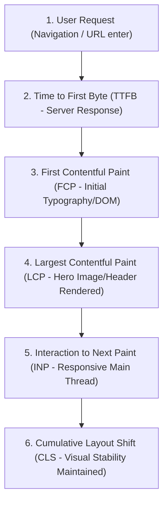
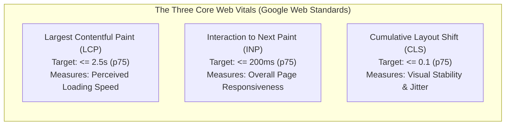
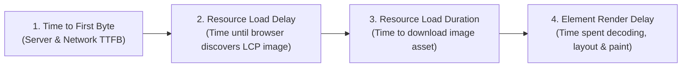
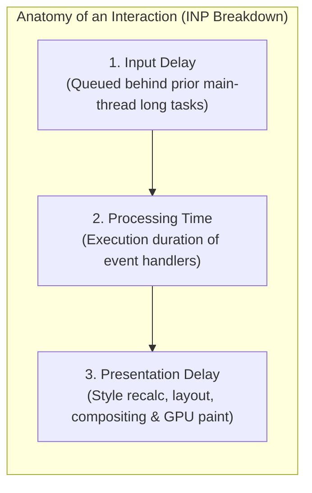
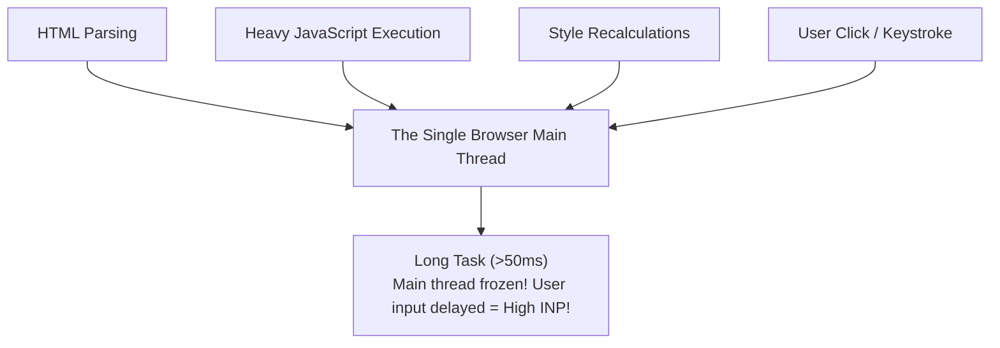
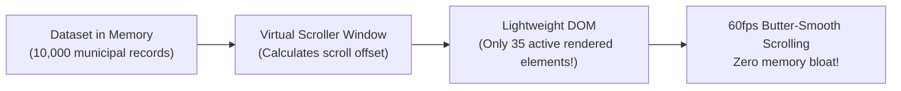
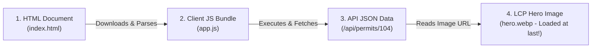
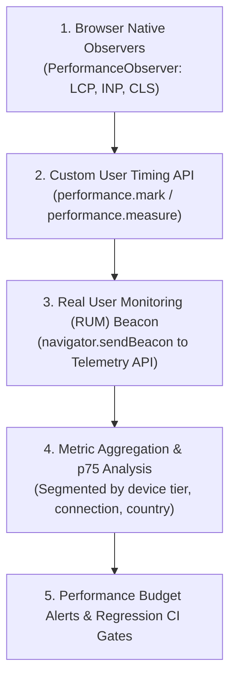

# Core Web Vitals & Performance Engineering

Measure the experience before changing the code

**Chapter 15**

Polla Fattah

---

## Today's goal

Treat performance as a user-experience property and an engineering discipline.

We will connect:

- field data, lab data, and representative measurement;
- LCP, INP, and CLS;
- network, JavaScript, rendering, memory, and layout cost;
- images, fonts, lists, workers, caching, and third parties;
- rendering topology and route-transition performance;
- DevTools traces, User Timing, PerformanceObserver, and RUM;
- budgets, regression detection, ownership, and performance culture.

---

## By the end of today you can

- explain what Core Web Vitals measure and what they do not;
- use p75 and segmentation instead of hiding slow users in averages;
- diagnose LCP resource discovery and server delay;
- trace INP through input, main-thread work, rendering, and paint;
- prevent CLS through reserved space and stable layout;
- identify request waterfalls and unnecessary JavaScript;
- optimize large lists and CPU work only when evidence supports it;
- use browser tools and production signals together;
- define route and user-journey budgets;
- turn an optimization into a hypothesis, measurement, and regression guardrail.

---

## The central principle

> **Performance work begins with a measured user problem, forms a hypothesis about its cause, and ends with a verified improvement under representative conditions.**

An optimization is not successful because it sounds sophisticated.

It is successful when a user journey improves without unacceptable trade-offs.

---

## The performance journey



Performance is a sequence of experiences, not one score.

---

## Core Web Vitals



Together they cover important parts of the user journey.

They are not the complete product experience or business metric.

---

## Why the 75th percentile matters

```text
p75 = a value that 75% of observed experiences meet or beat
```

The worst quarter of experiences still matters.

An excellent average can hide slow devices, difficult networks, or specific routes with real users.

---

## Field data versus lab data

| Field data | Lab data |
|---|---|
| real users and devices | controlled environment |
| shows what happened | helps explain why it may happen |
| segmented by route and conditions | repeatable experiments |
| noisy but representative | limited but diagnostic |

Use both; do not treat them as interchangeable.

---

## Field data answers “what is happening?”

Field data can reveal:

- a slow region or device class;
- a route with poor p75;
- a regression after release;
- real-user impact of a third-party script;
- differences by network, locale, or interaction.

It rarely identifies the exact code line by itself.

---

## Lab data answers “why might it be happening?”

Lab tools can reveal:

- request waterfalls;
- long tasks;
- layout calculations;
- LCP resource delay;
- JavaScript execution;
- memory and rendering traces.

Use controlled experiments to test a specific hypothesis.

---

## Synthetic testing needs representative conditions

Vary:

- CPU speed;
- network latency and bandwidth;
- device memory;
- viewport;
- locale and direction;
- route state;
- cache state.

A single laptop and fast connection do not represent the user population.

---

## Real User Monitoring

RUM can collect:

- Web Vitals;
- route and release;
- device and connection class;
- user journey markers;
- errors and long tasks;
- interaction context.

Collect only what is needed, protect privacy, and make the data actionable.

---

## Segment performance data

Useful segments include:

```text
route / release / device / network / locale / viewport / user state
```

A global p75 can improve while an important route or region regresses.

---

## Largest Contentful Paint

LCP measures when the largest relevant content element becomes visible in the viewport.

It can be:

- an image;
- a text block;
- a poster or background-like visual;
- another large content element selected by the browser.

The metric is about the critical content experience, not only one file.

---

## LCP is not just image download time

```text
server response
  → resource discovery
  → request
  → download
  → decode
  → render and paint
```

An image can download quickly but still become LCP late because the page discovers or renders it late.

---

## LCP subparts

Diagnose:



Each subpart suggests a different fix.

Optimizing the wrong subpart can change little.

---

## Time to First Byte

TTFB includes:

- connection setup;
- redirects;
- server processing;
- time until the first response bytes.

Slow TTFB can delay every downstream rendering milestone.

Investigate server, deployment, cache, and network paths before optimizing browser code.

---

## Redirects add delay

```text
request A → redirect → request B → response
```

Remove unnecessary redirects from critical navigation and asset paths.

Check protocol, host, trailing slash, authentication, and locale redirects.

---

## LCP resource discovery

The browser cannot request what it does not know exists.

An LCP image discovered only after:

- JavaScript execution;
- CSS evaluation;
- a late component mount;

may arrive too late even if its file is optimized.

---

## Prioritize the LCP resource selectively

Use:

- semantic HTML;
- early discoverability;
- correct fetch priority;
- selective preload;
- appropriate caching.

Priority hints are not a substitute for a correct document and should not be applied to every image.

---

## Do not lazy-load above-the-fold LCP images

Lazy loading tells the browser that a resource is not immediately important.

If that resource is the primary visible content, the hint contradicts the user experience.

Lazy-load content that is genuinely below the initial view.

---

## Preload selectively

Preload can help when:

- the resource is certain to be needed;
- discovery is otherwise delayed;
- it is part of the critical path.

It can hurt when it competes with CSS, fonts, scripts, or a different actual LCP resource.

---

## Optimize LCP images

Consider:

- correct dimensions;
- modern format;
- responsive sources;
- compression quality;
- CDN transformation;
- caching;
- avoiding unnecessary oversized files.

Image optimization must preserve visual quality and correct art direction.

---

## Responsive images reduce waste

```html

```

Send an image appropriate to the viewport and layout rather than the largest available file to every device.

---

## Image dimensions help CLS too

Reserve the rendered aspect ratio:

```css
img {
  aspect-ratio: 4 / 3;
}
```

Known dimensions let the browser allocate space before the image arrives.

---

## LCP text can be delayed by fonts

A text LCP may wait for:

- font discovery;
- font download;
- font blocking behavior;
- style calculation;
- fallback-to-webfont swap.

Treat fonts as part of the critical rendering path when they affect the largest content.

---

## Interaction to Next Paint

INP reflects how quickly the page produces the next visual update after user interactions across a session.

It considers more than the event handler's own duration.

---

## INP is a lifecycle metric

```text
input → handler → rendering → paint
```

The slowest meaningful interaction can influence the session metric.

Optimize the user journey, not only one fast demo click.

---

## Anatomy of an interaction



Any phase can dominate the perceived response.

---

## Input delay

Input delay occurs when the main thread is busy before the event can be handled.

Possible causes:

- startup JavaScript;
- long tasks;
- synchronous storage;
- parsing or layout work;
- another interaction's work.

The handler code may be fast while the user still waits.

---

## Main-thread contention



Work competes for responsiveness.

Reduce unnecessary work before moving necessary work to more complex mechanisms.

---

## Long tasks

Long tasks block the main thread long enough to delay input and visual updates.

Find:

- the task's initiator;
- script evaluation;
- event handler work;
- rendering and layout;
- third-party contribution.

Then optimize the cause, not only the symptom.

---

## Yielding

Break long work into opportunities for the browser to process input and paint.

```ts
await schedulerYieldOrTimeout();
processNextBatch();
```

Yielding improves responsiveness only when work can be safely divided and scheduled.

---

## Avoid work before optimizing work

First ask:

- is this calculation needed?
- is it repeated?
- is its input larger than necessary?
- can it happen later?
- can it be moved off the critical path?

Making unnecessary work faster is usually less valuable than removing it.

---

## Event handler work

Keep urgent interaction work small:

```text
read intent → update minimal state → schedule heavier work
```

Avoid synchronous parsing, large filtering, layout reads, and unrelated analytics in the immediate path.

---

## Rendering can dominate INP

The handler may finish quickly, but a large update can cause:

- broad component rendering;
- large DOM changes;
- style recalculation;
- layout;
- paint.

Trace from the input through the committed UI.

---

## Reduce render scope

Keep state close to the consumers that need it.

Use stable identities and explicit boundaries to avoid updating unrelated parts of the interface.

Do not split components blindly; make the dependency graph narrower.

---

## Virtualize large lists

Virtualization renders only the visible window plus a buffer.



It can reduce rendering and layout cost for genuinely large collections.

---

## Virtualization has UX costs

Consider:

- keyboard navigation;
- find-in-page;
- screen readers;
- variable row height;
- scroll position;
- focus preservation;
- copy and selection behavior.

Virtualize when the trace shows a need and test the full interaction model.

---

## Web Workers move CPU work off the main thread

Workers can help with:

- large parsing;
- data transformation;
- computation;
- search indexing;
- image or file processing.

They do not make an algorithm cheaper and do not remove communication or serialization cost.

---

## Worker communication has cost

```mermaid
sequenceDiagram
    autonumber
    participant Main as Browser Main Thread (UI at 60fps)
    participant Worker as Dedicated Web Worker Thread

    Main->>Worker: postMessage({ type: 'CALCULATE_AUDIT', data: largeMatrix })
    Note over Worker: Worker executes heavy 400ms calculation in background!
Main thread remains 100% responsive to user clicks.
    Worker-->>Main: postMessage({ type: 'AUDIT_COMPLETE', result: summary })
    Note over Main: Main thread updates UI badge with zero frame drops
```

Move enough work to justify the boundary.

Use transferable data or shared strategies deliberately and safely.

---

## Interaction feedback first

The user needs an immediate response such as:

- pressed state;
- focus change;
- optimistic visual update;
- progress indication;
- disabled or pending state.

Defer nonessential work so feedback is not behind logging, formatting, or secondary requests.

---

## Cumulative Layout Shift

CLS measures unexpected layout movement during page use.

Common causes:

- images without dimensions;
- late banners;
- font swaps;
- inserted content;
- changing ads or embeds;
- transitions that move unrelated content.

---

## Layout shift sources

Trace each shift to:

```text
what moved?
what caused the new size?
was the change user-initiated?
was space reserved?
```

The fix depends on the cause, not only the visual symptom.

---

## Reserve space

Reserve space for:

- media;
- ads or sponsored regions;
- async controls;
- embeds;
- validation messages;
- banners and notifications.

Stable geometry improves reading, focus, and interaction even beyond the metric.

---

## User-initiated changes are different

A layout change directly caused by a user action may not count the same way as an unexpected shift.

It can still be a poor experience if it moves the user away from the control they are using.

Metrics do not replace design judgment.

---

## Avoid inserting content above the view

If a late response inserts a banner above the user's reading position, the page can jump.

Reserve the region or place updates where they do not displace current content unexpectedly.

---

## Fonts and layout shift

Font changes can alter:

- text width;
- line wrapping;
- block height;
- button size;
- layout position.

Choose fallback metrics and loading behavior that preserve useful geometry.

---

## Font loading strategy

Options include:

- system fonts;
- self-hosted subsets;
- preload for truly critical fonts;
- `font-display` policy;
- metric-compatible fallbacks;
- delayed noncritical families.

The fastest font is often the one the critical path does not need.

---

## `font-display`

Font display controls how text behaves while a webfont loads.

Choose based on:

- content importance;
- brand requirements;
- fallback compatibility;
- readability;
- layout stability.

There is no single setting that is correct for every text region.

---

## System fonts can be excellent

System fonts can provide:

- immediate text;
- no font transfer;
- good platform integration;
- stable performance.

Brand typography should justify its loading and layout cost.

---

## Network performance

The network path includes:

```text
DNS → connection → TLS → request → server → transfer → parse
```

Optimize the path that is actually slow.

---

## Request waterfalls



Sequential discovery delays the final content.

Find dependencies that could be:

- discovered earlier;
- requested in parallel;
- embedded in the initial response;
- cached or prefetched.

---

## Flatten unnecessary waterfalls

```ts
const [products, categories] = await Promise.all([
  loadProducts(),
  loadCategories(),
]);
```

Parallelize independent work.

Do not parallelize operations that depend on one another or that would overwhelm the server.

---

## Connection reuse

Reuse can reduce setup cost for:

- HTTP connections;
- TLS;
- pooled server connections;
- persistent sessions.

Avoid unnecessary origins that prevent effective reuse and increase discovery work.

---

## Compression helps transfer, not execution

Compression reduces bytes over the network.

It does not remove:

- JavaScript parsing;
- compilation;
- execution;
- hydration;
- memory;
- DOM work.

Optimize both transfer and device work.

---

## JavaScript is expensive in several ways

```text
transfer → parse → compile → execute → render → memory
```

A small compressed bundle can still be expensive on a slower device if it contains heavy startup work.

---

## Reduce unnecessary JavaScript

Possible strategies:

- remove unused dependencies;
- delay noncritical features;
- keep static content server-rendered;
- use route and component boundaries;
- avoid shipping server-only logic;
- replace a library with a platform capability when appropriate.

Measure the user journey after each change.

---

## Route-level code splitting

```text
home chunk
catalogue chunk
admin-editor chunk
```

Route splitting aligns code delivery with navigation and often gives a strong return.

Define loading, error, and prefetch behavior for each route.

---

## Component-level lazy loading

Use it for:

- rarely opened dialogs;
- expensive editors;
- below-the-fold visualizations;
- optional reports;
- feature-specific integrations.

Avoid splitting tiny, always-used components into network overhead.

---

## Third-party JavaScript is shared product cost

Third-party code can add:

- transfer;
- CPU;
- layout;
- network requests;
- privacy and security review;
- failure dependencies.

The product owns the cost even when another company wrote the script.

---

## Lazy-load third-party features

Delay analytics, chat, experiments, maps, and widgets when they are not needed for the first useful interaction.

Load them after consent, idle time, visibility, or explicit interaction where appropriate.

---

## CSS performance

CSS affects:

- style calculation;
- layout;
- paint;
- render-blocking behavior;
- asset discovery;
- layout stability.

Keep critical styles available and avoid shipping large unused style systems to every route.

---

## Critical CSS

Critical CSS covers styles needed for the initial visible content.

Possible approaches include:

- inline critical rules;
- route-specific CSS;
- efficient stylesheet delivery;
- deferred noncritical styles.

Avoid making the critical path more complex than the benefit justifies.

---

## Avoid flashing unstyled content

Coordinate:

- stylesheet discovery;
- font behavior;
- class application;
- theme initialization;
- server and client markup.

A fast first paint that changes dramatically is not a stable experience.

---

## DOM size and depth

A large or deeply nested DOM can increase:

- style calculation;
- layout;
- accessibility tree work;
- memory;
- query and update scope.

Do not reduce markup mechanically; identify the subtree causing measured work.

---

## Batch reads and writes

Avoid alternating layout reads and writes:

```mermaid
flowchart TD
    subgraph LayoutThrashing["The Layout Thrashing Anti-Pattern"]
        R1["Read: elem1.offsetWidth"] --> W1["Write: elem1.style.width = '...'"]
        W1 -->|Forces immediate sync layout recalc!| R2["Read: elem2.offsetWidth"]
        R2 --> W2["Write: elem2.style.width = '...'"]
        W2 -->|Forces second layout recalc!| Bad["Result: 30 dropped frames / massive jank"]
    end
    subgraph BatchedSolution["The Batched Solution (Fast)"]
        BR1["Batch All Reads First:
r1 = elem1.offsetWidth;
r2 = elem2.offsetWidth;"] --> BW1["Batch All Writes in next frame:
elem1.style.width = ...;
elem2.style.width = ...;"]
        BW1 --> Good["Result: Exactly ONE clean layout recalculation!"]
    end
```



Group reads, then writes where possible to reduce forced layout and synchronization.

---

## Paint and composite

Visual updates can cost through:

- large paint regions;
- expensive shadows or filters;
- image decoding;
- transparency and layers;
- layout-triggering properties.

Use DevTools traces to identify actual paint and composite costs.

---

## `will-change` is not a speed button

`will-change` can reserve resources or create layers.

Use it only for a measured, anticipated change and remove it when the change ends.

Overuse increases memory and can make rendering worse.

---

## Animation frame budget

At a common 60Hz target, a frame arrives roughly every 16.7ms.

That time includes:

- JavaScript;
- style;
- layout;
- paint;
- composite;
- browser overhead.

Animation and interaction work must share the frame budget.

---

## `requestAnimationFrame`

Use it to coordinate visual writes with the browser's rendering cycle.

```ts
requestAnimationFrame(() => {
  element.style.transform = nextTransform;
});
```

It does not make expensive work free; it schedules it at a meaningful time.

---

## Caching is a performance policy

Define:

- what is immutable;
- what can be stale;
- what is user-specific;
- what invalidates it;
- how long it lives;
- how it behaves offline.

Caching can reduce latency and increase correctness risk if the policy is unclear.

---

## Fingerprinted static assets

```text
app.8f31c.js
styles.2a1d.css
```

Content-addressed assets can be cached for a long time because a new content version receives a new URL.

---

## HTML cache policy differs from hashed assets

HTML points to the current asset names and may need more frequent revalidation.

Caching HTML as aggressively as fingerprinted assets can serve old entry points or stale deployment manifests.

Match cache lifetime to artifact meaning.

---

## API caching

API caching must consider:

- freshness;
- user identity;
- permissions;
- query inputs;
- invalidation after mutation;
- privacy;
- offline usefulness.

The fastest response is not useful if it is the wrong user's data.

---

## Cache hit rate is not the whole story

Also measure:

- stale response rate;
- revalidation cost;
- memory and storage;
- cache eviction;
- incorrect reuse;
- time to useful content.

A high hit rate with stale or mismatched data is not a success.

---

## Prefetching

Prefetch when a next action is likely and the cost is bounded.

Good signals include:

- visible navigation intent;
- hover or focus with caution;
- route prediction;
- idle time;
- sufficient connection and storage.

---

## Speculation can waste resources

Prefetching and prerendering can consume:

- bandwidth;
- battery;
- memory;
- server capacity;
- privacy budget.

Do not optimize one user's transition by imposing invisible cost on every user.

---

## Preconnect and DNS prefetch

These hints can reduce connection setup for origins known to be needed.

Use them selectively:

- `preconnect` for a critical known origin;
- DNS prefetch when a connection may be useful later.

Unnecessary origins still add work and complexity.

---

## Performance and rendering topology

```text
CSR     → browser startup and execution cost
SSR     → server response plus hydration cost
SSG     → build-time work and static delivery
islands → selective browser responsibility
```

The rendering choice changes where performance work appears.

---

## Hydration cost

Measure:

- JavaScript needed for the route;
- components that hydrate;
- event setup;
- client data handoff;
- main-thread time before interaction.

HTML already visible does not mean the page is interactive.

---

## Streaming performance

Streaming can improve:

- first useful output;
- perceived progress;
- independent slow regions.

It can also add:

- boundary complexity;
- layout shifts;
- coordination and error states;
- client handoff work.

Measure the user journey, not only the first chunk.

---

## SPA and soft-navigation performance

After initial load, measure:

- route request time;
- code chunk loading;
- data loading;
- transition feedback;
- rendering and layout;
- scroll and focus restoration.

A fast initial page can still have slow navigation.

---

## Route-transition metrics

Define markers:

```text
navigation requested
route code ready
data ready
content committed
interaction ready
```

Use them to locate the phase that users are waiting through.

---

## User Timing API

```ts
performance.mark("catalogue-start");
await loadCatalogue();
performance.mark("catalogue-ready");
performance.measure("catalogue-load", "catalogue-start", "catalogue-ready");
```

Custom marks connect browser traces to product journeys.

Name them consistently and avoid collecting sensitive data.

---

## PerformanceObserver

Observers can collect browser performance entries such as:

- largest contentful paint;
- layout shifts;
- long tasks;
- navigation timing;
- resource timing.

Use them to build useful signals, not to collect every possible event without a question.

---

## DevTools Performance panel

Start with a user action:

```text
click / type / scroll / navigate
  → record trace
  → inspect main thread
  → correlate rendering and network
```

The trace should answer a hypothesis about the delay.

---

## Flame charts

Flame charts reveal:

- which functions consume time;
- call depth;
- repeated work;
- long tasks;
- layout and paint boundaries.

Read from the interaction or milestone rather than scanning for the largest colorful block without context.

---

## Bottom-up analysis

Bottom-up views aggregate cost by function or category.

They can reveal:

- a dependency's shared cost;
- repeated parsing;
- expensive event handlers;
- a framework operation called from many paths.

Use call stacks and user journeys to interpret the total.

---

## Network panel

Inspect:

- request order;
- queueing;
- connection setup;
- response time;
- transfer size;
- cache status;
- priority;
- initiator chain.

Network evidence often explains why an apparently optimized asset still arrives late.

---

## Coverage and bundle analysis

Coverage can show unused code during one journey.

Bundle analysis can show:

- large dependencies;
- duplicate packages;
- shared chunk cost;
- route chunk composition;
- accidental client inclusion.

Unused in one journey is a clue, not automatic proof that code should be removed.

---

## Lighthouse is one lab view

Lighthouse can provide useful repeatable diagnostics.

It is not:

- real-user data;
- a complete accessibility audit;
- a business metric;
- proof that every route is healthy;
- a substitute for traces and production monitoring.

Use it as one instrument in the measurement stack.

---

## Repeat measurements

Control:

- cache state;
- CPU and network;
- viewport;
- route data;
- browser version;
- device conditions.

Compare enough runs to distinguish signal from noise.

---

## CPU and network throttling

Representative throttling helps reveal:

- startup execution;
- input delay;
- slow resource discovery;
- dependency waterfalls;
- layout and paint pressure.

Do not mistake one artificial throttle for the entire user population.

---

## Memory performance

Watch for:

- detached DOM nodes;
- unbounded caches;
- retained event listeners;
- subscriptions without cleanup;
- large closures;
- worker and image memory.

Memory problems can become interaction and crash problems later.

---

## Memory leaks

A leak is retained data that should no longer be reachable.

Reproduce a lifecycle repeatedly:

```text
mount → interact → unmount → repeat
```

Compare heap snapshots and retained references rather than relying on one memory reading.

---

## Detached DOM nodes

Detached nodes may remain because:

- a listener retains them;
- a closure stores a reference;
- a library cache never releases them;
- a subscription outlives the component.

Clean up at the owner boundary.

---

## Unbounded caches

Every cache needs:

- maximum size or expiry;
- invalidation;
- identity scope;
- persistence policy;
- behavior under storage pressure.

An optimization that grows without bound is a future outage.

---

## Subscription cleanup

Clean up:

- event listeners;
- observers;
- timers;
- sockets;
- workers;
- requests;
- media resources.

The cleanup should belong to the lifecycle that created the subscription.

---

## Performance budgets

A budget turns an aspiration into a reviewable constraint.

Possible budgets include:

- initial transfer;
- JavaScript execution;
- route transition;
- LCP, INP, and CLS;
- memory;
- third-party cost.

---

## Budgets need context

A single global number hides route and user differences.

Define budgets by:

```text
route × device class × network × journey
```

Keep the budget small enough to guide decisions and flexible enough to reflect product reality.

---

## Bundle budgets

Track:

- initial compressed transfer;
- initial uncompressed parse volume;
- route chunk sizes;
- third-party additions;
- duplicate dependencies.

Bundle size is a useful constraint, not the complete performance outcome.

---

## Metric budgets

Metrics can be reviewed by:

- route;
- release;
- device segment;
- user journey;
- p75 or other percentile.

Define what action occurs when the budget is exceeded.

---

## User-journey budgets

```text
open catalogue → see products → filter → open detail → save
```

The journey budget can include:

- useful content;
- interaction readiness;
- route transition;
- server confirmation;
- recovery after failure.

It connects performance to product value.

---

## Performance regression

A regression is meaningful when:

- a measured signal worsens;
- under comparable conditions;
- for a meaningful segment;
- beyond expected noise;
- with an owner and response path.

Do not fail a build over a noisy metric without understanding variance.

---

## Performance ownership

Assign responsibility for:

- budgets;
- monitoring;
- dependency review;
- route regressions;
- third-party approval;
- incident response;
- optimization follow-up.

Performance that belongs to nobody becomes cleanup work after users complain.

---

## Performance review in pull requests

Ask when a change affects:

- initial route imports;
- large lists;
- images or fonts;
- third-party scripts;
- rendering scope;
- network waterfalls;
- cache behavior;
- memory lifecycle.

Not every PR needs a benchmark, but every costly change needs a reasoning path.

---

## Performance and accessibility

Do not optimize by removing:

- labels;
- focus behavior;
- semantic structure;
- keyboard support;
- announcements;
- readable loading states.

A fast interface that cannot be used is not a performance success.

---

## Performance and internationalization

Localization can change:

- text length;
- line wrapping;
- font coverage;
- direction;
- date and number formatting;
- layout and interaction size.

Measure representative locales and directions, not only the default language.

---

## Font subsetting and multilingual products

Subset fonts by language or route when appropriate.

Verify:

- fallback behavior;
- glyph coverage;
- layout stability;
- preload scope;
- cache reuse.

Reducing font bytes should not create missing characters or unstable text.

---

## Performance and security

Security controls can affect performance:

- CSP and third-party loading;
- integrity checks;
- authentication redirects;
- encryption and headers;
- sanitization;
- logging and monitoring.

Do not remove a security boundary for a benchmark win. Find the right design trade-off.

---

## Performance and offline architecture

Offline systems can improve perceived speed with local reads.

They also add:

- storage work;
- synchronization;
- reconciliation;
- memory and disk cost;
- stale-data decisions.

Measure both online first load and offline/restore journeys.

---

## Performance and micro-frontends

Micro-frontends can add:

- remote requests;
- duplicate runtimes;
- mount work;
- CSS and font duplication;
- integration waterfalls.

They can also isolate route loading and reduce one giant application bundle.

Measure the assembled page and route transition.

---

## Diagnose LCP

Ask in order:

1. Is TTFB slow?
2. Is the LCP resource discovered late?
3. Is the resource too large or poorly prioritized?
4. Is rendering blocked by fonts or JavaScript?
5. Is the final element delayed by layout or hydration?

Match the fix to the slow subpart.

---

## Diagnose INP

Ask:

1. Was the input delayed by a long task?
2. Is the event handler doing unnecessary work?
3. Does state update too broad a region?
4. Is rendering or layout expensive?
5. Can work be deferred, batched, or moved?

The answer may be outside the handler itself.

---

## Diagnose CLS

Ask:

1. Which element moved?
2. What changed its geometry?
3. Was space reserved?
4. Did a font, image, ad, or async message arrive late?
5. Was the change necessary and user-initiated?

Fix the layout model, not only the visible jump.

---

## Optimization should match cause

```text
slow server → cache, data path, server work
late image  → discovery, priority, dimensions
slow input  → main-thread or render scope
layout jump → reserved geometry and font policy
large route → imports, splitting, dependency review
```

Avoid applying a favorite optimization to every symptom.

---

## Performance triage

Prioritize by:

- user impact;
- affected population;
- severity;
- confidence in the cause;
- cost and risk of the fix;
- reversibility;
- business importance of the journey.

The biggest measured cause is often more valuable than a long list of minor improvements.

---

## Performance hypotheses

Use a structured statement:

```text
We believe [cause] makes [journey] slow for [segment].
If we change [intervention], [signal] should improve without [trade-off].
```

Then measure before and after under comparable conditions.

---

## Before and after measurement

Record:

- baseline;
- environment;
- route and data;
- change;
- expected signal;
- observed result;
- side effects;
- rollback or follow-up.

An optimization without a baseline is a story, not evidence.

---

## Avoid benchmark theater

Do not:

- optimize a synthetic score disconnected from users;
- report one best run;
- hide slow segments;
- compare different route states;
- claim universal frame rates;
- remove accessible behavior to win a metric.

Performance evidence should improve decisions, not decorate a release.

---

## Production verification

After deployment, verify:

- field metrics;
- route segments;
- release comparison;
- error and abandonment signals;
- cache behavior;
- device and network impact.

Lab success does not prove production success.

---

## Core Web Vitals are not business metrics

They describe aspects of experience.

Business outcomes may include:

- task completion;
- search success;
- conversion;
- retention;
- support contacts;
- revenue or cost.

Connect performance improvements to meaningful user outcomes.

---

## Core Web Vitals are not the whole experience

Also consider:

- accessibility;
- correctness;
- content clarity;
- responsiveness outside measured interactions;
- resilience and offline behavior;
- perceived progress;
- privacy and security.

Optimize the experience, not only the dashboard.

---

## A performance measurement stack



Each layer answers different questions.

---

## Performance dashboard design

A useful dashboard shows:

- route and release;
- p75 and distribution;
- device/network segment;
- sample size;
- metric subparts where available;
- business journey;
- regression threshold;
- owner and next action.

Avoid a single score that hides all context.

---

## Percentiles beyond p75

p75 is useful for common experience reporting.

p90, p95, and tail behavior can reveal severe experiences for a smaller group.

Choose percentiles based on the decision and sample size; do not compare tiny samples as if they were stable populations.

---

## Sample size matters

A metric from a handful of sessions can move dramatically by chance.

Use:

- confidence intervals or uncertainty awareness;
- minimum sample thresholds;
- longer windows for sparse routes;
- segmentation that does not destroy statistical usefulness.

---

## Performance budgets by route

Different routes may need different budgets:

```text
marketing page → initial load and LCP
catalogue      → filtering and transition INP
editor         → input responsiveness and save flow
reports        → data and visualization cost
```

Route budgets align architecture with user journeys.

---

## Component performance contracts

A shared component can define expectations for:

- DOM size;
- interaction work;
- image behavior;
- hydration or client code;
- accessibility;
- cleanup;
- bundle contribution.

Contracts should guide design without making every component artificially identical.

---

## Performance and architecture decisions

Before choosing:

- CSR or SSR;
- monolith or micro-frontend;
- client or server component;
- eager or lazy feature;
- cache or refetch;
- virtualized or full list;

state the user journey, bottleneck, measurement, and trade-off.

---

## A performance culture

Healthy teams:

- measure before optimizing;
- share traces and context;
- review performance impact early;
- protect accessibility and security;
- assign ownership;
- learn from production data;
- keep budgets actionable.

Performance is a continuous engineering property, not a final cleanup phase.

---

## Practical lab: Measure and Improve a Slow Interface

Diagnose a slow catalogue using field-like and lab measurements, then test whether virtualization, scheduling, asset changes, or caching address the measured cause.

Every change must begin with a hypothesis and end with a representative re-measurement.

---

## Practical stages 1–5: loading diagnosis

1. Record LCP, INP, and CLS baselines.
2. Capture a trace for a slow interaction.
3. Identify long tasks, layout work, network delays, and rendering cost.
4. Inspect LCP.
5. Optimize hero delivery and test a resource-priority experiment.

Do not preload or optimize blindly.

---

## Practical stages 6–9: interaction work

6. Diagnose INP.
7. Remove unnecessary work.
8. Virtualize a large list only if the trace supports it.
9. Move CPU work to a worker.

Compare responsiveness, memory, communication cost, accessibility, and implementation complexity.

---

## Practical stages 10–13: layout and network

10. Diagnose CLS.
11. Test font strategy.
12. Inspect network waterfalls.
13. Remove an artificial waterfall.

Re-measure under representative CPU, network, locale, and direction settings.

---

## Practical stages 14–18: code and navigation

14. Inspect JavaScript.
15. Audit third-party scripts.
16. Add caching.
17. Measure an SPA route transition.
18. Add User Timing.

Connect each change to a specific journey and signal.

---

## Practical stages 19–24: production discipline

19. Investigate memory.
20. Create performance budgets.
21. Add a CI guardrail.
22. Build a RUM design.
23. Build a performance regression report.
24. Draw the final performance architecture.

Verification: the optimization improves a user journey or validated signal; no universal “zero INP” promise is made.

---

## Practical extension: budget and regression test

Add a performance budget and regression test.

Document why the budget is useful and why it is not a replacement for Core Web Vitals, field data, or user-journey measurement.

---

## Try this yourself

Choose one slow interaction and write:

```text
segment:
baseline:
hypothesis:
trace evidence:
change:
expected trade-off:
after measurement:
```

If you cannot fill in the evidence, measure before changing code.

---
## Troubleshooting guide (Part 1)

| Symptom | Likely cause |
|---|---|
| Lighthouse is good but users are slow | Lab conditions or route differ from field data |
| LCP image is compressed but still late | Discovery, TTFB, priority, or render delay |
| Click handler is short but INP is poor | Input delay or expensive rendering follows |
| CLS occurs after font load | Metrics and fallback geometry differ |
| Virtualization improves speed but breaks keyboard use | UX and accessibility contract was not tested |
---
## Troubleshooting guide (Part 2)

| Symptom | Likely cause |
|---|---|
| Worker adds no benefit | Transfer and setup cost exceed CPU savings |
| Bundle shrinks but interaction is unchanged | Execution, rendering, or network is the actual bottleneck |
| Cache hit rate rises but data is wrong | Freshness, identity, or invalidation policy is weak |
| Budget fails randomly | Sample, environment, or threshold is not controlled |
---

## Completion checklist

- [ ] field and lab data are used for different questions;
- [ ] p75 and segments are considered;
- [ ] LCP is diagnosed by subparts;
- [ ] INP includes input, handler, rendering, and paint;
- [ ] CLS sources have reserved geometry;
- [ ] network and JavaScript waterfalls are inspected;
- [ ] list and worker optimizations are evidence-driven;
- [ ] memory, cache, and subscription lifecycles are bounded;
- [ ] route budgets and performance ownership are explicit;
- [ ] production verification follows lab experiments.

---
## Misconceptions to leave behind (Part 1)

| Misconception | Better mental model |
|---|---|
| Performance means Lighthouse score | It is a measured user experience |
| Fast on my machine means fast | Device, network, and route segments differ |
| Average performance is enough | Percentiles reveal slow experiences |
| LCP is image download time | Discovery, server, download, and render all matter |
| Every above-fold image should be preloaded | Prioritize the actual critical resource |
| Lazy loading always helps | It can delay content the user needs now |
| INP is only handler duration | Input, processing, render, and paint form the interaction |
| Memoization always improves speed | Caches have cost and may not target the cause |
---
## Misconceptions to leave behind (Part 2)

| Misconception | Better mental model |
|---|---|
| Virtualize every list | Virtualization has UX and accessibility trade-offs |
| Workers make code faster | They trade main-thread work for communication cost |
| Compression solves JavaScript bloat | Parsing and execution remain |
| More code splitting is always better | Chunks have request and coordination cost |
| Prefetch everything | Speculation consumes user and server resources |
| SSR guarantees good Web Vitals | Topology moves work; it does not remove it |
| Optimization is final polish | Performance is an architectural constraint |
---

## The chapter in one sentence

> **Measure the real journey, diagnose the actual bottleneck, and make the smallest evidence-backed change that improves users without sacrificing accessibility, security, or correctness.**

---

## Next: Chapter 16

The next chapter will build on performance engineering with:

- observability and production diagnostics;
- logging, tracing, and error reporting;
- reliability signals and incident response;
- operational feedback for front-end systems;
- architecture that remains explainable in production.

---

## Questions

Which user journey is slow for a real segment of your users, and what evidence would distinguish network, JavaScript, rendering, layout, and server causes?
