# Testing Strategies for Resilient Interfaces

Build confidence around real behavior

**Chapter 16**

Polla Fattah

---

## Today's goal

Design a test strategy that finds important failures without coupling every test to implementation details.

We will connect:

- risk, evidence, and the testing pyramid;
- static analysis, unit, component, integration, and E2E tests;
- semantic queries, accessible names, keyboard, and focus behavior;
- async UI, network mocking, cancellation, and races;
- Playwright journeys, visual regression, contracts, and browser matrices;
- offline, cache, routing, permissions, security, and performance tests;
- flakiness, CI selection, coverage, maintenance, and test architecture.

---

## By the end of today you can

- choose a test level from the risk and boundary involved;
- test user-visible behavior without inspecting private state unnecessarily;
- use semantic queries and accessible names effectively;
- distinguish simulated DOM tests from real-browser tests;
- test loading, empty, error, retry, cancellation, and optimistic rollback;
- mock at stable boundaries rather than mocking every internal module;
- design realistic browser journeys and failure artifacts;
- detect flakiness instead of normalizing it;
- use coverage as a map rather than a grade;
- maintain a layered suite that remains useful as the UI evolves.

---

## The central principle

> **A test is valuable when it provides trustworthy evidence about a risk the product actually has.**

Fast tests, realistic tests, and broad tests each provide different evidence.

Quality comes from a balanced set of boundaries—not from a single test type or coverage percentage.

---

## Testing is risk management

Ask:

- what can fail?
- who is affected?
- how likely is it?
- how costly is detection after release?
- which test level observes the risk most directly?

The answer determines where to invest test effort.

---

## Confidence comes from different evidence

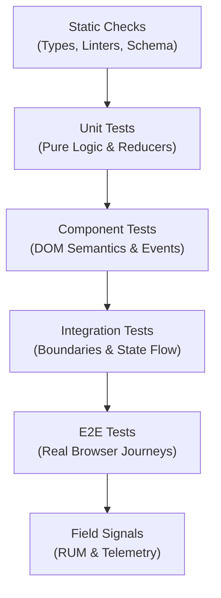

No one layer can prove the others.

---

## Testing pyramid, trophy, and reality

The shape is less important than the reasoning:

- fast checks should catch cheap mistakes early;
- integration tests should cover important boundaries;
- E2E tests should protect critical journeys;
- production signals should reveal what test environments missed.

Choose the mix from risk, not from a diagram's proportions.

---

## The cost-confidence spectrum

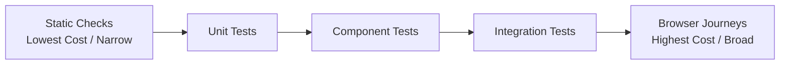

Use the narrowest test that provides enough confidence for the risk.

Put a failure at the closest useful boundary.

---

## Static analysis is part of testing strategy

Static checks can catch:

- type inconsistencies;
- unreachable branches;
- unsafe imports;
- dependency direction violations;
- accessibility lint issues;
- unused or suspicious code.

They are fast evidence, but they do not observe runtime behavior.

---

## Static analysis has limits

It cannot fully prove:

- server responses;
- browser timing;
- focus behavior;
- visual layout;
- network failures;
- authentication flows;
- user comprehension;
- correct business outcomes.

Use runtime tests where the risk exists.

---

## Unit tests target deterministic logic

```ts
expect(formatPrice(1250, "USD")).toBe("$12.50");
```

Good unit targets include:

- parsers;
- reducers;
- formatters;
- validation;
- URL serialization;
- cache-key construction;
- state-transition logic.

---

## Avoid unit testing language syntax

Do not write tests to prove that:

- `Array.prototype.map` maps;
- an `if` statement branches;
- a framework renders a known element;
- a constant equals itself.

Test your decision logic and product behavior around the language feature.

---

## Test behavior, not line count

```text
user input → validation message → submit disabled or request sent
```

This is more valuable than asserting that every internal line executed.

Coverage can identify untested areas, but behavior determines confidence.

---

## Component tests should resemble user interaction

```text
find searchbox → type query → press Enter → observe loading/results
```

Prefer interactions and visible outcomes over calls to private helpers or internal state snapshots.

---

## Why role-based queries are valuable

```ts
screen.getByRole("button", { name: /save/i });
```

Role-based queries:

- reflect the accessibility tree;
- survive many visual refactors;
- encourage meaningful semantics;
- match how assistive technologies identify controls.

They are a quality signal, not complete accessibility certification.

---

## Accessible name is part of the contract

```html
<button aria-label="Close dialog">×</button>
```

The role identifies the control type.

The accessible name identifies what it does.

Test both when the behavior depends on them.

---

## Accessible name computation is a web concept

Accessible names can come from:

- visible text;
- associated labels;
- `aria-label`;
- `aria-labelledby`;
- other standard mechanisms.

Testing-library queries reflect platform semantics; they do not invent a private testing concept.

---

## Preferred query order

Often prefer:

1. role and accessible name;
2. label;
3. placeholder or visible text where appropriate;
4. semantic state or value;
5. test ID as a fallback.

Choose the query that represents the user-facing contract.

---

## `getByLabelText` for forms

```ts
screen.getByLabelText("Email address");
```

This tests that the label and control are associated in a meaningful way.

It can reveal form accessibility problems that a class selector would miss.

---

## Role queries do not replace accessibility audits

A control can be findable by role and still have:

- poor focus behavior;
- incorrect state announcements;
- bad color contrast;
- keyboard traps;
- confusing reading order;
- missing error association.

Automated checks supplement human and assistive-technology evaluation.

---

## Test IDs are legitimate fallbacks

Use a test ID when:

- no meaningful user-facing semantic exists;
- a structural target is required;
- a complex visualization needs a stable anchor;
- the stronger query would be misleading.

The issue is not the attribute; it is using it to avoid designing a semantic interface.

---

## Avoid overfitting to CSS selectors

```ts
container.querySelector(".blue-primary-button");
```

This couples the test to styling and class names.

Use CSS selectors when CSS structure is genuinely the behavior under test, such as a visual or layout integration.

---

## Avoid testing internal state

Prefer:

```text
click tab → selected tab is announced and panel changes
```

Over:

```text
expect(component.state.selected).toBe("reviews")
```

Internal state is an implementation choice; visible behavior is the contract.

---

## Avoid testing private methods

Private methods can change during a refactor while the product behavior remains correct.

Test them indirectly through the public behavior unless the logic is extracted into a meaningful pure unit with its own contract.

---

## Component test example

```ts
it("shows an error when the email is invalid", async () => {
  await user.type(screen.getByLabelText("Email"), "not-an-email");
  await user.click(screen.getByRole("button", { name: "Save" }));

  expect(screen.getByRole("alert")).toHaveTextContent("valid email");
});
```

The test follows interaction and outcome rather than implementation.

---

## Integration tests connect boundaries

Integration may include:

- component plus reducer;
- form plus validation;
- query layer plus cache;
- route plus URL state;
- API adapter plus parser;
- shell plus remote contract.

The scope should reflect a real interaction boundary.

---

## Integration is a spectrum

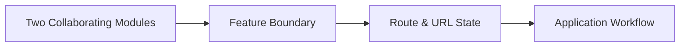

Name the scope clearly.

The goal is not to make every test “large”; it is to verify the collaboration that matters.

---

## Browser simulation versus a real browser

| Simulated environment | Real browser |
|---|---|
| fast and focused | realistic layout and platform behavior |
| easy unit/integration loop | network, focus, CSS, storage, workers |
| incomplete browser APIs | higher cost and setup |
| good for most logic | needed for critical browser behavior |

Use both intentionally.

---

## Vitest and test-runner responsibilities

A runner typically provides:

- test discovery;
- assertions;
- isolation;
- mocks and timers;
- watch mode;
- coverage;
- reporting.

It does not decide whether the tested behavior is valuable.

---

## Watch mode supports rapid feedback

Watch mode should:

- rerun affected tests;
- preserve readable failure output;
- make focused testing easy;
- encourage small feedback loops.

Do not let a slow or noisy watch workflow push developers toward skipping tests.

---

## Browser mode

Browser-based component tests can reveal:

- real DOM behavior;
- CSS and layout interaction;
- focus and selection;
- browser API differences.

Use them where simulated DOM limitations are relevant rather than moving every unit test into a browser.

---

## Simulated DOM still has value

It is often sufficient for:

- roles and labels;
- event flows;
- state transitions;
- loading and error rendering;
- form validation;
- network boundary behavior.

Know what the environment does not implement before trusting it for a browser-specific claim.

---

## User event simulation

Prefer realistic sequences over synthetic dispatch:

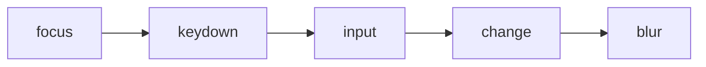

A single direct property assignment may skip behavior your product depends on.

Use a user-event tool when the interaction sequence matters.

---

## Keyboard testing

Test:

- Tab order;
- Enter and Space activation;
- arrow-key navigation;
- Escape behavior;
- focus after open and close;
- disabled controls;
- keyboard traps.

Mouse-only tests miss a major part of interaction architecture.

---

## Focus testing

```ts
await user.click(screen.getByRole("button", { name: "Open" }));
expect(screen.getByRole("dialog")).toHaveFocus();
```

Focus is observable user state.

Test where focus goes, what happens on dismissal, and whether the trigger is restored.

---

## Testing async UI

Cover asynchronous state transitions:

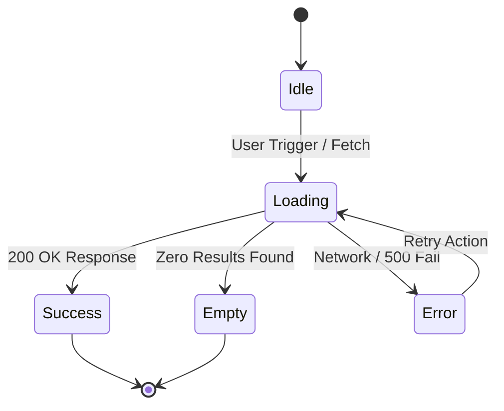

Assert after the relevant state settles, not immediately after starting an asynchronous operation.

---

## Avoid arbitrary sleeps

```ts
await new Promise(resolve => setTimeout(resolve, 1000));
```

Sleeps make tests slow and still do not prove the condition is ready.

Wait for a meaningful outcome, event, network response, or visible state.

---

## Assertions should match user outcomes

Prefer:

```text
retry button appears
previous results remain visible
error is associated with the field
```

Over asserting:

```text
setTimeout was called once
```

Unless the timer itself is the contract, test what the user experiences.

---

## Mock at stable boundaries

Good boundaries include:

- network API;
- clock;
- storage adapter;
- repository;
- browser capability;
- feature flag provider.

Mocking at a stable boundary keeps tests aligned with architecture.

---

## Mocking internal modules can over-couple tests

If every internal import is mocked, a refactor changes hundreds of tests without changing behavior.

Mock only where the boundary is expensive, nondeterministic, or outside the test's responsibility.

---

## Network mocking

Network mocks should model:

- status codes;
- response shapes;
- latency where relevant;
- malformed payloads;
- cancellation;
- retries;
- partial failure.

Mock the protocol the feature depends on, not a convenient internal helper.

---

## Mock Service Worker style

An interception layer can let application code use real request paths while tests control responses.

This preserves more of the transport boundary than mocking `fetch()` in every module.

Use realistic response contracts and reset handlers between tests.

---

## Test success, error, and empty states

For remote features, cover:

```text
loading / success / empty / stale / error / retry
```

The happy path is one state among several that users will encounter.

---

## Test cancellation and races where relevant

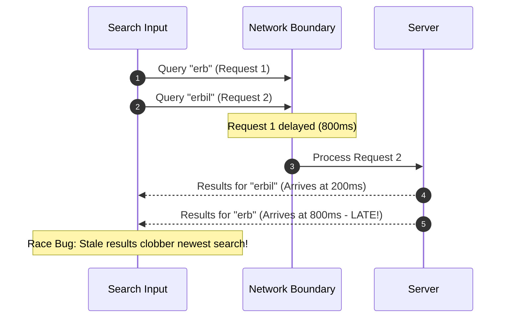

The test should prove that Query 2 remains authoritative and Request 1 was aborted.

---

## Demonstration: Failing race condition

```ts
// User types rapidly: "erb" then "erbil"
// Without AbortController, Request 1 resolves after Request 2:
test("demonstrates race condition failure", async () => {
  render(<LiveSearch />);
  await user.type(screen.getByRole("searchbox"), "erb");
  await user.type(screen.getByRole("searchbox"), "il");
  // If the component lacks cancellation, delayed response for "erb"
  // overwrites the newer "erbil" results in the DOM!
  expect(screen.getByRole("searchbox")).toHaveValue("erbil");
  // FAILS: DOM displays items for "erb" instead of "erbil"
  expect(await screen.findByText("Erbil International Airport")).toBeInTheDocument();
});
```

A test that does not control network timing will never detect this intermittent race.

---

## Demonstration: Setting up the race test

Simulate network latency on the first query using MSW:

```ts
const heldResolvers: Array<() => void> = [];
server.use(
  http.get("/api/search", ({ request }) => {
    const q = new URL(request.url).searchParams.get("q");
    if (q === "erb") {
      // Hold Request 1 until manually released
      return new Promise(r => heldResolvers.push(() => 
        r(HttpResponse.json([{ id: 1, name: "Old Erbil Entry" }]))
      ));
    }
    return HttpResponse.json([{ id: 2, name: "Erbil International Airport" }]);
  })
);
```

---

## Demonstration: Asserting race resilience

Trigger rapid typing and verify late responses are ignored:

```ts
render(<LiveSearch />);

// User types "erbil" - Request 2 resolves quickly
await user.type(screen.getByRole("searchbox"), "erbil");
expect(await screen.findByText("Erbil International Airport")).toBeInTheDocument();

// Resolve delayed Request 1: must NOT clobber current UI
heldResolvers[0]?.();
expect(screen.queryByText("Old Erbil Entry")).not.toBeInTheDocument();
```

The test controls network timing at the transport boundary.

---

## What the passing race test proves

Passing the mocked component race test validates:

- **Order-independence:** delayed earlier requests do not overwrite newer state;
- **DOM accuracy:** rendered search results reflect the active query;
- **Cancellation:** `AbortController` dispatches signal on new keystrokes.

The contract between input and view is verified.

---

## What the passing test still cannot prove

Even with the component test green, it cannot prove:

- **Backend capacity:** server rate-limiting under concurrent queries;
- **Screen-reader cadence:** `aria-live` speech queue congestion;
- **Device rendering:** frame drops on low-tier mobile hardware;
- **Input methods:** IME Arabic/CJK composition events.

Confidence requires complementary evidence across layers.

---

## Fake timers

Fake timers help test:

- debounce;
- retry backoff;
- polling;
- expiration;
- scheduled UI work.

Advance time deliberately and restore real timers after each test.

Do not use fake time to hide a missing synchronization condition.

---

## Test data builders

```ts
const product = buildProduct({ priceCents: 1250, inStock: true });
```

Builders provide valid defaults and make the relevant variation visible.

They reduce repetitive fixture setup without hiding important input differences.

---

## Avoid magic fixtures

A giant fixture can make every test depend on irrelevant fields.

Prefer small, intention-revealing builders and explicit edge-case data.

The test should show why the data matters.

---

## End-to-end testing

E2E tests verify a deployed-like journey through:

- browser;
- route;
- application code;
- server or controlled backend;
- network and storage;
- visible user outcomes.

They provide broad confidence at higher cost.

---

## Playwright locators

Prefer locators that reflect user semantics:

```ts
page.getByRole("button", { name: "Save" });
page.getByLabel("Email");
```

Use stable test IDs when semantic locators do not describe the target.

---

## Auto-waiting

A browser tool can wait for:

- visibility;
- enabled state;
- attachment;
- navigation;
- assertions.

Use built-in waiting and web-first assertions rather than adding arbitrary sleeps.

---

## Web-first assertions

```ts
await expect(page.getByRole("heading", { name: "Catalogue" }))
  .toBeVisible();
```

Assertions should wait for the user-visible condition and produce useful failure output.

---

## Test real user journeys

Good E2E candidates include:

- sign-in and redirect;
- search and filter;
- edit and save;
- error and retry;
- offline draft recovery;
- back and forward navigation;
- critical purchase or submission.

Do not use E2E to cover every small rendering branch.

---

## The critical-path suite

Keep a small, reliable suite for:

```text
open → act → submit → confirm
```

It should run quickly enough to block unsafe releases and produce actionable artifacts on failure.

---

## E2E data isolation

Tests should use:

- isolated accounts or tenants;
- unique records;
- resettable data;
- explicit cleanup;
- deterministic server state.

Shared mutable test data creates order dependence and flakiness.

---

## Test setup through APIs when appropriate

Create test state through a supported API or fixture layer when the behavior under test is not the setup flow.

Then use the UI for the actual journey.

Do not bypass the behavior you are trying to verify.

---

## E2E authentication

Choose between:

- UI login for the login journey;
- API or storage setup for unrelated tests;
- reusable authenticated contexts with isolated identities.

Document which boundary each test actually verifies.

---

## Multi-browser and mobile testing

Test a matrix based on risk:

- supported browser engines;
- viewport classes;
- touch and keyboard behavior;
- locale and direction;
- critical layout and input paths.

Do not run every test on every browser without a reason; do not test only one browser when compatibility matters.

---

## Accessibility-oriented testing

Combine:

```text
semantic queries
automated rules
keyboard journeys
focus checks
human review
screen-reader testing
```

Each catches different failures.

---

## Automated accessibility checks

Automated checks can find:

- missing labels;
- invalid ARIA relationships;
- contrast issues in some cases;
- landmark and structural problems.

They cannot fully evaluate meaning, workflow, focus strategy, or real assistive-technology experience.

---

## Visual regression testing

Visual tests are useful for:

- design-system components;
- themes;
- responsive layouts;
- typography;
- overlays;
- cross-route visual contracts.

They should complement behavior tests, not replace them.

---

## Visual regression noise

Control:

- browser version;
- fonts;
- viewport;
- animations;
- network content;
- time and locale;
- screenshot masking.

Review visual changes as product changes, not blindly approve every diff.

---

## Snapshot testing

Snapshots can reveal broad output changes quickly.

They become low-value when:

- output is huge;
- reviewers approve without reading;
- implementation details dominate;
- snapshots replace focused assertions.

Keep snapshots small and meaningful.

---

## Contract tests

Contract tests verify an agreement at a boundary:

- API request and response schema;
- event payload;
- package public API;
- micro-frontend mount contract;
- generated client assumptions.

Test the boundary the consumer actually depends on.

---

## Schema-driven testing

A runtime schema can support:

- response validation;
- generated examples;
- malformed-input tests;
- compatibility checks;
- property-based variations.

Shared schemas improve agreement but do not remove the need to test real delivery and failure.

---

## Test network conditions

Include scenarios such as:

- slow response;
- offline;
- timeout;
- aborted request;
- malformed response;
- 401/403;
- 404;
- 422;
- 500;
- partial dashboard failure.

Resilient UI is defined by recovery behavior.

---

## Test offline behavior where promised

Verify:

- draft survives reload;
- queued work is visible;
- retry has a limit;
- permanent failure is recoverable;
- reconnection does not duplicate work;
- stale data is labeled appropriately.

Do not claim offline support from an offline screen alone.

---

## Flaky tests are signals

Flakiness can indicate:

- uncontrolled time;
- shared state;
- races;
- missing awaits;
- unstable selectors;
- order dependence;
- real product nondeterminism.

Treat it as a defect in the test or system until understood.

---

## Never normalize flakiness

“It passes on retry” hides:

- release risk;
- missing confidence;
- slow CI;
- developer distrust;
- real timing bugs.

Quarantine only with an owner, issue, scope, and removal plan.

---

## Retries are not a fix

Retries may help identify intermittent infrastructure failures.

They can also:

- hide races;
- double mutations;
- make failures slower;
- produce false green builds.

Use retries as a diagnostic or bounded operational policy, not as proof of reliability.

---

## Trace artifacts improve failure diagnosis

Keep useful artifacts such as:

- screenshots;
- video;
- browser trace;
- console output;
- network logs;
- server correlation IDs;
- DOM snapshots where safe.

Artifacts should help reconstruct the user journey without leaking sensitive data.

---

## Failure messages are part of test quality

A useful failure says:

- which journey failed;
- what state was expected;
- what state appeared;
- which request or boundary was involved;
- where artifacts are stored.

“Expected true to be false” is rarely enough for a team to act quickly.

---

## Test names are documentation

```text
shows previous results while a refresh fails
```

is more useful than:

```text
handles error
```

Name the behavior and the important condition.

---

## Arrange–Act–Assert

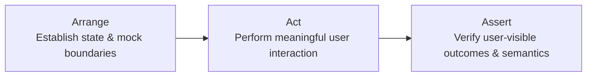

Keep the structure readable, even when a test uses several assertions.

---

## Given–When–Then

```text
Given an expired session
When the user submits the form
Then the app asks them to sign in and preserves the draft
```

This style can clarify product behavior for technical and nontechnical reviewers.

---

## One test can have several assertions

Several assertions are appropriate when they describe one outcome:

```text
error is visible
field is invalid
submit is blocked
```

Split tests when assertions represent independent behaviors with different setup or failure meaning.

---

## Avoid mega tests

A mega test that covers an entire application can be:

- slow;
- hard to diagnose;
- stateful;
- impossible to run in parallel;
- fragile under small changes.

Keep critical journeys focused and compose confidence across layers.

---

## Test independence

Each test should control or reset:

- data;
- clock;
- network;
- storage;
- authentication;
- feature flags;
- browser state.

Order should not decide whether a test passes.

---

## Parallel execution

Parallel tests need:

- isolated data;
- independent ports or contexts;
- deterministic seeds;
- no shared mutable files;
- bounded server resources.

Parallelism improves speed only when the environment preserves independence.

---

## Determinism

Control or model:

- time;
- randomness;
- IDs;
- network order;
- locale;
- timezone;
- animation;
- async scheduling.

Do not remove realistic variability from the product merely to make tests easy.

---

## Locale, RTL, and date testing

Test representative:

- long translations;
- plural forms;
- right-to-left layout;
- localized dates and numbers;
- timezone boundaries;
- daylight-saving transitions.

The default locale hides real layout and logic bugs.

---

## Browser APIs need realistic tests

If a feature uses:

- storage;
- service workers;
- workers;
- notifications;
- permissions;
- clipboard;
- media;
- WebSockets or SSE;

use a test environment that models the relevant behavior or include a real-browser test.

---

## Testing service workers and live connections

Test:

- install and update;
- cache strategy;
- offline fallback;
- message validation;
- reconnect;
- duplicate events;
- missed-event recovery;
- cleanup.

Do not test only the connected happy path.

---

## Race testing

Make the race controllable at the boundary:

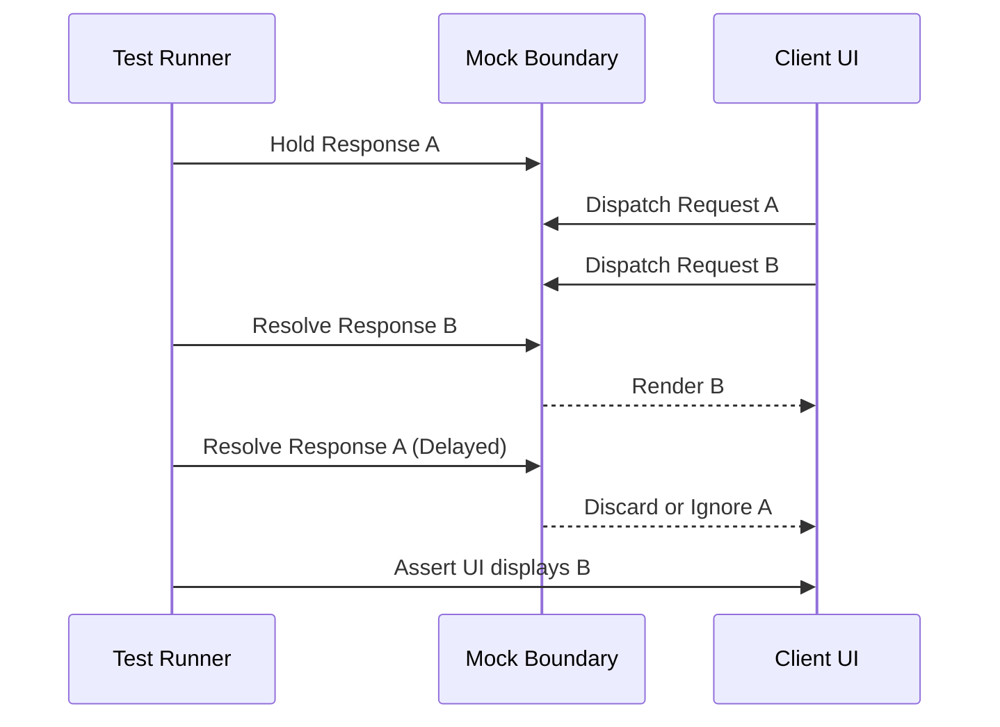

Assert that the current identity or version wins according to the product policy.

---

## Error and loading boundary testing

Verify that a failure is contained at the intended boundary:

```text
remote panel fails → panel error and retry
shell remains usable
```

Also test loading fallbacks for focus, layout, and accessibility.

---

## Cache behavior testing

Test:

- key separation;
- fresh versus stale;
- deduplication;
- invalidation;
- mutation reconciliation;
- cache eviction;
- user identity scope.

A cache test should prove what the user sees, not merely that a map received a value.

---

## Optimistic update test

Cover the optimistic state lifecycle:

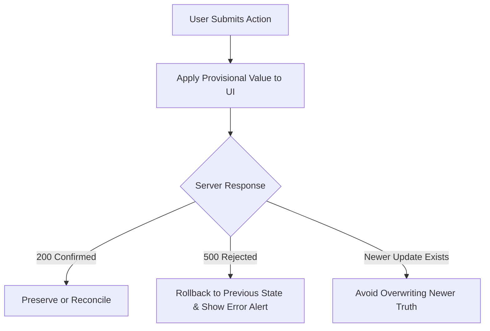

Optimism without rollback testing is only a happy-path demo.

---

## Testing forms

Cover:

- labels and names;
- touched and dirty behavior;
- field and cross-field validation;
- disabled and pending states;
- server validation mapping;
- draft preservation on failure;
- successful reset or navigation.

Forms are workflows, not just input snapshots.

---

## Testing routing

Verify:

- route parsing and invalid parameters;
- redirects;
- URL state serialization;
- back and forward behavior;
- scroll and focus;
- route-level loading and errors;
- code-split failure and recovery.

The browser history is part of the product contract.

---

## Permission and security testing boundaries

Test:

- unauthorized UI behavior;
- server rejection despite hidden controls;
- CSRF decisions;
- CORS integration;
- token and session expiration;
- safe rendering;
- open redirect prevention.

Do not treat a client-side permission branch as security enforcement.

---

## Coverage is a map, not a grade

Coverage can show:

- unexecuted branches;
- missing error paths;
- dead code candidates;
- areas needing review.

High coverage can still miss wrong assertions, incorrect fixtures, inaccessible behavior, and integration failures.

---

## Mutation testing

Mutation testing changes code deliberately to see whether tests fail.

It can reveal weak assertions and untested logic.

Use it selectively on high-risk pure logic; applying it everywhere may cost more than the confidence gained.

---

## Property-based testing

Property-based tests generate many inputs and verify invariants:

```text
serialize(parse(url)) remains valid
price never formats as a negative value
parser rejects malformed records
```

They are useful for parsers, state transitions, URLs, and domain rules with broad input space.

---

## Themes and responsive visual testing

Visual coverage should include:

- light and dark themes;
- narrow and wide viewports;
- high text scale where relevant;
- RTL;
- long content;
- loading and error states.

A component that looks correct in one theme and viewport is not fully verified.

---

## Test environment strategy

Define which environment supports each layer:

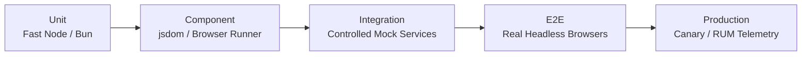

Keep environment differences documented and intentional.

---

## Smoke tests

Smoke tests provide a fast release signal:

- app loads;
- critical route works;
- one key action succeeds;
- health and assets are available.

They should be small, reliable, and safe to run against production-like systems.

---

## Production tests must be safe

Use:

- read-only checks;
- isolated test accounts;
- non-destructive identifiers;
- explicit cleanup;
- rate limits;
- privacy-aware logging.

Do not test a production payment or deletion path by accident.

---

## Feature flags and testing

Flags multiply states:

```text
old behavior × new behavior × user role × route × device
```

Define flag ownership, expiry, test coverage, rollout, and removal.

An old flag is permanent untested architecture.

---

## Test matrix explosion

You cannot test every combination of:

- browsers;
- locales;
- roles;
- feature flags;
- network conditions;
- route states;
- data sizes.

Prioritize combinations by risk and use representative sampling plus targeted coverage.

---

## CI test parallelism

Parallel CI can reduce feedback time when:

- tests are independent;
- data is isolated;
- workers have resources;
- artifacts remain attributable;
- test selection is reliable.

Fast, nondeterministic CI is not a quality improvement.

---

## Test selection

Use changed files, dependency graphs, and risk labels to select fast feedback.

Still run a broader suite at release boundaries or on a reliable schedule.

Selection is safe only when the graph and ownership assumptions are accurate.

---

## Quarantine flaky tests carefully

A quarantine policy needs:

- owner;
- issue;
- reason;
- expiry or review date;
- alternative coverage;
- removal plan.

Quarantine is a temporary containment measure, not a second home for broken tests.

---

## Delete low-value tests

Remove tests that:

- assert implementation with no product risk;
- duplicate stronger coverage;
- fail noisily without useful evidence;
- protect behavior intentionally being removed;
- cost more to maintain than the confidence they provide.

Test suites need maintenance like production code.

---

## Testing refactors

Good tests allow internal refactoring while preserving contracts.

If a visual extraction breaks dozens of tests, inspect whether those tests depend on private structure rather than user behavior.

Testing should support architecture evolution, not freeze every implementation detail.

---

## Test architecture smells

Watch for:

- every test queries a test ID;
- every internal function is mocked;
- refactoring markup breaks hundreds of tests;
- E2E suite takes hours;
- failures disappear on retry;
- 100% coverage but critical bugs escape;
- snapshots are approved without review;
- production bugs cannot be reproduced.

These are signals to redesign the evidence strategy.

---

## A balanced strategy by layer

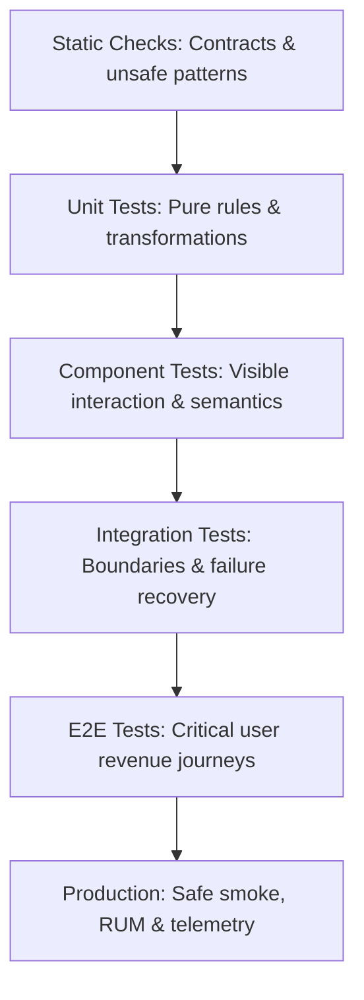

The layers should reinforce rather than duplicate one another.

---

## Testing a dialog

Verify:

- accessible name;
- initial focus;
- Escape and close button;
- focus restoration;
- background interaction policy;
- error and loading states;
- keyboard navigation.

One user-facing behavior can need several complementary tests.

---

## Testing a pricing function

Unit-test:

- currency and rounding;
- zero and negative handling;
- locale formatting;
- discounts and boundaries;
- invalid input policy.

Then integration-test where the formatted value appears in a real product journey.

---

## Testing search

Cover the complete search user journey:

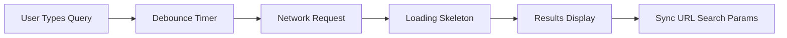

Search is a small feature with many asynchronous contracts.

---

## Testing offline drafts

Verify:

- draft persistence;
- reload recovery;
- outbox entry;
- sync status;
- retry limit;
- duplicate prevention;
- conflict behavior.

Do not test only the initial save click.

---

## Testing micro-frontends

Use:

- remote unit and component tests;
- contract tests for mount and events;
- host integration tests;
- remote failure and fallback tests;
- end-to-end cross-route journeys;
- version compatibility checks.

The runtime boundary needs evidence at both sides.

---

## Testing rendering topologies

Verify:

- server and client output agreement;
- hydration behavior;
- static freshness;
- stream loading and failure;
- client-only boundaries;
- route navigation and handoff;
- secrets staying server-side.

Rendering architecture changes what the test environment must observe.

---

## Testing performance contracts

Test or monitor:

- route budgets;
- asset and chunk limits;
- key interaction timing;
- list behavior at representative sizes;
- memory cleanup;
- loading and transition markers.

Use performance tests as signals with context, not brittle universal promises.

---

## Testing security contracts

Verify:

- safe text rendering;
- sanitized rich content;
- CORS and credential behavior;
- CSRF protection;
- server authorization;
- redirect validation;
- security headers;
- no secrets in browser artifacts.

Security tests should target trust boundaries explicitly.

---

## The test strategy document

Document:

- risks;
- test layers;
- supported browsers;
- data and environment strategy;
- ownership;
- CI selection;
- flaky-test policy;
- production verification;
- review and deletion rules.

The document keeps the suite intentional as the system evolves.

---

## Testing philosophy

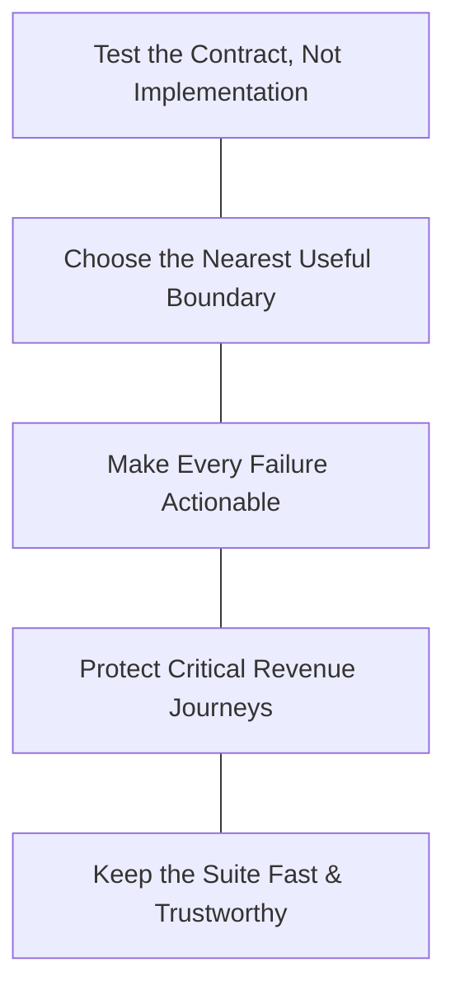

More tests do not automatically mean higher quality.

Better evidence does.

---

## Practical lab: Resilient UI Integration Suite

Test a catalogue workflow through user-visible behavior, accessibility semantics, network boundaries, and recovery paths.

The practical builds a layered strategy rather than one giant end-to-end test.

---

## Practical stages 1–2: pure logic & accessible semantics

1. **Stage 1 (Pure Logic & Parser Unit Testing):**
   - Test price formatting, pagination math, and schema parsers against valid, boundary, and corrupt input.
   - Pure fast Node runtime without DOM overhead.
2. **Stage 2 (Component Semantics & Accessible Names):**
   - Query by `getByRole` and `getByLabelText`.
   - Test keyboard navigation (`Tab`, `Escape`) and focus retention.

Verification: Tests depend on platform accessibility contracts, not CSS classes or private component state.

---

## Practical stages 3–4: boundary mocking & fault injection

3. **Stage 3 (Network Interception with MSW):**
   - Intercept requests at the HTTP transport boundary.
   - Simulate network delays, 500 server crashes, and offline states.
4. **Stage 4 (Asynchronous Resilience & Fault Injection):**
   - Inject deliberate faults (dropped `AbortController`, broken optimistic rollback, missing `aria-invalid`).
   - Confirm tests fail immediately and pinpoint the exact failure mechanism.

Verification: Tests prove loading, empty, error, retry, and cancellation behaviors without arbitrary `sleep()` delays.

---

## Practical stage 5: Playwright critical-path journey

5. **Stage 5 (Playwright Critical-Path Browser Journey):**
   - Run a real headless Chromium/Firefox/WebKit test.
   - Exercise the full user journey: search, filter, optimistic order drafting, and error recovery.
   - Capture trace artifacts, network waterfalls, and screenshots on failure.

Verification: Fast feedback in CI with zero flakiness; high confidence across real browser layout engines.

---

## Practical extension: contract and mutation tests

Add:

- a contract test for the runtime-validated API response;
- a deliberate mutation test that changes an important pricing or validation rule.

Confirm that the suite fails for the right reason and reports an actionable difference.

---

## Try this yourself

Choose one critical user journey and map:

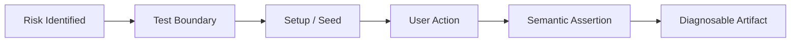

Then remove one test that duplicates stronger evidence and explain why confidence remains adequate.

---
## Troubleshooting guide (Part 1)

| Symptom | Likely cause |
|---|---|
| Tests break after harmless markup refactor | Assertions depend on private structure |
| Everything uses test IDs | User-facing semantics are missing or ignored |
| Async tests need sleeps | Tests wait for time instead of conditions |
| Mocks hide integration failures | Mock boundary is too deep |
| E2E suite is slow and flaky | Too much setup and shared mutable data |
---
## Troubleshooting guide (Part 2)

| Symptom | Likely cause |
|---|---|
| Retry makes CI green | Flakiness is being normalized |
| Coverage is high but bugs escape | Assertions and risk mapping are weak |
| Visual diffs are always approved | Review policy and baseline ownership are weak |
| Offline test passes only once | Storage and cleanup are not isolated |
---

## Completion checklist

- [ ] risks determine the test layers;
- [ ] static, unit, component, integration, and E2E roles are clear;
- [ ] tests use semantic user-facing queries where appropriate;
- [ ] keyboard and focus behavior are covered;
- [ ] async states and races are deterministic;
- [ ] network mocks sit at stable boundaries;
- [ ] critical browser journeys have failure artifacts;
- [ ] accessibility and visual checks supplement behavior tests;
- [ ] flakiness has ownership and a removal policy;
- [ ] coverage and CI selection support, rather than replace, judgment.

---
## Misconceptions to leave behind (Part 1)

| Misconception | Better mental model |
|---|---|
| 100% coverage means well tested | Coverage is a map, not a confidence grade |
| Unit tests are always better | Use the nearest boundary that proves the risk |
| Everything should be E2E | Broad tests are costly and should protect journeys |
| Component tests should inspect state | Test visible behavior and semantics |
| CSS selectors are forbidden | Use the selector that matches the contract |
| Test IDs are bad | They are a legitimate fallback when semantics are unsuitable |
---
## Misconceptions to leave behind (Part 2)

| Misconception | Better mental model |
|---|---|
| `getByRole` certifies accessibility | Queries are one quality signal, not an audit |
| Simulated DOM equals a browser | Real browser behavior needs targeted tests |
| Mocks make tests reliable | Boundary choice and realistic failures matter |
| Sleeps fix async tests | Wait for meaningful conditions |
| Retries solve flaky tests | They can hide nondeterminism |
| More tests always mean higher quality | Better evidence and maintainability matter |
---

## The chapter in one sentence

> **Build a layered, user-centered test strategy that protects real risks, observes meaningful boundaries, and remains trustworthy under failure and change.**

---

## Next: Chapter 17

The next chapter will build on resilient testing with:

- maintainability and refactoring;
- technical debt and architectural evolution;
- documenting decisions;
- sustainable quality over a system’s lifetime.

---

## Questions

Which important user journey currently has the most confidence from implementation details—and the least evidence from the behavior users actually experience?
